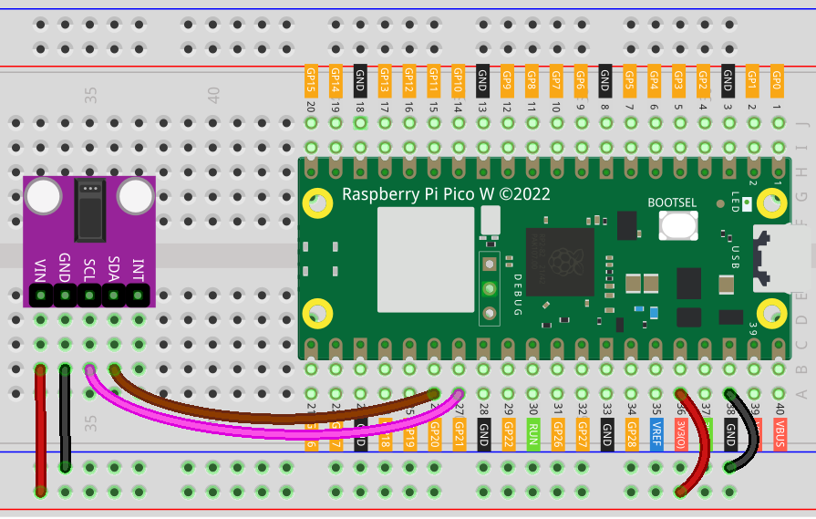

.. note:: 

    Bonjour et bienvenue dans la communauté des passionnés de SunFounder Raspberry Pi, Arduino et ESP32 sur Facebook ! Explorez plus en profondeur le Raspberry Pi, Arduino et ESP32 avec d'autres passionnés.

    **Pourquoi nous rejoindre ?**

    - **Support d’experts** : Résolvez les problèmes après-vente et les défis techniques avec l'aide de notre communauté et de notre équipe.
    - **Apprendre et partager** : Échangez des astuces et des tutoriels pour perfectionner vos compétences.
    - **Aperçus exclusifs** : Accédez en avant-première aux annonces de nouveaux produits et aperçus exclusifs.
    - **Réductions spéciales** : Profitez de réductions exclusives sur nos nouveaux produits.
    - **Promotions festives et concours** : Participez à des concours et promotions lors des fêtes.

    👉 Prêt à explorer et à créer avec nous ? Cliquez sur [|link_sf_facebook|] et rejoignez-nous dès aujourd'hui !

.. _pico_lesson14_max30102:

Leçon 14 : Module Oxymètre de Pouls et Capteur de Fréquence Cardiaque (MAX30102)
===================================================================================

Dans cette leçon, vous apprendrez à utiliser le Raspberry Pi Pico W pour interfacer avec l'oxymètre de pouls et le capteur de fréquence cardiaque MAX30102. Vous découvrirez comment configurer la communication I2C, configurer le capteur et lire les données brutes du capteur. En observant les changements dans les données, vous pourrez obtenir des informations sur la fréquence cardiaque.

Composants Requis
--------------------------

Dans ce projet, nous avons besoin des composants suivants.

Il est définitivement plus pratique d'acheter un kit complet, voici le lien :

.. list-table::
    :widths: 20 20 20
    :header-rows: 1

    *   - Nom	
        - Éléments dans ce kit
        - Lien
    *   - Universal Maker Sensor Kit
        - 94
        - |link_umsk|

Vous pouvez également les acheter séparément via les liens ci-dessous.

.. list-table::
    :widths: 30 10
    :header-rows: 1

    *   - Introduction des composants
        - Lien d'achat

    *   - Raspberry Pi Pico W
        - \-
    *   - :ref:`cpn_max30102`
        - |link_max30102_module_buy|
    *   - :ref:`cpn_breadboard`
        - |link_breadboard_buy|

Câblage
---------------------------

Code
---------------------------

.. note::

    * Ouvrez le fichier ``14_max30102_module.py`` dans le répertoire ``universal-maker-sensor-kit-main/pico/Lesson_14_MAX30102_Module`` ou copiez ce code dans Thonny, puis cliquez sur "Exécuter le script actuel" ou appuyez simplement sur F5 pour l'exécuter. Pour des tutoriels détaillés, veuillez consulter :ref:`open_run_code_py`.

    * Vous devez utiliser le dossier ``max30102``, vérifiez s'il a bien été téléchargé sur le Pico W, pour un tutoriel détaillé, consultez :ref:`add_libraries_py`.

    * N'oubliez pas de sélectionner l'interpréteur "MicroPython (Raspberry Pi Pico)" dans le coin inférieur droit.

.. code-block:: python

   from machine import SoftI2C, Pin
   from time import ticks_diff, ticks_us, sleep
   
   from max30102 import MAX30102, MAX30105_PULSE_AMP_MEDIUM
   
   
   def main():
       # Instance I2C logiciel
       i2c = SoftI2C(sda=Pin(20),  # Utilisez ici votre broche SDA I2C
                     scl=Pin(21),  # Utilisez ici votre broche SCL I2C
                     freq=400000)  # Vitesse rapide : 400 kHz, lente : 100 kHz
   
       # Instance du capteur
       sensor = MAX30102(i2c=i2c)  # Une instance I2C est nécessaire
   
       # Scannez le bus I2C pour vérifier que le capteur est connecté
       if sensor.i2c_address not in i2c.scan():
           print("Sensor not found.")
           return
       elif not (sensor.check_part_id()):
           # Vérifiez que le capteur ciblé est compatible
           print("I2C device ID not corresponding to MAX30102 or MAX30105.")
           return
       else:
           print("Sensor connected and recognized.")
   
       # Il est possible de configurer le capteur en une seule fois avec la méthode setup_sensor().
       # Si aucun paramètre n'est fourni, la configuration par défaut est chargée :
       # Mode LED : 2 (ROUGE + IR)
       # Plage ADC : 16384
       # Taux d'échantillonnage : 400 Hz
       # Puissance LED : maximum (50,0 mA - Détection de présence à environ 30 cm)
       # Échantillons moyennés : 8
       # Largeur d'impulsion : 411
       print("Setting up sensor with default configuration.", '\n')
       sensor.setup_sensor()
   
       # Il est également possible d'ajuster les paramètres de configuration un par un.
       # Définir le taux d'échantillonnage à 400 : 400 échantillons/s sont collectés par le capteur
       sensor.set_sample_rate(400)
       # Définir le nombre d'échantillons à moyenné par lecture
       sensor.set_fifo_average(8)
       # Définir la luminosité des LED à une valeur moyenne
       sensor.set_active_leds_amplitude(MAX30105_PULSE_AMP_MEDIUM)
   
       sleep(1)
   
       # La méthode readTemperature() permet d'extraire la température du capteur en °C    
       print("Reading temperature in °C.", '\n')
       print(sensor.read_temperature())
   
       print("Starting data acquisition from RED & IR registers...", '\n')
       sleep(1)
   
       while True:
           # La méthode check() doit être interrogée en continu pour vérifier si
           # de nouvelles lectures sont disponibles dans la file FIFO du capteur. Lorsque de nouvelles
           # lectures sont disponibles, cette fonction les stocke.
           sensor.check()
   
           # Vérifiez si des échantillons sont disponibles dans la mémoire
           if sensor.available():
               # Accédez à la mémoire FIFO et récupérez les lectures (entiers)
               red_reading = sensor.pop_red_from_storage()
               ir_reading = sensor.pop_ir_from_storage()
   
               # Affichez les données acquises (afin qu'elles puissent être tracées avec un Serial Plotter)
               print("red_reading", red_reading, "ir_reading", ir_reading)
   
   if __name__ == '__main__':
       main()

Analyse du Code
---------------------------

1. Configuration de l'interface I2C

   ``SoftI2C`` est initialisé avec les broches SDA et SCL, et une fréquence de 400 kHz est définie pour la communication.

   .. code-block:: python

      from machine import SoftI2C, Pin
      i2c = SoftI2C(sda=Pin(20), scl=Pin(21), freq=400000)

2. Initialisation du capteur

   Le capteur MAX30102 est initialisé à l'aide de l'interface I2C. Un scan du bus I2C est effectué pour vérifier que le capteur est connecté et reconnu.

   Pour plus d'informations sur la bibliothèque ``max30102``, veuillez consulter |link_micropython_max30102_driver|.

   .. code-block:: python

      from max30102 import MAX30102
      sensor = MAX30102(i2c=i2c)

3. Configuration du capteur

   Le capteur est configuré avec des paramètres par défaut pour le mode LED, la plage ADC, le taux d'échantillonnage, la puissance LED, les échantillons moyennés et la largeur d'impulsion. D'autres configurations comme le taux d'échantillonnage, la moyenne FIFO et l'amplitude LED sont ensuite définies.

   .. code-block:: python

      sensor.setup_sensor()
      sensor.set_sample_rate(400)
      sensor.set_fifo_average(8)
      sensor.set_active_leds_amplitude(MAX30105_PULSE_AMP_MEDIUM)

4. Lecture de la température

   La température du capteur est lue et affichée.

   .. code-block:: python

      print(sensor.read_temperature())

5. Acquisition des données

   Une boucle est configurée pour acquérir en continu les données du capteur. 
   La méthode ``check()`` est interrogée pour vérifier si de nouvelles lectures 
   sont disponibles. Les lectures de la lumière rouge et infrarouge sont récupérées 
   de la mémoire du capteur et affichées.

   .. code-block:: python

      while True:
          sensor.check()
          if sensor.available():
              red_reading = sensor.pop_red_from_storage()
              ir_reading = sensor.pop_ir_from_storage()
              print("red_reading",red_reading, "ir_reading", ir_reading)

   Ouvrez le plotteur dans Thonny pour observer les données de fréquence cardiaque.

   .. image:: img/Lesson_14_max30102_plotter.png
      :width: 60%
