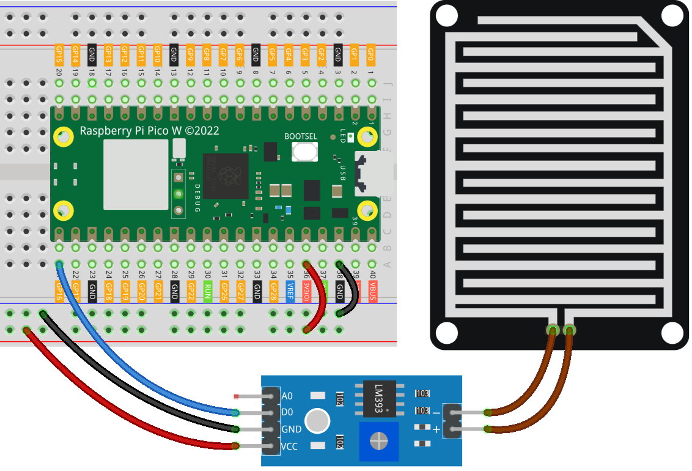

.. note:: 

    Bonjour et bienvenue dans la communauté des passionnés de SunFounder Raspberry Pi, Arduino et ESP32 sur Facebook ! Plongez plus profondément dans les mondes de Raspberry Pi, Arduino et ESP32 avec d'autres passionnés.

    **Pourquoi nous rejoindre ?**

    - **Support d’experts** : Résolvez vos problèmes après-vente et vos défis techniques grâce à l’aide de notre communauté et de notre équipe.
    - **Apprendre et partager** : Échangez des astuces et des tutoriels pour améliorer vos compétences.
    - **Aperçus exclusifs** : Accédez en avant-première aux annonces de nouveaux produits et aperçus exclusifs.
    - **Réductions spéciales** : Profitez de réductions exclusives sur nos produits les plus récents.
    - **Promotions festives et concours** : Participez à des concours et des promotions pendant les fêtes.

    👉 Prêt à explorer et créer avec nous ? Cliquez sur [|link_sf_facebook|] et rejoignez-nous dès aujourd'hui !

.. _pico_lesson15_raindrop:

Leçon 15 : Module de Détection de Gouttes de Pluie
=====================================================

Dans cette leçon, vous apprendrez à utiliser le Raspberry Pi Pico W pour détecter des gouttes de pluie à l’aide d’un capteur de pluie connecté à la broche 16. Le script surveille en continu la présence de gouttes de pluie et affiche "Goutte de pluie détectée !" lorsqu’une goutte est détectée ; sinon, il affiche "Surveillance en cours..." en attendant les gouttes de pluie. Cette session offre une expérience pratique dans la gestion des entrées numériques avec le Raspberry Pi Pico W et la compréhension de la détection environnementale en MicroPython, idéale pour les débutants en électronique et en programmation.

Composants Requis
--------------------------

Dans ce projet, nous avons besoin des composants suivants.

Il est sans doute plus pratique d'acheter un kit complet, voici le lien :

.. list-table::
    :widths: 20 20 20
    :header-rows: 1

    *   - Nom	
        - Éléments dans ce kit
        - Lien
    *   - Universal Maker Sensor Kit
        - 94
        - |link_umsk|

Vous pouvez également les acheter séparément via les liens ci-dessous.

.. list-table::
    :widths: 30 20
    :header-rows: 1

    *   - Introduction des composants
        - Lien d'achat

    *   - Raspberry Pi Pico W
        - \-
    *   - :ref:`cpn_raindrop`
        - |link_raindrop_sensor_module_buy|
    *   - :ref:`cpn_breadboard`
        - |link_breadboard_buy|

Câblage
---------------------------

Code
---------------------------

.. code-block:: python

   from machine import Pin
   import time
   
   # Initialiser le capteur de gouttes de pluie connecté à la broche 16 en mode entrée
   raindrop_sensor = Pin(16, Pin.IN)
   
   while True:
       # Vérifier la valeur du capteur de gouttes de pluie
       if raindrop_sensor.value() == 0:  
           print("Raindrop detected!")  # Goutte de pluie détectée
       else:
           print("Monitoring...")  # Pas de goutte de pluie détectée
       
       time.sleep(0.1)  # Court délai de 0.1 seconde pour réduire l'utilisation du processeur

Analyse du Code
---------------------------

1. Initialisation du capteur de gouttes de pluie :

   Le capteur de gouttes de pluie est initialisé à l'aide de la classe ``Pin`` du module ``machine``, configuré pour la broche 16 en mode entrée. Cela permet au Raspberry Pi Pico W de lire la sortie du capteur.

   .. code-block:: python
   
       from machine import Pin
       raindrop_sensor = Pin(16, Pin.IN)

2. Boucle de surveillance continue :

   Une boucle ``while`` continue est utilisée pour surveiller le capteur. À l'intérieur de la boucle, la valeur du capteur est vérifiée. Si la valeur est 0, cela indique que des gouttes de pluie ont été détectées et affiche "Goutte de pluie détectée !". Sinon, il affiche "Surveillance en cours..." pour indiquer l'absence de gouttes de pluie.

   .. code-block:: python
   
       while True:
           if raindrop_sensor.value() == 0:  
               print("Raindrop detected!")
           else:
               print("Monitoring...")

3. Introduction d'un délai :

   Pour réduire l'utilisation du processeur, un délai de 0,1 seconde est introduit à chaque itération de la boucle avec ``time.sleep(0.1)``, afin d'éviter que la boucle ne s'exécute trop rapidement.

   .. code-block:: python
   
       time.sleep(0.1)