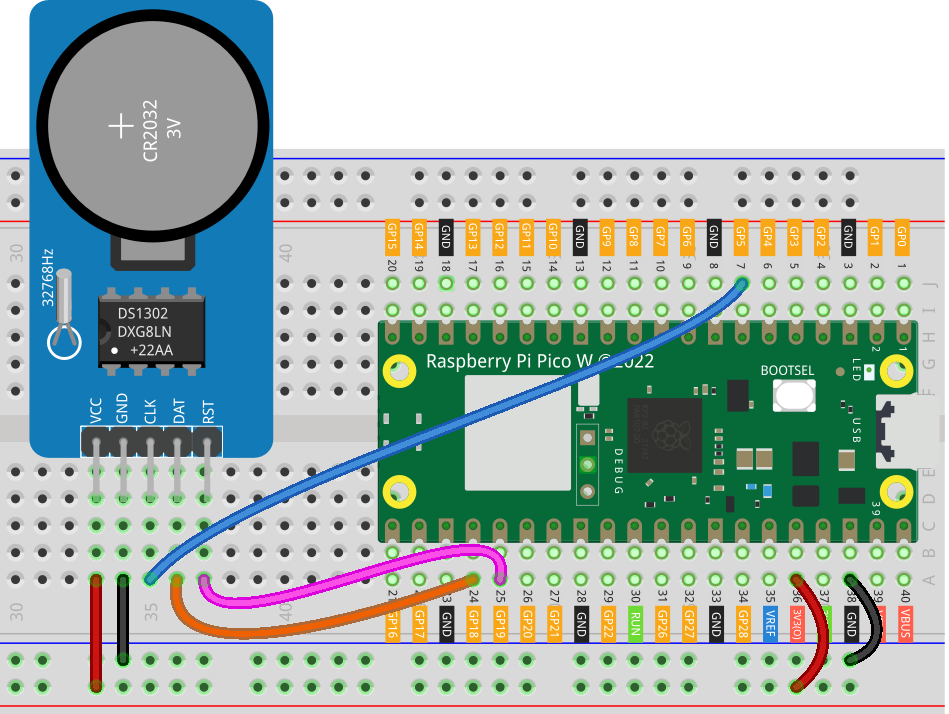

.. note::

    ¡Hola, bienvenido a la Comunidad de Entusiastas de Raspberry Pi, Arduino y ESP32 en Facebook! Profundiza en Raspberry Pi, Arduino y ESP32 junto con otros entusiastas.

    **¿Por qué unirte?**

    - **Soporte de expertos**: Resuelve problemas postventa y desafíos técnicos con la ayuda de nuestra comunidad y equipo.
    - **Aprende y comparte**: Intercambia consejos y tutoriales para mejorar tus habilidades.
    - **Avances exclusivos**: Accede a novedades sobre productos y vistas previas de manera anticipada.
    - **Descuentos especiales**: Disfruta de descuentos exclusivos en nuestros productos más recientes.
    - **Promociones festivas y sorteos**: Participa en sorteos y promociones especiales de temporada.

    👉 ¿Listo para explorar y crear con nosotros? Haz clic en [|link_sf_facebook|] y únete hoy mismo!

.. _pico_lesson16_ds1306:

Lección 16: Módulo de Reloj en Tiempo Real (DS1302)
======================================================

En esta lección, aprenderás cómo usar el Raspberry Pi Pico W para interactuar con un módulo de Reloj en Tiempo Real DS1302. Comenzaremos configurando el DS1302 y conectándolo al Pico W utilizando pines GPIO específicos. También aprenderás a recuperar y ajustar la fecha y hora actuales en el DS1302. Además, exploraremos cómo mostrar continuamente la fecha y hora actual en tu consola, actualizándola cada medio segundo.

Componentes necesarios
---------------------------

En este proyecto, necesitaremos los siguientes componentes.

Es muy conveniente comprar un kit completo, aquí está el enlace:

.. list-table::
    :widths: 20 20 20
    :header-rows: 1

    *   - Nombre
        - ARTÍCULOS EN ESTE KIT
        - ENLACE
    *   - Kit Universal Maker Sensor
        - 94
        - |link_umsk|

También puedes comprarlos por separado desde los siguientes enlaces.

.. list-table::
    :widths: 30 20
    :header-rows: 1

    *   - Introducción del componente
        - Enlace de compra

    *   - Raspberry Pi Pico W
        - \-
    *   - :ref:`cpn_rtc_ds1302`
        - |link_ds1302_module_buy|
    *   - :ref:`cpn_breadboard`
        - |link_breadboard_buy|

Conexiones
---------------------------

Código
---------------------------

.. note::

    * Abre el archivo ``16_ds1302_module.py`` en la ruta ``universal-maker-sensor-kit-main/pico/Lesson_16_DS1302_Module`` o copia este código en Thonny, luego haz clic en "Ejecutar script actual" o simplemente presiona F5 para ejecutarlo. Para tutoriales detallados, consulta :ref:`open_run_code_py`.

    * Aquí necesitarás usar el archivo ``ds1302.py``, por favor verifica si ya ha sido subido al Pico W, para un tutorial detallado consulta :ref:`add_libraries_py`.

    * No olvides hacer clic en el intérprete "MicroPython (Raspberry Pi Pico)" en la esquina inferior derecha.

.. code-block:: python

   from machine import Pin
   import ds1302
   import time
   
   # Inicializar RTC DS1302 con pines GPIO específicos
   ds = ds1302.DS1302(Pin(5), Pin(18), Pin(19))  # (clk, dio, cs)
   
   # Obtener la fecha y hora actuales del DS1302
   ds.date_time()
   
   # Establecer la fecha y hora del DS1302 a 2024-01-01 lunes 00:00:00
   ds.date_time([2024, 1, 1, 1, 0, 0, 0])  # (año, mes, día, día de la semana, hora, minuto, segundo)
   
   # Establecer los segundos a 10
   ds.second(10)
   
   # Mostrar continuamente la fecha y hora actuales cada medio segundo
   while True:
       print(ds.date_time())
       time.sleep(0.5)

Análisis del código
---------------------------

#. **Importar bibliotecas**

   Esta sección importa las bibliotecas necesarias: ``machine`` para el control de los pines GPIO, ``ds1302`` para el módulo RTC y ``time`` para implementar los retrasos.

   Para más detalles sobre la biblioteca ``ds1302``, consulta ``ds1302.py``.

   .. code-block:: python

      from machine import Pin
      import ds1302
      import time

#. **Inicializar el RTC DS1302**

   Este código inicializa el módulo DS1302 definiendo qué pines GPIO del Raspberry Pi Pico W están conectados al reloj (clk), entrada/salida de datos (dio) y al pin de selección de chip (cs) del DS1302.

   .. code-block:: python

      ds = ds1302.DS1302(Pin(5), Pin(18), Pin(19))  # (clk, dio, cs)

#. **Obtener la fecha y hora actuales**

   Recupera la fecha y hora actuales del DS1302. El método ``date_time()`` devuelve una lista con el año, mes, día, día de la semana, hora, minuto y segundo.

   .. code-block:: python

      ds.date_time()

#. **Establecer la fecha y hora del DS1302**

   Establece la fecha y hora del DS1302 a 1 de enero de 2024, a las 00:00:00. El día de la semana (lunes) se representa con el valor 1.

   .. code-block:: python

      ds.date_time([2024, 1, 1, 1, 0, 0, 0])  # (año, mes, día, día de la semana, hora, minuto, segundo)

#. **Establecer los segundos**

   Establece el valor de los segundos del DS1302 a 10.

   .. code-block:: python

      ds.second(10)

#. **Mostrar continuamente la fecha y hora actuales**

   Este bucle muestra continuamente la fecha y hora actuales cada medio segundo. La función ``time.sleep(0.5)`` crea un retraso de medio segundo entre cada iteración.

   .. code-block:: python

      while True:
          print(ds.date_time())
          time.sleep(0.5)