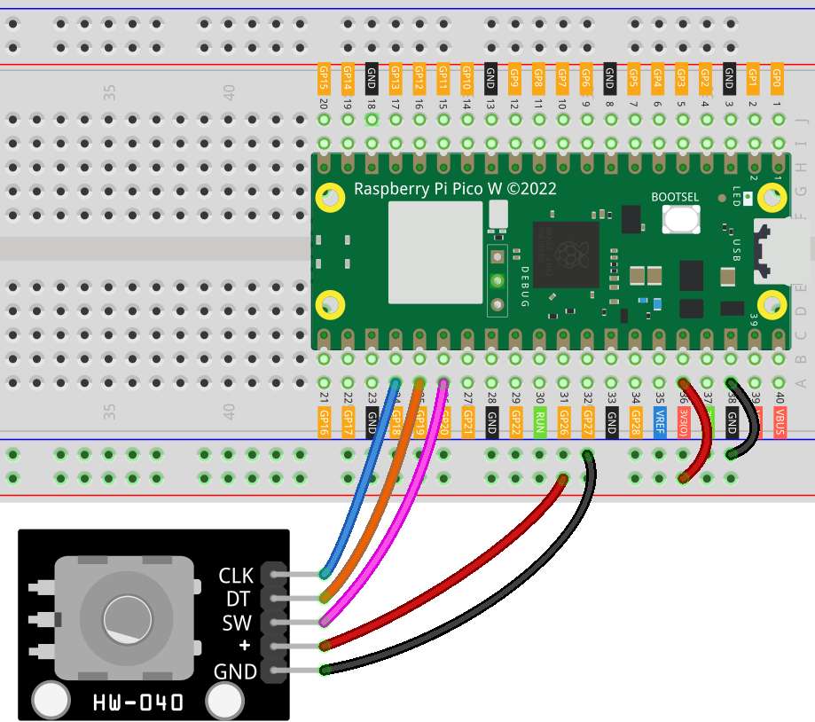

.. note::

   Hallo und willkommen in der SunFounder Raspberry Pi & Arduino & ESP32 Enthusiasten-Gemeinschaft auf Facebook! Tauchen Sie tiefer ein in die Welt von Raspberry Pi, Arduino und ESP32 mit anderen Enthusiasten.

   **Warum beitreten?**

   - **Expertenunterstützung**: Lösen Sie Nachverkaufsprobleme und technische Herausforderungen mit Hilfe unserer Gemeinschaft und unseres Teams.
   - **Lernen & Teilen**: Tauschen Sie Tipps und Anleitungen aus, um Ihre Fähigkeiten zu verbessern.
   - **Exklusive Vorschauen**: Erhalten Sie frühzeitigen Zugang zu neuen Produktankündigungen und exklusiven Einblicken.
   - **Spezialrabatte**: Genießen Sie exklusive Rabatte auf unsere neuesten Produkte.
   - **Festliche Aktionen und Gewinnspiele**: Nehmen Sie an Gewinnspielen und Feiertagsaktionen teil.

   👉 Sind Sie bereit, mit uns zu erkunden und zu erschaffen? Klicken Sie auf [|link_sf_facebook|] und treten Sie heute bei!

.. _pico_lesson17_rotary_encoder:

Lektion 17: Drehgebermodul
====================================

In diesem Lektion lernst du, wie du den Raspberry Pi Pico W verwendest, um einen Drehgeber zu steuern. Der Drehgeber ist ein fortschrittlicher Sensor, der die Drehung eines Knopfes in ein Ausgangssignal übersetzt, das sowohl die Menge als auch die Richtung der Drehung angibt. Dieses Projekt bietet praktische Erfahrung mit digitalen Eingabegeräten und verbessert deine Fähigkeit, mit komplexeren Sensoren zu arbeiten. Du wirst den Drehgeber mit spezifischen GPIO-Pins konfigurieren, seine Ausgabe lesen, um Drehrichtung und -menge zu bestimmen, und das Auslösen von Ereignissen mit einem Knopfmechanismus beherrschen.

Benötigte Komponenten
----------------------------

Für dieses Projekt benötigen wir folgende Komponenten.

Es ist definitiv praktisch, ein ganzes Kit zu kaufen, hier ist der Link:

.. list-table::
    :widths: 20 20 20
    :header-rows: 1

    *   - Name	
        - ITEMS IN THIS KIT
        - LINK
    *   - Universal Maker Sensor Kit
        - 94
        - |link_umsk|

Du kannst sie auch separat von den unten stehenden Links kaufen.

.. list-table::
    :widths: 30 20
    :header-rows: 1

    *   - Component Introduction
        - Purchase Link

    *   - Raspberry Pi Pico W
        - |link_picow_buy|
    *   - :ref:`cpn_rotary_encoder`
        - \-
    *   - :ref:`cpn_breadboard`
        - |link_breadboard_buy|

Verkabelung
---------------------------

Code
---------------------------

.. note::

    * Öffnen Sie die Datei ``17_rotary_encoder_module.py`` im Pfad ``universal-maker-sensor-kit-main/pico/Lesson_17_Rotary_Encoder_Module`` oder kopieren Sie diesen Code in Thonny und klicken Sie dann auf "Aktuelles Skript ausführen" oder drücken Sie einfach F5, um es auszuführen. Für detaillierte Anleitungen lesen Sie bitte :ref:`open_run_code_py`.
    
    * Hier müssen Sie die Dateien ``rotary_irq_rp2.py`` verwenden. Bitte überprüfen Sie, ob sie auf dem Pico W hochgeladen wurden. Für eine detaillierte Anleitung siehe :ref:`add_libraries_py`.
    
    * Vergessen Sie nicht, auf den Interpreter "MicroPython (Raspberry Pi Pico)" in der unteren rechten Ecke zu klicken.

.. code-block:: python

   from rotary_irq_rp2 import RotaryIRQ
   import time
   from machine import Pin
   
   # Set GPIO 20 as an input pin for reading the button(sw)'s state
   button_pin = Pin(20, Pin.IN, Pin.PULL_UP)
   
   # Initialize the rotary encoder with specific GPIO pins and settings
   rotary_encoder = RotaryIRQ(
       pin_num_clk=18,
       pin_num_dt=19,
       min_val=0,
       max_val=14,
       reverse=False,
       range_mode=RotaryIRQ.RANGE_WRAP,
   )
   
   # Store the initial value of the rotary encoder and button state
   last_rotary_value = rotary_encoder.value()
   last_button_state = button_pin.value()
   
   # Main loop
   while True:
       # Read the current value of the rotary encoder and button state
       current_rotary_value = rotary_encoder.value()
       current_button_state = button_pin.value()
   
       # Check if the rotary encoder's value has changed
       if last_rotary_value != current_rotary_value:
           last_rotary_value = current_rotary_value
           print("result =", current_rotary_value)
   
       # Check if the button's state changed from not pressed to pressed
       if last_button_state and not current_button_state:
           print("Button pressed!")
   
       # Update the previous state of the button for the next loop iteration
       last_button_state = current_button_state
   
       # Short delay to prevent debouncing issues
       time.sleep_ms(50)

Code-Analyse
---------------------------

#. **Bibliotheken importieren**

   Zuerst werden die benötigten Bibliotheken importiert. ``rotary_irq_rp2`` ist für den Drehgeber, ``time`` für Verzögerungen und ``machine`` für die Hardwaresteuerung.

   Weitere Informationen zur Bibliothek ``rotary_irq_rp2`` findest du unter |link_rotary_irq_rp2_library|.

   .. code-block:: python

      from rotary_irq_rp2 import RotaryIRQ
      import time
      from machine import Pin

#. **Konfiguration des Tastenpins**

   Der GPIO-Pin, der mit dem SW-Pin verbunden ist, wird als Eingang mit einem Pull-up-Widerstand konfiguriert. Dies gewährleistet ein stabiles HIGH-Signal, wenn die Taste nicht gedrückt ist.

   .. code-block:: python

      button_pin = Pin(20, Pin.IN, Pin.PULL_UP)

#. **Initialisierung des Drehgebers**

   Der Drehgeber wird mit spezifischen GPIO-Pins für CLK und DT eingerichtet. ``min_val`` und ``max_val`` definieren den Wertebereich, und ``range_mode`` legt fest, wie sich der Wert an den Grenzen verhält (hier umwickelt).

   .. code-block:: python

      rotary_encoder = RotaryIRQ(
          pin_num_clk=18,
          pin_num_dt=19,
          min_val=0,
          max_val=14,
          reverse=False,
          range_mode=RotaryIRQ.RANGE_WRAP,
      )

#. **Speichern von Anfangswerten**

   Die Anfangswerte des Drehgebers und der Taste werden gespeichert, um spätere Änderungen ihrer Zustände zu erkennen.

   .. code-block:: python

      last_rotary_value = rotary_encoder.value()
      last_button_state = button_pin.value()

#. **Hauptschleife**

   Die Schleife überprüft kontinuierlich Änderungen des Drehgeberwerts und des Tastenzustands. Wenn sich der Drehwert ändert, wird der neue Wert ausgegeben. Wenn sich der Zustand der Taste von ungedrückt auf gedrückt ändert, wird "Taste gedrückt!" ausgegeben.

   .. code-block:: python

      while True:
          current_rotary_value = rotary_encoder.value()
          current_button_state = button_pin.value()

          if last_rotary_value != current_rotary_value:
              last_rotary_value = current_rotary_value
              print("result =", current_rotary_value)

          if last_button_state and not current_button_state:
              print("Button pressed!")

          last_button_state = current_button_state
          time.sleep_ms(50)

   Das ``time.sleep_ms(50)`` am Ende der Schleife dient dazu, Prellprobleme zu verhindern, die zu unregelmäßigen Messwerten führen können.
