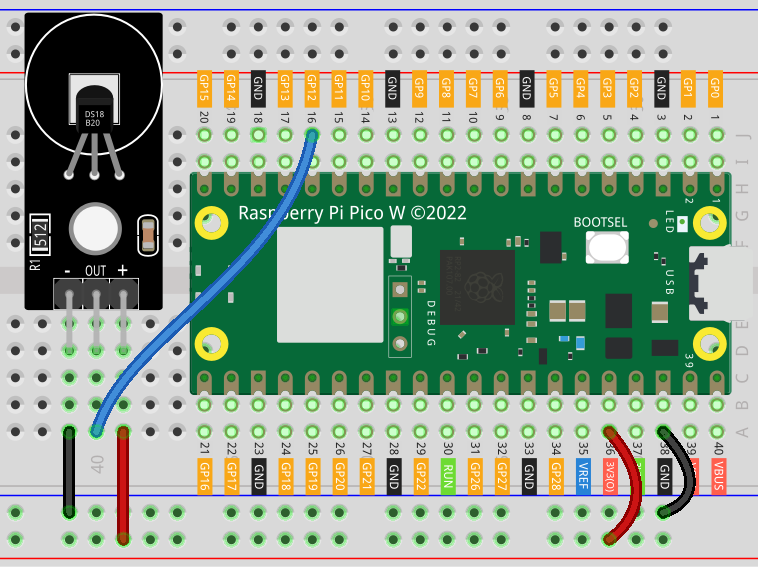

.. note:: 

    Bonjour et bienvenue dans la communauté des passionnés de SunFounder Raspberry Pi, Arduino et ESP32 sur Facebook ! Explorez plus en profondeur le Raspberry Pi, Arduino et ESP32 avec d'autres passionnés.

    **Pourquoi nous rejoindre ?**

    - **Support d’experts** : Résolvez vos problèmes après-vente et vos défis techniques avec l'aide de notre communauté et de notre équipe.
    - **Apprendre et partager** : Échangez des astuces et des tutoriels pour améliorer vos compétences.
    - **Aperçus exclusifs** : Accédez en avant-première aux annonces de nouveaux produits et aperçus.
    - **Réductions spéciales** : Profitez de réductions exclusives sur nos derniers produits.
    - **Promotions festives et concours** : Participez à des concours et promotions pendant les fêtes.

    👉 Prêt à explorer et créer avec nous ? Cliquez sur [|link_sf_facebook|] et rejoignez-nous dès aujourd'hui !

.. _pico_lesson18_ds18b20:

Leçon 18 : Module de Capteur de Température (DS18B20)
========================================================

Dans cette leçon, vous apprendrez à intégrer et à lire les données de température des capteurs DS18B20 en utilisant le Raspberry Pi Pico W. Vous commencerez par configurer un bus OneWire sur la broche GPIO et rechercher les appareils DS18X20. L'objectif principal de cette leçon est de lire en continu et d'afficher les mesures de température provenant de ces capteurs.

Composants Requis
--------------------------

Dans ce projet, nous avons besoin des composants suivants.

Il est définitivement plus pratique d'acheter un kit complet, voici le lien :

.. list-table::
    :widths: 20 20 20
    :header-rows: 1

    *   - Nom	
        - Éléments dans ce kit
        - Lien
    *   - Universal Maker Sensor Kit
        - 94
        - |link_umsk|

Vous pouvez également les acheter séparément via les liens ci-dessous.

.. list-table::
    :widths: 30 20
    :header-rows: 1

    *   - Introduction des composants
        - Lien d'achat

    *   - Raspberry Pi Pico W
        - \-
    *   - :ref:`cpn_ds18b20`
        - \-
    *   - :ref:`cpn_breadboard`
        - |link_breadboard_buy|

Câblage
---------------------------

Code
---------------------------

.. note::

    * Ouvrez le fichier ``18_ds18b20_module.py`` dans le répertoire ``universal-maker-sensor-kit-main/pico/Lesson_18_DS18B20_Module`` ou copiez ce code dans Thonny, puis cliquez sur "Exécuter le script actuel" ou appuyez simplement sur F5 pour l'exécuter. Pour des tutoriels détaillés, veuillez vous référer à :ref:`open_run_code_py`.

    * N'oubliez pas de sélectionner l'interpréteur "MicroPython (Raspberry Pi Pico)" dans le coin inférieur droit.

.. code-block:: python

   from machine import Pin
   import onewire
   import time, ds18x20
   
   # Initialiser le bus OneWire sur la broche GPIO 12
   ow = onewire.OneWire(Pin(12))
   
   # Créer une instance DS18X20 en utilisant le bus OneWire
   ds = ds18x20.DS18X20(ow)
   
   # Rechercher les appareils DS18X20 sur le bus et afficher leurs adresses
   roms = ds.scan()
   print('found devices:', roms)
   
   # Lire et afficher continuellement les données de température des capteurs
   while True:
       # Démarrer le processus de conversion de température
       ds.convert_temp()
       # Attendre la fin de la conversion (750 ms pour DS18X20)
       time.sleep_ms(750)
       
       # Lire et afficher la température de chaque capteur trouvé sur le bus
       for rom in roms:
           print(ds.read_temp(rom))
       
       # Attendre un court délai avant la prochaine lecture (1000 ms)
       time.sleep_ms(1000)

Analyse du Code
---------------------------

1. Importation des Bibliothèques

   Le code commence par importer les bibliothèques nécessaires. ``machine`` est utilisée pour le contrôle des broches GPIO, ``onewire`` pour le protocole de communication OneWire, ``ds18x20`` pour le capteur de température spécifique, et ``time`` pour les délais.

   Pour plus d'informations sur OneWire en MicroPython, vous pouvez consulter |link_micropython_onewire_driver|.

   .. code-block:: python

      from machine import Pin
      import onewire
      import time, ds18x20

2. Initialisation du Bus OneWire

   Un bus OneWire est initialisé sur la broche GPIO 12. Cela permet de configurer la communication entre le Raspberry Pi Pico W et le capteur DS18B20.

   .. code-block:: python

      ow = onewire.OneWire(Pin(12))

3. Création de l'Instance DS18X20

   Une instance DS18X20 est créée en utilisant le bus OneWire. Cette instance est utilisée pour interagir avec le capteur de température.

   .. code-block:: python

      ds = ds18x20.DS18X20(ow)

4. Recherche des Appareils

   Le code recherche les appareils DS18X20 sur le bus OneWire et affiche leurs adresses. Cela permet d'identifier les capteurs connectés.

   .. code-block:: python

      roms = ds.scan()
      print('found devices:', roms)

5. Lecture des Données de Température

   - La boucle principale du programme lit en continu les données de température du capteur.
   - Elle commence le processus de conversion de température et attend qu'il soit terminé, ce qui prend environ 750 millisecondes.
   - Ensuite, elle lit et affiche la température de chaque capteur trouvé sur le bus.
   - La boucle fait une pause de 1000 millisecondes avant de répéter.

   .. raw:: html

       

   .. code-block:: python

      while True:
          ds.convert_temp()
          time.sleep_ms(750)
          for rom in roms:
              print(ds.read_temp(rom))
          time.sleep_ms(1000)