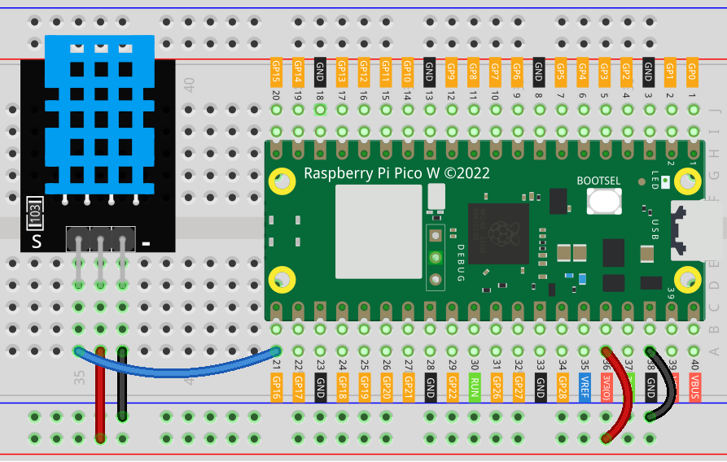
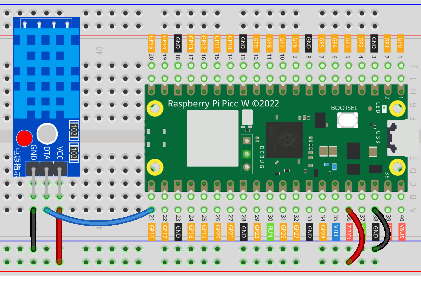

.. note:: 

    ¡Hola, bienvenido a la Comunidad de Entusiastas de Raspberry Pi, Arduino y ESP32 en Facebook! Profundiza en Raspberry Pi, Arduino y ESP32 junto con otros entusiastas.

    **¿Por qué unirte?**

    - **Soporte de expertos**: Resuelve problemas postventa y desafíos técnicos con la ayuda de nuestra comunidad y equipo.
    - **Aprende y comparte**: Intercambia consejos y tutoriales para mejorar tus habilidades.
    - **Avances exclusivos**: Accede a novedades sobre productos y vistas previas de manera anticipada.
    - **Descuentos especiales**: Disfruta de descuentos exclusivos en nuestros productos más recientes.
    - **Promociones festivas y sorteos**: Participa en sorteos y promociones especiales de temporada.

    👉 ¿Listo para explorar y crear con nosotros? Haz clic en [|link_sf_facebook|] y únete hoy mismo!

.. _pico_lesson19_dht11:

Lección 19: Módulo de Sensor de Temperatura y Humedad (DHT11)
====================================================================

En esta lección, aprenderás cómo usar el Raspberry Pi Pico W para conectar un sensor de temperatura y humedad DHT11. Explorarás cómo medir de manera precisa las condiciones ambientales registrando datos de temperatura y humedad. Este tutorial ofrece una guía práctica sobre el uso de sensores digitales con el Raspberry Pi Pico W, programación con MicroPython y gestión de procesamiento de datos en tiempo real. 

Componentes necesarios
--------------------------

En este proyecto, necesitaremos los siguientes componentes. 

Es muy conveniente comprar un kit completo, aquí está el enlace: 

.. list-table::
    :widths: 20 20 20
    :header-rows: 1

    *   - Nombre	
        - ARTÍCULOS EN ESTE KIT
        - ENLACE
    *   - Kit Universal Maker Sensor
        - 94
        - |link_umsk|

También puedes comprarlos por separado desde los siguientes enlaces.

.. list-table::
    :widths: 30 10
    :header-rows: 1

    *   - Introducción del componente
        - Enlace de compra

    *   - Raspberry Pi Pico W
        - \-
    *   - :ref:`cpn_dht11`
        - |link_dht11_humiture_buy|
    *   - :ref:`cpn_breadboard`
        - |link_breadboard_buy|

Conexiones
---------------------------

.. note:: 
   El kit puede contener diferentes versiones del módulo DHT11. Por favor, confirma el método de conexión según el módulo que tengas.

.. csv-table:: 
   :header: "module", "diagram"
   :widths: 25, 75

   |dht11_module|, |dht11_module_circuit|
   |dht11_module_withLED|, |dht11_module_withLED_circuit|

.. |dht11_module| image:: img/Lesson_19_dht11_module.png 
   :width: 100px

.. |dht11_module_withLED| image:: img/Lesson_19_dht11_module_withLED.png
   :width: 150px

Código
---------------------------

.. code-block:: python

   import dht
   import machine
   import time
   
   # Inicializar el sensor DHT11 en GPIO 16
   d = dht.DHT11(machine.Pin(16))
   
   # Leer y mostrar continuamente la temperatura y la humedad
   while True: 
       d.measure()    
       print("Temperature:" ,d.temperature())  # Mostrar temperatura
       print("Humidity:" ,d.humidity())  # Mostrar humedad
       time.sleep_ms(1000)  # Leer cada segundo

Análisis del código
---------------------------

#. Importación de bibliotecas:

   El código comienza importando las bibliotecas necesarias. ``dht`` es para el sensor DHT11, ``machine`` para interactuar con el hardware, y ``time`` para agregar retrasos en el bucle.

   .. code-block:: python
      
      import dht
      import machine
      import time

#. Inicialización del sensor DHT11:

   El sensor DHT11 se inicializa especificando el pin GPIO al que está conectado. En este caso, está conectado al GPIO 16 del Raspberry Pi Pico W. Esto se hace utilizando la función ``machine.Pin``.

   .. code-block:: python

      d = dht.DHT11(machine.Pin(16))

#. Lectura e impresión de datos en un bucle:

   El bucle ``while True`` permite que el programa lea continuamente los datos de temperatura y humedad. Dentro del bucle, se llama a ``d.measure()`` para tomar una nueva medición. ``d.temperature()`` y ``d.humidity()`` se usan para obtener los datos de temperatura y humedad, respectivamente. Estos valores se imprimen. El bucle hace una pausa de un segundo (``1000`` milisegundos) usando ``time.sleep_ms(1000)``, asegurando que los datos se lean e impriman cada segundo.

   .. code-block:: python

      while True: 
          d.measure()    
          print("Temperature:" ,d.temperature())  # Mostrar temperatura
          print("Humidity:" ,d.humidity())  # Mostrar humedad
          time.sleep_ms(1000)  # Leer cada segundo
