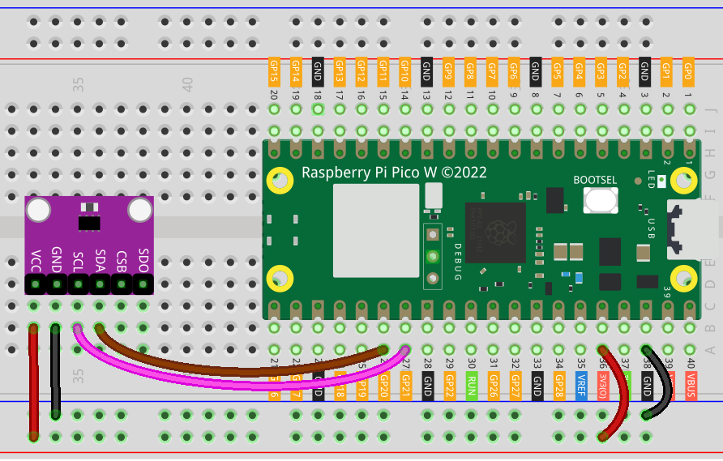

.. note:: 

    Bonjour et bienvenue dans la communauté des passionnés de SunFounder Raspberry Pi, Arduino et ESP32 sur Facebook ! Explorez davantage le Raspberry Pi, Arduino et ESP32 avec d'autres passionnés.

    **Pourquoi nous rejoindre ?**

    - **Support d’experts** : Résolvez vos problèmes après-vente et vos défis techniques avec l'aide de notre communauté et de notre équipe.
    - **Apprendre et partager** : Échangez des astuces et des tutoriels pour améliorer vos compétences.
    - **Aperçus exclusifs** : Accédez en avant-première aux annonces de nouveaux produits et aperçus.
    - **Réductions spéciales** : Profitez de réductions exclusives sur nos derniers produits.
    - **Promotions festives et concours** : Participez à des concours et promotions pendant les fêtes.

    👉 Prêt à explorer et créer avec nous ? Cliquez sur [|link_sf_facebook|] et rejoignez-nous dès aujourd'hui !

.. _pico_lesson20_bmp280:

Leçon 20 : Capteur de Température, Humidité et Pression (BMP280)
====================================================================

Dans cette leçon, vous apprendrez à connecter le capteur BMP280 de température, d'humidité et de pression au Raspberry Pi Pico W en utilisant MicroPython. Vous acquerrez une expérience pratique sur la mise en place de la communication I2C, la configuration du capteur BMP280 pour la surveillance météorologique et l'obtention des données de température et de pression. À la fin de ce tutoriel, vous serez en mesure d'afficher des données environnementales en temps réel sur votre console.

Composants Requis
--------------------------

Dans ce projet, nous avons besoin des composants suivants.

Il est définitivement plus pratique d'acheter un kit complet, voici le lien :

.. list-table::
    :widths: 20 20 20
    :header-rows: 1

    *   - Nom	
        - Éléments dans ce kit
        - Lien
    *   - Universal Maker Sensor Kit
        - 94
        - |link_umsk|

Vous pouvez également les acheter séparément via les liens ci-dessous.

.. list-table::
    :widths: 30 10
    :header-rows: 1

    *   - Introduction des composants
        - Lien d'achat

    *   - Raspberry Pi Pico W
        - \-
    *   - :ref:`cpn_bmp280`
        - |link_bmp280_module_buy|
    *   - :ref:`cpn_breadboard`
        - |link_breadboard_buy|

Câblage
---------------------------

Code
---------------------------

.. note::

    * Ouvrez le fichier ``20_bmp280_module.py`` situé dans le dossier ``universal-maker-sensor-kit-main/pico/Lesson_20_BMP280_Module`` ou copiez ce code dans Thonny, puis cliquez sur "Run Current Script" ou appuyez simplement sur F5 pour l'exécuter. Pour des tutoriels détaillés, veuillez consulter :ref:`open_run_code_py`.

    * Vous devez également utiliser le fichier ``bmp280.py``, veuillez vérifier s'il a bien été téléchargé sur le Pico W. Pour un tutoriel détaillé, consultez :ref:`add_libraries_py`.

    * N'oubliez pas de sélectionner l'interpréteur "MicroPython (Raspberry Pi Pico)" dans le coin inférieur droit.

.. code-block:: python

   from machine import I2C, Pin
   import bmp280
   import time
   
   # Initialiser la communication I2C
   i2c = I2C(0, sda=Pin(20), scl=Pin(21), freq=100000)
   
   # Configurer le capteur BMP280
   bmp = bmp280.BMP280(i2c)
   bmp.oversample(bmp280.BMP280_OS_HIGH)
   
   while True:
       # Configurer le capteur en mode de surveillance météorologique
       bmp.use_case(bmp280.BMP280_CASE_WEATHER)
   
       # Afficher les données de température et de pression
       print("tempC: {}".format(bmp.temperature))
       print("pressure: {}Pa".format(bmp.pressure))
   
       # Lire les données toutes les secondes
       time.sleep_ms(1000)

Analyse du Code
---------------------------

1. **Importation des Bibliothèques et Initialisation de la Communication I2C** :

   Ce segment de code importe les bibliothèques nécessaires et initialise la communication I2C. Le module ``machine`` est utilisé pour interagir avec les composants matériels comme l'I2C et les broches. La bibliothèque ``bmp280`` est importée pour interagir avec le capteur BMP280.

   Pour plus d'informations sur la bibliothèque ``bmp280``, veuillez consulter |link_micropython_bmp280_driver|.

   .. code-block:: python

      from machine import I2C, Pin
      import bmp280
      import time

      # Initialiser la communication I2C
      i2c = I2C(0, sda=Pin(20), scl=Pin(21), freq=100000)

2. **Configuration du Capteur BMP280** :

   Ici, le capteur BMP280 est configuré. Un objet ``bmp`` est créé pour interagir avec le capteur. Le paramètre d'oversampling est ajusté pour obtenir une plus grande précision.

   .. code-block:: python

      # Configurer le capteur BMP280
      bmp = bmp280.BMP280(i2c)
      bmp.oversample(bmp280.BMP280_OS_HIGH)

3. **Lecture et Affichage des Données du Capteur dans une Boucle** :

   Le capteur est continuellement lu dans une boucle infinie. À chaque itération, le capteur est configuré en mode de surveillance météorologique, la température et la pression sont lues et affichées. La fonction ``time.sleep_ms(1000)`` garantit que la boucle s'exécute une fois par seconde.

   .. code-block:: python

      while True:
          # Configurer le capteur en mode de surveillance météorologique
          bmp.use_case(bmp280.BMP280_CASE_WEATHER)

          # Afficher les données de température et de pression
          print("tempC: {}".format(bmp.temperature))
          print("pressure: {}Pa".format(bmp.pressure))

          # Lire les données toutes les secondes
          time.sleep_ms(1000)