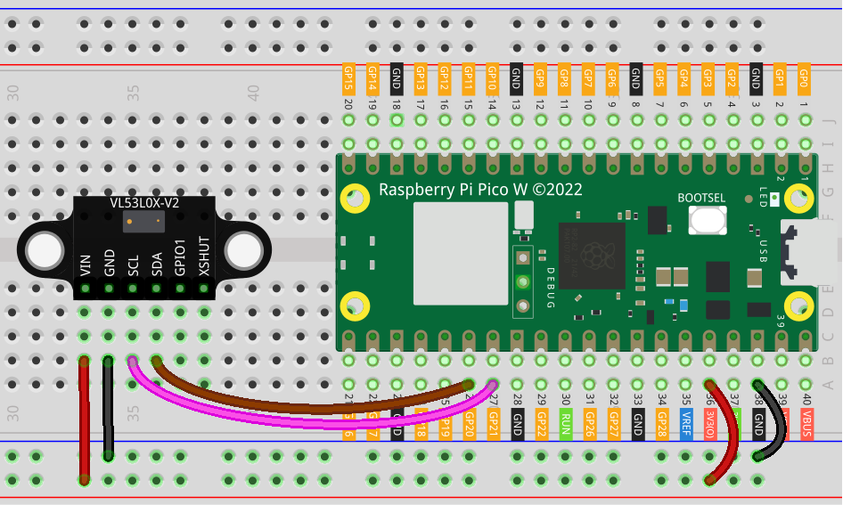

.. note:: 

    Bonjour et bienvenue dans la communauté des passionnés de SunFounder Raspberry Pi, Arduino et ESP32 sur Facebook ! Explorez plus profondément le Raspberry Pi, Arduino et ESP32 avec d'autres passionnés.

    **Pourquoi nous rejoindre ?**

    - **Support d'experts** : Résolvez vos problèmes après-vente et défis techniques grâce à l'aide de notre communauté et de notre équipe.
    - **Apprendre et partager** : Échangez des astuces et des tutoriels pour améliorer vos compétences.
    - **Aperçus exclusifs** : Accédez en avant-première aux annonces de nouveaux produits et aperçus.
    - **Réductions spéciales** : Profitez de réductions exclusives sur nos derniers produits.
    - **Promotions festives et concours** : Participez à des concours et promotions lors des fêtes.

    👉 Prêt à explorer et créer avec nous ? Cliquez sur [|link_sf_facebook|] et rejoignez-nous dès aujourd'hui !

.. _pico_lesson21_vl53l0x:

Leçon 21 : Capteur de Distance Micro-LIDAR Time of Flight (VL53L0X)
=======================================================================

Dans cette leçon, vous apprendrez à utiliser le Raspberry Pi Pico W pour mesurer des distances avec le capteur de distance micro-LIDAR Time of Flight VL53L0X. Nous vous guiderons dans la mise en place de la communication I2C entre le Raspberry Pi Pico W et le capteur, puis nous explorerons la configuration des paramètres du capteur pour une performance optimale. Vous apprendrez également à ajuster le timing de mesure et les périodes de pulsation VCSEL pour améliorer la précision et la portée.

Composants Requis
--------------------------

Dans ce projet, nous avons besoin des composants suivants.

Il est définitivement plus pratique d'acheter un kit complet, voici le lien :

.. list-table::
    :widths: 20 20 20
    :header-rows: 1

    *   - Nom	
        - Éléments dans ce kit
        - Lien
    *   - Universal Maker Sensor Kit
        - 94
        - |link_umsk|

Vous pouvez également les acheter séparément via les liens ci-dessous.

.. list-table::
    :widths: 30 10
    :header-rows: 1

    *   - Introduction des composants
        - Lien d'achat

    *   - Raspberry Pi Pico W
        - \-
    *   - :ref:`cpn_VL53L0X`
        - |link_vl53l0x_module_buy|
    *   - :ref:`cpn_breadboard`
        - |link_breadboard_buy|

Câblage
---------------------------

Code
---------------------------

.. note::

    * Ouvrez le fichier ``21_vl53l0x_module.py`` situé dans le chemin ``universal-maker-sensor-kit-main/pico/Lesson_21_VL53L0X_Module`` ou copiez ce code dans Thonny, puis cliquez sur "Run Current Script" ou appuyez simplement sur F5 pour l'exécuter. Pour des tutoriels détaillés, veuillez consulter :ref:`open_run_code_py`.

    * Vous devez également utiliser le fichier ``vl53l0x.py``, veuillez vérifier s'il a bien été téléchargé sur le Pico W. Pour un tutoriel détaillé, consultez :ref:`add_libraries_py`.

    * N'oubliez pas de sélectionner l'interpréteur "MicroPython (Raspberry Pi Pico)" dans le coin inférieur droit.

.. code-block:: python

   import time
   from machine import Pin, I2C
   from vl53l0x import VL53L0X
   
   print("setting up i2c")
   id = 0
   sda = Pin(20)
   scl = Pin(21)
   
   i2c = I2C(id=id, sda=sda, scl=scl)
   
   print(i2c.scan())
   
   # print("Création de l'objet vl53lox")
   # Créer un objet VL53L0X
   tof = VL53L0X(i2c)
   
   # Pré : 12 à 18 (initialisé à 14 par défaut)
   # Final : 8 à 14 (initialisé à 10 par défaut)
   
   # Le "measurement_timing_budget" est une valeur en ms. Plus le budget est long, plus la lecture est précise.
   budget = tof.measurement_timing_budget_us
   print("Budget was:", budget)
   tof.set_measurement_timing_budget(40000)
   
   # Définit la période de pulsation VCSEL (Vertical Cavity Surface Emitting Laser) pour le
   # type de période donné (VL53L0X::VcselPeriodPreRange ou VL53L0X::VcselPeriodFinalRange)
   # à la valeur spécifiée (en PCLKs). Des périodes plus longues augmentent la portée du capteur.
   # Les valeurs valides sont (seulement des nombres pairs) :
   
   # tof.set_Vcsel_pulse_period(tof.vcsel_period_type[0], 18)
   tof.set_Vcsel_pulse_period(tof.vcsel_period_type[0], 12)
   
   # tof.set_Vcsel_pulse_period(tof.vcsel_period_type[1], 14)
   tof.set_Vcsel_pulse_period(tof.vcsel_period_type[1], 8)
   
   while True:
       # Démarrer la mesure de distance
       print(tof.ping() - 50, "mm")
   
       time.sleep_ms(100)  # Petite pause de 0,1 seconde pour réduire l'utilisation du processeur

Analyse du Code
---------------------------

1. **Configuration de l'Interface I2C** :

   Le code commence par l'importation des modules nécessaires et l'initialisation de la communication I2C. Le module ``machine`` est utilisé pour configurer l'I2C avec les bonnes broches du Raspberry Pi Pico W.

   Pour plus d'informations sur la bibliothèque ``vl53l0x``, veuillez consulter |link_micropython_vl53l0x_driver|.

   .. code-block:: python

      import time
      from machine import Pin, I2C
      from vl53l0x import VL53L0X

      print("setting up i2c")
      id = 0
      sda = Pin(20)
      scl = Pin(21)
      i2c = I2C(id=id, sda=sda, scl=scl)
      print(i2c.scan())

2. **Création de l'Objet VL53L0X** :

   Un objet de la classe ``VL53L0X`` est créé. Cet objet sera utilisé pour interagir avec le capteur VL53L0X.

   .. code-block:: python

      tof = VL53L0X(i2c)

3. **Configuration du Timing de Mesure** :

   Le "timing budget" de la mesure est configuré. Cela détermine le temps que le capteur met pour effectuer une mesure. Un budget de temps plus long permet des lectures plus précises.

   .. code-block:: python

      budget = tof.measurement_timing_budget_us
      print("Budget was:", budget)
      tof.set_measurement_timing_budget(40000)

4. **Réglage des Périodes de Pulsation VCSEL** :

   Ici, les périodes de pulsation pour le VCSEL (Vertical Cavity Surface Emitting Laser) sont réglées. Cela affecte la portée et la précision du capteur.

   .. code-block:: python

      tof.set_Vcsel_pulse_period(tof.vcsel_period_type[0], 12)
      tof.set_Vcsel_pulse_period(tof.vcsel_period_type[1], 8)

5. **Boucle de Mesure Continue** :

   Le capteur mesure en continu la distance et l'affiche. La méthode ``ping()`` de la classe ``VL53L0X`` est utilisée pour obtenir la distance en millimètres. Une petite pause est ajoutée pour réduire l'utilisation du processeur.

   .. code-block:: python

      while True:
          print(tof.ping() - 50, "mm")
          time.sleep_ms(100)