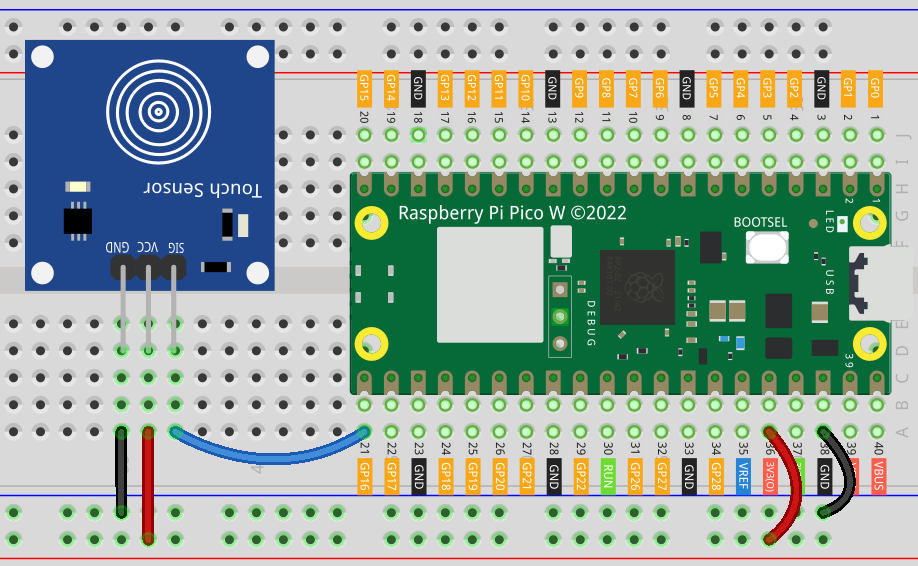

.. note:: 

    ¡Hola, bienvenido a la comunidad de entusiastas de Raspberry Pi, Arduino y ESP32 de SunFounder en Facebook! Profundiza en Raspberry Pi, Arduino y ESP32 con otros entusiastas.

    **¿Por qué unirse?**

    - **Soporte Experto**: Resuelve problemas post-venta y desafíos técnicos con la ayuda de nuestra comunidad y equipo.
    - **Aprende y Comparte**: Intercambia consejos y tutoriales para mejorar tus habilidades.
    - **Avances Exclusivos**: Obtén acceso anticipado a anuncios de nuevos productos y avances.
    - **Descuentos Especiales**: Disfruta de descuentos exclusivos en nuestros productos más nuevos.
    - **Promociones Festivas y Sorteos**: Participa en sorteos y promociones de temporada.

    👉 ¿Listo para explorar y crear con nosotros? Haz clic en [|link_sf_facebook|] y únete hoy mismo!

.. _pico_lesson22_touch_sensor:

Lección 22: Módulo Sensor Táctil
=====================================

En esta lección, aprenderás a conectar un sensor táctil al Raspberry Pi Pico W para controlar un LED integrado. Usando un código Python sencillo, configurarás el sensor táctil como un dispositivo de entrada. Cuando el sensor detecta un toque, enviará una señal para encender el LED, proporcionando una indicación visual de que se ha detectado un toque. Por el contrario, cuando no hay toque, el LED permanece apagado.

Componentes Requeridos
--------------------------

En este proyecto, necesitamos los siguientes componentes.

Es muy conveniente comprar un kit completo, aquí tienes el enlace:

.. list-table::
    :widths: 20 20 20
    :header-rows: 1

    *   - Nombre
        - ARTÍCULOS EN ESTE KIT
        - ENLACE
    *   - Kit Sensor Universal Maker
        - 94
        - |link_umsk|

También puedes comprarlos por separado desde los siguientes enlaces.

.. list-table::
    :widths: 30 20
    :header-rows: 1

    *   - Introducción del componente
        - Enlace de compra

    *   - Raspberry Pi Pico W
        - \-
    *   - :ref:`cpn_touch`
        - |link_touch_buy|
    *   - :ref:`cpn_breadboard`
        - |link_breadboard_buy|

Conexión
---------------------------

Código
---------------------------

.. code-block:: python

   from machine import Pin
   import time
   
   # Configurar el GPIO 16 como un pin de entrada para leer el estado del sensor táctil
   touch_sensor = Pin(16, Pin.IN)
   
   # Inicializar el LED integrado del Raspberry Pi Pico W
   led = Pin("LED", Pin.OUT)
   
   while True:
       if touch_sensor.value() == 1:
           led.value(1)  # Encender el LED
           print("Touch detected!")
       else:
           led.value(0)  # Apagar el LED
           print("No touch detected")
   
       time.sleep(0.1)  # Pausa corta para reducir el uso de la CPU

Análisis del Código
---------------------------

#. **Configuración de los pines**:

   Aquí importamos las bibliotecas necesarias y configuramos los pines GPIO. El sensor táctil está conectado al GPIO 16 como entrada, y el LED integrado está configurado como salida.

   .. code-block:: python

      from machine import Pin
      import time

      touch_sensor = Pin(16, Pin.IN)
      led = Pin("LED", Pin.OUT)

#. **Bucle principal y detección de toques**:

   En un bucle infinito, el código comprueba constantemente el estado del sensor táctil. Si se detecta un toque (valor igual a 1), se enciende el LED y se imprime un mensaje. De lo contrario, el LED permanece apagado y se imprime otro mensaje. Se agrega una pequeña pausa para reducir el uso de la CPU.

   .. code-block:: python

      while True:
          if touch_sensor.value() == 1:
              led.value(1)  # Encender el LED
              print("Touch detected!")
          else:
              led.value(0)  # Apagar el LED
              print("No touch detected")

          time.sleep(0.1)  # Pausa corta para reducir el uso de la CPU