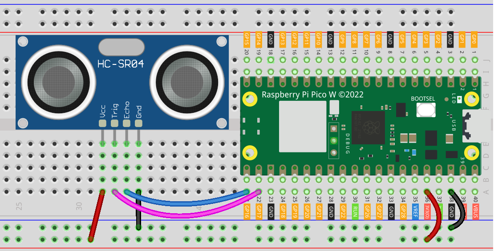

.. note:: 

    ¡Hola, bienvenido a la comunidad de entusiastas de Raspberry Pi, Arduino y ESP32 de SunFounder en Facebook! Profundiza en Raspberry Pi, Arduino y ESP32 con otros entusiastas.

    **¿Por qué unirse?**

    - **Soporte Experto**: Resuelve problemas post-venta y desafíos técnicos con la ayuda de nuestra comunidad y equipo.
    - **Aprende y Comparte**: Intercambia consejos y tutoriales para mejorar tus habilidades.
    - **Avances Exclusivos**: Obtén acceso anticipado a anuncios de nuevos productos y avances.
    - **Descuentos Especiales**: Disfruta de descuentos exclusivos en nuestros productos más nuevos.
    - **Promociones Festivas y Sorteos**: Participa en sorteos y promociones de temporada.

    👉 ¿Listo para explorar y crear con nosotros? Haz clic en [|link_sf_facebook|] y únete hoy mismo!

.. _pico_lesson23_ultrasonic:

Lección 23: Módulo Sensor Ultrasonido (HC-SR04)
================================================

En esta lección, aprenderás a medir distancias utilizando el Raspberry Pi Pico W y un sensor ultrasónico HC-SR04. Aprenderás cómo conectar el sensor al Pico W y escribir un script en MicroPython para controlarlo. La lección abordará cómo calcular distancias en función del tiempo que tardan las ondas ultrasónicas en reflejarse desde los objetos. Este proyecto práctico proporciona conocimientos sobre el trabajo con sensores, el manejo de señales digitales y cálculos básicos en MicroPython, siendo ideal para quienes estén interesados en la interfaz de hardware con el Raspberry Pi Pico W.

Componentes Requeridos
--------------------------

En este proyecto, necesitamos los siguientes componentes.

Es muy conveniente comprar un kit completo, aquí tienes el enlace:

.. list-table::
    :widths: 20 20 20
    :header-rows: 1

    *   - Nombre
        - ARTÍCULOS EN ESTE KIT
        - ENLACE
    *   - Kit Sensor Universal Maker
        - 94
        - |link_umsk|

También puedes comprarlos por separado desde los siguientes enlaces.

.. list-table::
    :widths: 30 20
    :header-rows: 1

    *   - Introducción del componente
        - Enlace de compra

    *   - Raspberry Pi Pico W
        - \-
    *   - :ref:`cpn_ultrasonic`
        - |link_ultrasonic_buy|
    *   - :ref:`cpn_breadboard`
        - |link_breadboard_buy|

Conexión
---------------------------

Código
---------------------------

.. code-block:: python

   import machine  # Importar módulo machine para control de hardware
   import time  # Importar módulo time para retrasos
   
   # Definir números de pines para TRIG y ECHO del sensor ultrasónico
   TRIG = machine.Pin(17, machine.Pin.OUT)  # Pin TRIG como salida
   ECHO = machine.Pin(16, machine.Pin.IN)  # Pin ECHO como entrada
   
   
   def distance():
       # Función para calcular distancia en centímetros
       TRIG.low()  # Establecer TRIG en bajo
       time.sleep_us(2)  # Esperar 2 microsegundos
       TRIG.high()  # Establecer TRIG en alto
       time.sleep_us(10)  # Esperar 10 microsegundos
       TRIG.low()  # Establecer TRIG en bajo nuevamente
   
       # Esperar a que el pin ECHO se ponga en alto
       while not ECHO.value():
           pass
   
       time1 = time.ticks_us()  # Registrar el tiempo cuando ECHO se pone en alto
   
       # Esperar a que el pin ECHO se ponga en bajo
       while ECHO.value():
           pass
   
       time2 = time.ticks_us()  # Registrar el tiempo cuando ECHO se pone en bajo
   
       # Calcular la duración del pin ECHO en alto
       during = time.ticks_diff(time2, time1)
   
       # Devolver la distancia calculada (usando la velocidad del sonido)
       return during * 340 / 2 / 10000  # Distancia en centímetros
   
   
   # Bucle principal
   while True:
       dis = distance()  # Obtener distancia del sensor
       print("Distance: %.2f cm" % dis)  # Imprimir distancia
       time.sleep_ms(300)  # Esperar 300 milisegundos antes de la siguiente medición

Análisis del Código
---------------------------

#. **Importación de bibliotecas**

   Se importan los módulos ``machine`` y ``time`` para acceder a funciones específicas de hardware y relacionadas con el tiempo, respectivamente.

   .. code-block:: python

      import machine
      import time

#. **Configuración de pines para el HC-SR04**

   Se definen dos pines GPIO para el sensor HC-SR04: ``TRIG`` es un pin de salida para activar el pulso ultrasónico, y ``ECHO`` es un pin de entrada para recibir el pulso reflejado.

   .. code-block:: python

      TRIG = machine.Pin(17, machine.Pin.OUT)
      ECHO = machine.Pin(16, machine.Pin.IN)

#. **Función de medición de distancia**

   La función ``distance`` activa el pulso ultrasónico y calcula la distancia en función del tiempo que tarda el eco en regresar. Utiliza funciones basadas en el tiempo para medir la duración del eco.

   Para más detalles, consulta el principio de funcionamiento :ref:`principle <cpn_ultrasonic_principle>` del módulo sensor ultrasónico.

   .. code-block:: python

      def distance():
          TRIG.low()
          time.sleep_us(2)
          TRIG.high()
          time.sleep_us(10)
          TRIG.low()

          while not ECHO.value():
              pass

          time1 = time.ticks_us()

          while ECHO.value():
              pass

          time2 = time.ticks_us()
          during = time.ticks_diff(time2, time1)
          return during * 340 / 2 / 10000

#. **Bucle principal**

   El bucle principal llama continuamente a la función ``distance`` e imprime la distancia medida. Espera 300 milisegundos entre cada medición para evitar la saturación del sensor.

   .. code-block:: python
    
      while True:
          dis = distance()
          print("Distance: %.2f cm" % dis)
          time.sleep_ms(300)