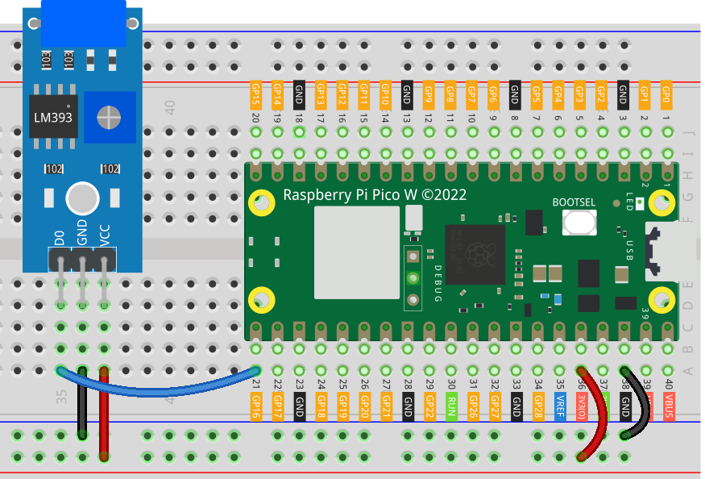

 
.. note::

   Hallo und willkommen in der SunFounder Raspberry Pi & Arduino & ESP32 Enthusiasten-Gemeinschaft auf Facebook! Tauchen Sie tiefer ein in die Welt von Raspberry Pi, Arduino und ESP32 mit anderen Enthusiasten.

   **Warum beitreten?**

   - **Expertenunterstützung**: Lösen Sie Nachverkaufsprobleme und technische Herausforderungen mit Hilfe unserer Gemeinschaft und unseres Teams.
   - **Lernen & Teilen**: Tauschen Sie Tipps und Anleitungen aus, um Ihre Fähigkeiten zu verbessern.
   - **Exklusive Vorschauen**: Erhalten Sie frühzeitigen Zugang zu neuen Produktankündigungen und exklusiven Einblicken.
   - **Spezialrabatte**: Genießen Sie exklusive Rabatte auf unsere neuesten Produkte.
   - **Festliche Aktionen und Gewinnspiele**: Nehmen Sie an Gewinnspielen und Feiertagsaktionen teil.

   👉 Sind Sie bereit, mit uns zu erkunden und zu erschaffen? Klicken Sie auf [|link_sf_facebook|] und treten Sie heute bei!

.. _pico_lesson24_vibration_sensor:

Lektion 24: Vibrationsensorsmodul (SW-420)
==============================================

In dieser Lektion lernen Sie, wie Sie ein SW-420 Vibrationsensorsmodul mit einem Raspberry Pi Pico W verbinden und verwenden. Der Kurs führt Sie durch die Einrichtung des Vibrationsensors am GPIO 16 und das Schreiben eines MicroPython-Skripts zur Überwachung von Vibrationen. Sie werden eine Schleife schreiben, um kontinuierlich den Ausgang des Sensors zu überprüfen, und eine Meldung anzeigen, wenn Vibrationen erkannt werden. Diese praktische Übung führt Sie in die Arbeit mit externen Sensoren am Raspberry Pi Pico W ein und vertieft Ihr Verständnis für die Hardware-Interaktion und Programmierung in MicroPython.

Benötigte Komponenten
--------------------------

Für dieses Projekt benötigen wir folgende Komponenten. 

Es ist definitiv praktisch, ein ganzes Kit zu kaufen, hier ist der Link: 

.. list-table::
    :widths: 20 20 20
    :header-rows: 1

    *   - Name	
        - ITEMS IN THIS KIT
        - LINK
    *   - Universal Maker Sensor Kit
        - 94
        - |link_umsk|

Sie können sie auch separat von den folgenden Links kaufen.

.. list-table::
    :widths: 30 20
    :header-rows: 1

    *   - Component Introduction
        - Purchase Link

    *   - Raspberry Pi Pico W
        - |link_picow_buy|
    *   - :ref:`cpn_vibration`
        - |link_sw420_vibration_module_buy|
    *   - :ref:`cpn_breadboard`
        - |link_breadboard_buy|

Verkabelung
---------------------------

Code
---------------------------

.. code-block:: python

   from machine import Pin
   import time
   
   # Initialize GPIO 16 as an input pin for the vibration sensor
   vibration_sensor = Pin(16, Pin.IN)
   
   # Continuously check the vibration sensor's state
   while True:
       # If the sensor detects vibration (value is 1), print a message
       if vibration_sensor.value() == 1:
           print("Vibration detected!")
       # If no vibration is detected, print ellipses
       else:
           print("...")
   
       # Pause for 0.1 seconds to lower the demand on the CPU
       time.sleep(0.1)

Codeanalyse
---------------------------

#. Importieren der benötigten Bibliotheken

   .. code-block:: python

      from machine import Pin
      import time

   Dies importiert das Modul ``machine``für hardwarebezogene Operationen und das Modul ``time`` für die Handhabung zeitbezogener Aufgaben.

#. Initialisierung des Vibrationsensors

   .. code-block:: python
 
      # Initialize GPIO 16 as an input pin for the vibration sensor
      vibration_sensor = Pin(16, Pin.IN)
 
   Hier wird GPIO 16 als Eingangspin eingerichtet. Die Klasse ``Pin`` aus dem Modul ``machine`` wird verwendet, um mit den GPIO-Pins zu interagieren. "Pin.IN" konfiguriert ihn als Eingang.

#. Kontinuierliche Überwachung des Sensors

   .. code-block:: python

      # Continuously check the vibration sensor's state
      while True:

   Eine ``while True`` -Schleife wird verwendet, um eine endlose Schleife zu erstellen, die den Zustand des Sensors kontinuierlich überprüft.

#. Überprüfung des Sensorzustands und Reaktion

   .. code-block:: python

          # If the sensor detects vibration (value is 1), print a message
          if vibration_sensor.value() == 1:
              print("Vibration detected!")
          # If no vibration is detected, print ellipses
          else:
              print("...")

   Innerhalb der Schleife überprüft ``vibration_sensor.value()`` den aktuellen Zustand des Sensors. Wenn er ``1`` zurückgibt, deutet dies darauf hin, dass Vibrationen erkannt wurden, und es wird eine Nachricht ausgegeben. Andernfalls werden Auslassungspunkte gedruckt.

#. Verwaltung der CPU-Auslastung

   .. code-block:: python

          # Pause for 0.1 seconds to lower the demand on the CPU
          time.sleep(0.1)

   ``time.sleep(0.1)`` pausiert die Schleife für 0,1 Sekunden. Dies ist wichtig, um zu verhindern, dass das Skript zu viel CPU-Zeit verbraucht.
