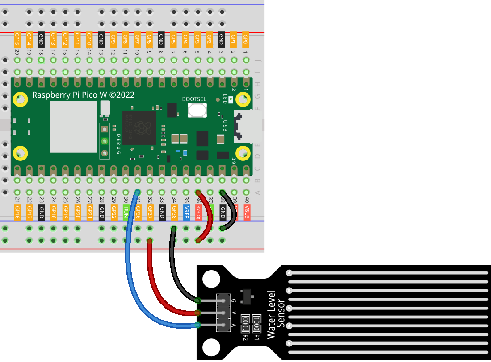

.. note:: 

    ¡Hola, bienvenido a la comunidad de entusiastas de Raspberry Pi, Arduino y ESP32 de SunFounder en Facebook! Profundiza en Raspberry Pi, Arduino y ESP32 con otros entusiastas.

    **¿Por qué unirse?**

    - **Soporte Experto**: Resuelve problemas post-venta y desafíos técnicos con la ayuda de nuestra comunidad y equipo.
    - **Aprende y Comparte**: Intercambia consejos y tutoriales para mejorar tus habilidades.
    - **Avances Exclusivos**: Obtén acceso anticipado a anuncios de nuevos productos y avances.
    - **Descuentos Especiales**: Disfruta de descuentos exclusivos en nuestros productos más nuevos.
    - **Promociones Festivas y Sorteos**: Participa en sorteos y promociones de temporada.

    👉 ¿Listo para explorar y crear con nosotros? Haz clic en [|link_sf_facebook|] y únete hoy mismo!

.. _pico_lesson25_water_level:

Lección 25: Módulo Sensor de Nivel de Agua
============================================

En esta lección, aprenderás a usar el Raspberry Pi Pico W para medir niveles de agua con un sensor de nivel de agua. Aprenderás cómo conectar el sensor a la placa, leer su salida analógica utilizando MicroPython e interpretar estas lecturas para determinar los niveles de agua. Esta sesión práctica tiene como objetivo desarrollar tus habilidades en integración de sensores y adquisición de datos con el Raspberry Pi Pico W.

Componentes Requeridos
---------------------------

En este proyecto, necesitamos los siguientes componentes.

Es muy conveniente comprar un kit completo, aquí tienes el enlace:

.. list-table::
    :widths: 20 20 20
    :header-rows: 1

    *   - Nombre
        - ARTÍCULOS EN ESTE KIT
        - ENLACE
    *   - Kit Sensor Universal Maker
        - 94
        - |link_umsk|

También puedes comprarlos por separado desde los siguientes enlaces.

.. list-table::
    :widths: 30 20
    :header-rows: 1

    *   - Introducción del componente
        - Enlace de compra

    *   - Raspberry Pi Pico W
        - \-
    *   - :ref:`cpn_water_level`
        - \-
    *   - :ref:`cpn_breadboard`
        - |link_breadboard_buy|

Conexión
---------------------------

Código
---------------------------

.. code-block:: python

   import machine
   import utime
   
   # Inicializar un objeto ADC en el pin GPIO 26.
   # Este se utiliza típicamente para leer señales analógicas.
   water_level_sensor = machine.ADC(26)
   
   # Leer continuamente y mostrar los datos del sensor.
   while True:
       value = water_level_sensor.read_u16()  # Leer y convertir el valor analógico a un entero de 16 bits
       print("AO:", value)  # Mostrar el valor analógico
   
       utime.sleep_ms(200)  # Esperar 200 milisegundos antes de la siguiente lectura

Análisis del Código
---------------------------

#. Importación de Bibliotecas

   Aquí importamos las bibliotecas necesarias: ``machine`` para las interacciones con el hardware y ``utime`` para las funciones relacionadas con el tiempo.

   .. code-block:: python

      import machine
      import utime

#. Inicialización del Sensor de Nivel de Agua

   Se crea un objeto ADC en el pin GPIO 26 para leer las señales analógicas del sensor de nivel de agua. El ADC es crucial para convertir las señales analógicas del sensor a un formato digital que el microcontrolador pueda procesar.

   .. code-block:: python

      # Inicializar un objeto ADC en el pin GPIO 26.
      water_level_sensor = machine.ADC(26)

#. Lectura y Visualización de los Datos del Sensor

   El bucle ``while True`` permite la lectura continua de los datos del sensor. El método ``read_u16`` convierte la señal analógica a un entero de 16 bits. El valor se muestra y el bucle se pausa durante 200 milisegundos utilizando ``utime.sleep_ms(200)`` para evitar lecturas rápidas consecutivas.

   .. code-block:: python

      while True:
          value = water_level_sensor.read_u16()  # Leer y convertir el valor analógico a un entero de 16 bits
          print("AO:", value)  # Mostrar el valor analógico

          utime.sleep_ms(200)  # Esperar 200 milisegundos antes de la siguiente lectura