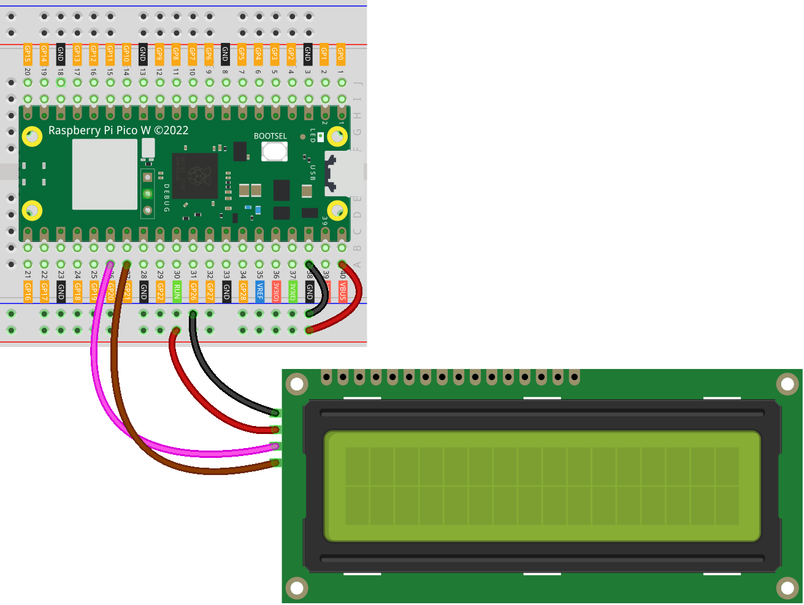

.. note:: 

    ¡Hola, bienvenido a la comunidad de entusiastas de Raspberry Pi, Arduino y ESP32 de SunFounder en Facebook! Profundiza en Raspberry Pi, Arduino y ESP32 con otros entusiastas.

    **¿Por qué unirse?**

    - **Soporte Experto**: Resuelve problemas post-venta y desafíos técnicos con la ayuda de nuestra comunidad y equipo.
    - **Aprende y Comparte**: Intercambia consejos y tutoriales para mejorar tus habilidades.
    - **Avances Exclusivos**: Obtén acceso anticipado a anuncios de nuevos productos y avances.
    - **Descuentos Especiales**: Disfruta de descuentos exclusivos en nuestros productos más nuevos.
    - **Promociones Festivas y Sorteos**: Participa en sorteos y promociones de temporada.

    👉 ¿Listo para explorar y crear con nosotros? Haz clic en [|link_sf_facebook|] y únete hoy mismo!

.. _pico_lesson26_lcd:

Lección 26: LCD I2C 1602
==================================

En esta lección, aprenderás a conectar una pantalla LCD 1602 con I2C a un Raspberry Pi Pico W. Entenderás cómo configurar la comunicación I2C, mostrar y borrar mensajes en la pantalla LCD utilizando MicroPython.

Componentes Requeridos
--------------------------

En este proyecto, necesitamos los siguientes componentes.

Es muy conveniente comprar un kit completo, aquí tienes el enlace:

.. list-table::
    :widths: 20 20 20
    :header-rows: 1

    *   - Nombre
        - ARTÍCULOS EN ESTE KIT
        - ENLACE
    *   - Kit Sensor Universal Maker
        - 94
        - |link_umsk|

También puedes comprarlos por separado desde los siguientes enlaces.

.. list-table::
    :widths: 30 20
    :header-rows: 1

    *   - Introducción del componente
        - Enlace de compra

    *   - Raspberry Pi Pico W
        - \-
    *   - :ref:`cpn_i2c_lcd1602`
        - |link_i2clcd1602_buy|
    *   - :ref:`cpn_breadboard`
        - |link_breadboard_buy|

Conexión
---------------------------

.. note:: 
   Para asegurar que el módulo LCD funcione correctamente, aliméntalo utilizando el pin VBUS del Pico.

Código
---------------------------

.. note::

    * Abre el archivo ``26_lcd1602_module.py`` en la ruta ``universal-maker-sensor-kit-main/pico/Lesson_26_I2C_LCD1602_Module`` o copia este código en Thonny, luego haz clic en "Ejecutar Script Actual" o simplemente presiona F5 para ejecutarlo. Para tutoriales detallados, consulta :ref:`open_run_code_py`.

    * Aquí debes usar el archivo ``lcd1602.py``, asegúrate de que esté cargado en el Pico W, para un tutorial detallado consulta :ref:`add_libraries_py`.

    * No olvides hacer clic en el intérprete "MicroPython (Raspberry Pi Pico)" en la esquina inferior derecha.

.. code-block:: python

   from machine import I2C, Pin
   from lcd1602 import LCD
   import time
   
   # Inicializar comunicación I2C;
   # Configurar SDA en el pin 20, SCL en el pin 21, y frecuencia en 400kHz
   i2c = I2C(0, sda=Pin(20), scl=Pin(21), freq=400000)
   
   # Crear un objeto LCD para interactuar con la pantalla LCD1602
   lcd = LCD(i2c)
   
   # Mostrar el primer mensaje en la pantalla LCD
   # Usa '\n' para crear una nueva línea.
   string = "SunFounder\n    LCD Tutorial"
   lcd.message(string)
   # Esperar 2 segundos
   time.sleep(2)
   # Limpiar la pantalla
   lcd.clear()
   
   # Mostrar el segundo mensaje en la pantalla LCD
   string = "Hello\n  World!"
   lcd.message(string)
   # Esperar 5 segundos
   time.sleep(5)
   # Limpiar la pantalla antes de salir
   lcd.clear()

Análisis del Código
---------------------------

#. Configuración de la Comunicación I2C

   El módulo ``machine`` se utiliza para configurar la comunicación I2C. Se definen los pines SDA (Datos Seriales) y SCL (Reloj Serial) (pin 20 y 21 respectivamente), junto con la frecuencia I2C (400kHz).

   .. code-block:: python
      
      from machine import I2C, Pin
      i2c = I2C(0, sda=Pin(20), scl=Pin(21), freq=400000)

#. Inicialización de la Pantalla LCD

   La clase ``LCD`` del módulo ``lcd1602`` se instancia. Esta clase maneja la comunicación con la pantalla LCD a través de I2C. Se crea un objeto ``LCD`` utilizando el objeto ``i2c``.

   Para más usos de la librería ``lcd1602``, consulta el archivo ``lcd1602.py``.

   .. code-block:: python
      
      from lcd1602 import LCD
      lcd = LCD(i2c)

#. Mostrar Mensajes en la Pantalla LCD

   El método ``message`` del objeto ``LCD`` se usa para mostrar texto en la pantalla. El carácter ``\n`` crea una nueva línea en la pantalla LCD. La función ``time.sleep()`` pausa la ejecución durante el número de segundos especificado.

   .. code-block:: python
      
      string = "SunFounder\n    LCD Tutorial"
      lcd.message(string)
      time.sleep(2)
      lcd.clear()

#. Limpiar la Pantalla

   Se llama al método ``clear`` del objeto ``LCD`` para borrar el texto de la pantalla.

   .. code-block:: python
      
      lcd.clear()

#. Mostrar un Segundo Mensaje

   Se muestra un nuevo mensaje, seguido de una pausa y luego se limpia la pantalla nuevamente.

   .. code-block:: python
      
      string = "Hello\n  World!"
      lcd.message(string)
      time.sleep(5)
      lcd.clear()