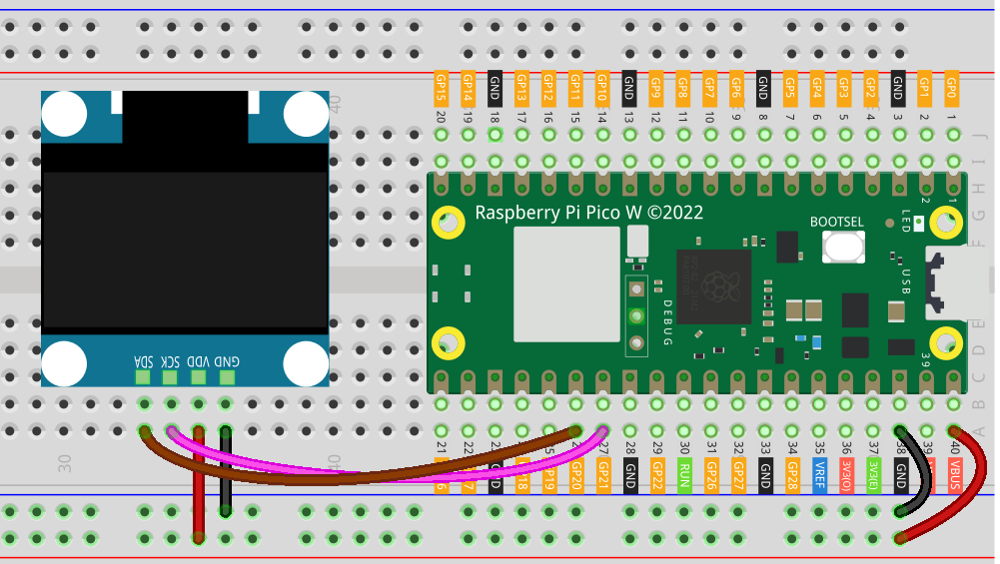

.. note::

    Ciao, benvenuto nella Community SunFounder dedicata agli appassionati di Raspberry Pi, Arduino ed ESP32 su Facebook! Approfondisci le tue conoscenze su Raspberry Pi, Arduino ed ESP32 insieme ad altri appassionati.

    **Perché unirsi?**

    - **Supporto esperto**: Risolvi problemi post-vendita e sfide tecniche con l’aiuto del nostro team e della community.
    - **Impara e condividi**: Scambia consigli e tutorial per migliorare le tue competenze.
    - **Anteprime esclusive**: Accedi in anteprima agli annunci di nuovi prodotti e alle anteprime.
    - **Sconti speciali**: Goditi sconti esclusivi sui nostri prodotti più recenti.
    - **Promozioni festive e giveaway**: Partecipa a promozioni stagionali e concorsi a premi.

    👉 Pronto per esplorare e creare con noi? Clicca su [|link_sf_facebook|] e unisciti subito!

.. _pico_lesson27_oled:

Lezione 27: Modulo Display OLED (SSD1306)
============================================

In questa lezione imparerai a collegare e visualizzare testi e grafica su un modulo display OLED SSD1306 utilizzando il Raspberry Pi Pico W. Configurerai la comunicazione I2C, utilizzerai MicroPython per programmare il Pico W e visualizzerai semplici messaggi di testo.

Componenti Necessari
--------------------------

Per questo progetto servono i seguenti componenti.

È sicuramente conveniente acquistare un kit completo, ecco il link:

.. list-table::
    :widths: 20 20 20
    :header-rows: 1

    *   - Nome
        - COMPONENTI INCLUSI NEL KIT
        - LINK
    *   - Universal Maker Sensor Kit
        - 94
        - |link_umsk|

Puoi anche acquistare i componenti singolarmente dai link seguenti.

.. list-table::
    :widths: 30 20
    :header-rows: 1

    *   - Introduzione al Componente
        - Link per l’acquisto

    *   - Raspberry Pi Pico W
        - |link_picow_buy|
    *   - :ref:`cpn_oled`
        - \-
    *   - :ref:`cpn_breadboard`
        - |link_breadboard_buy|

Collegamenti
---------------------------

.. note::
   Per garantire il corretto funzionamento del modulo OLED, alimentalo tramite il pin VBUS del Pico.

Codice
---------------------------

.. note::

    * Apri il file ``27_ssd1306_oled_module.py`` nella directory ``universal-maker-sensor-kit-main/pico/Lesson_27_SSD1306_OLED_Module`` oppure copia questo codice in Thonny e clicca su "Run Current Script" o premi F5 per eseguirlo. Per maggiori dettagli, vedi :ref:`open_run_code_py`.

    * Assicurati di aver caricato il file ``ssd1306.py`` su Pico W; per il tutorial dettagliato vedi :ref:`add_libraries_py`.

    * Non dimenticare di selezionare "MicroPython (Raspberry Pi Pico)" come interprete in basso a destra.

.. code-block:: python

   from machine import Pin, I2C
   import ssd1306
   import time

   # Configura la comunicazione I2C
   i2c = I2C(0, sda=Pin(20), scl=Pin(21))

   # Inizializza il display OLED (128x64 pixel) tramite I2C
   # SSD1306_I2C è una sottoclasse di FrameBuffer. FrameBuffer supporta le primitive grafiche.
   # http://docs.micropython.org/en/latest/pyboard/library/framebuf.html
   oled = ssd1306.SSD1306_I2C(128, 64, i2c)

   # Pulisce il display riempiendolo di bianco e aggiorna lo schermo
   oled.fill(1)
   oled.show()
   time.sleep(1)  # Attende 1 secondo

   # Pulisce nuovamente lo schermo riempiendolo di nero
   oled.fill(0)
   oled.show()
   time.sleep(1)  # Attende un altro secondo

   # Visualizza testo sullo schermo OLED
   oled.text('Hello,', 0, 0)  # Mostra "Hello," alla posizione (0, 0)
   oled.text('sunfounder.com', 0, 16)  # Mostra "sunfounder.com" alla posizione (0, 16)

   # Aggiorna il display con il contenuto
   oled.show()

Analisi del Codice
---------------------------

#. Inizializzazione della comunicazione I2C:

   Questo segmento imposta il protocollo di comunicazione I2C. I2C è uno standard per la comunicazione tra dispositivi. Utilizza due linee: SDA (linea dati) e SCL (linea di clock).

   .. code-block:: python

      from machine import Pin, I2C
      i2c = I2C(0, sda=Pin(20), scl=Pin(21))

#. Configurazione del display OLED:

   In questa parte, il display OLED SSD1306 viene inizializzato con il protocollo I2C. I parametri 128 e 64 definiscono larghezza e altezza del display in pixel.

   Per maggiori informazioni sulla libreria ``ssd1306``, consulta |link_micropython_ssd1306_driver|.

   .. code-block:: python

      import ssd1306
      oled = ssd1306.SSD1306_I2C(128, 64, i2c)

#. Pulizia del display:

   Il display viene inizialmente riempito di bianco (1) e aggiornato con ``oled.show()``. Dopo una pausa di un secondo, viene riempito di nero (0) e aggiornato di nuovo.

   SSD1306_I2C è una sottoclasse di FrameBuffer, che supporta funzioni grafiche di base. Per visualizzare altri tipi di grafica, consulta |link_FrameBuffer_doc|.

   .. code-block:: python

      oled.fill(1)
      oled.show()
      time.sleep(1)
      oled.fill(0)
      oled.show()
      time.sleep(1)

#. Visualizzazione di testo:

   Il metodo ``oled.text`` serve per mostrare testo sul display. I parametri sono il testo da visualizzare e le coordinate x, y. Infine, ``oled.show()`` aggiorna il display.

   .. code-block:: python

      oled.text('Hello,', 0, 0)
      oled.text('sunfounder.com', 0, 16)
      oled.show()