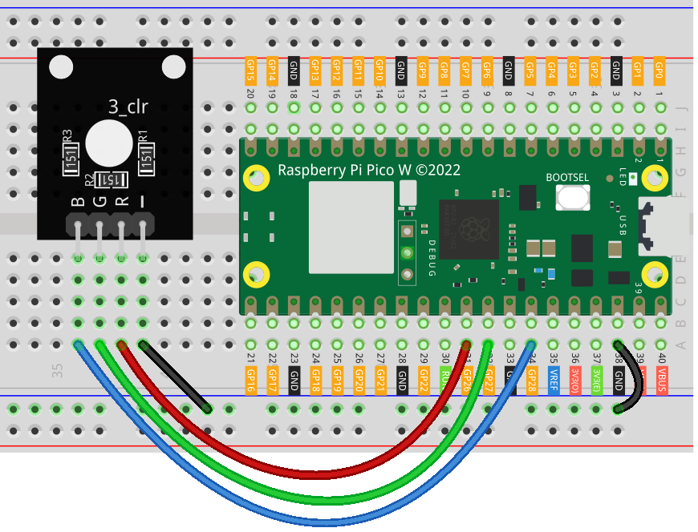

.. note:: 

    Bonjour et bienvenue dans la communauté des passionnés de SunFounder Raspberry Pi, Arduino et ESP32 sur Facebook ! Explorez plus en profondeur le Raspberry Pi, Arduino et ESP32 avec d'autres passionnés.

    **Pourquoi nous rejoindre ?**

    - **Support d'experts** : Résolvez vos problèmes après-vente et défis techniques grâce à l'aide de notre communauté et de notre équipe.
    - **Apprendre et partager** : Échangez des astuces et des tutoriels pour améliorer vos compétences.
    - **Aperçus exclusifs** : Accédez en avant-première aux annonces de nouveaux produits et aperçus.
    - **Réductions spéciales** : Profitez de réductions exclusives sur nos derniers produits.
    - **Promotions festives et concours** : Participez à des concours et promotions lors des fêtes.

    👉 Prêt à explorer et créer avec nous ? Cliquez sur [|link_sf_facebook|] et rejoignez-nous dès aujourd'hui !

.. _pico_lesson28_rgb_module:

Leçon 28 : Module LED RGB
==================================

Dans cette leçon, vous apprendrez à contrôler une LED RGB en utilisant le Raspberry Pi Pico W. Vous découvrirez comment configurer la modulation de largeur d'impulsion (PWM) sur différentes broches GPIO pour chaque canal de couleur de la LED RGB, vous permettant ainsi de créer diverses couleurs en ajustant l'intensité des composants rouge, vert et bleu. Ce projet offre aux débutants une excellente occasion d'acquérir de l'expérience pratique avec la PWM et le mélange de couleurs sur le Raspberry Pi Pico W à l'aide de MicroPython. De plus, vous apprendrez à gérer les interruptions pour éteindre la LED en toute sécurité. Cette leçon propose une manière ludique et interactive d'explorer les bases de l'électronique et de la programmation.

Composants Requis
--------------------------

Dans ce projet, nous avons besoin des composants suivants.

Il est définitivement plus pratique d'acheter un kit complet, voici le lien : 

.. list-table::
    :widths: 20 20 20
    :header-rows: 1

    *   - Nom	
        - Éléments dans ce kit
        - Lien
    *   - Universal Maker Sensor Kit
        - 94
        - |link_umsk|

Vous pouvez également les acheter séparément via les liens ci-dessous.

.. list-table::
    :widths: 30 20
    :header-rows: 1

    *   - Introduction des composants
        - Lien d'achat

    *   - Raspberry Pi Pico W
        - \-
    *   - :ref:`cpn_rgb`
        - \-
    *   - :ref:`cpn_breadboard`
        - |link_breadboard_buy|

Câblage
---------------------------

Code
---------------------------

.. code-block:: python

   from machine import Pin, PWM
   from time import sleep
   
   # Initialiser la PWM pour chaque canal de couleur de la LED RGB
   red = PWM(Pin(26))  # Canal rouge sur la broche GPIO 26
   green = PWM(Pin(27))  # Canal vert sur la broche GPIO 27
   blue = PWM(Pin(28))  # Canal bleu sur la broche GPIO 28
   
   # Définir une fréquence de 1000 Hz pour tous les canaux
   red.freq(1000)
   green.freq(1000)
   blue.freq(1000)
   
   
   # Fonction pour définir la couleur de la LED RGB
   def set_color(r, g, b):
       red.duty_u16(r)  # Intensité rouge
       green.duty_u16(g)  # Intensité verte
       blue.duty_u16(b)  # Intensité bleue
   
   
   try:
       while True:
           set_color(65535, 0, 0)  # Rouge
           sleep(1)
           set_color(0, 65535, 0)  # Vert
           sleep(1)
           set_color(0, 0, 65535)  # Bleu
           sleep(1)
   except KeyboardInterrupt:
       set_color(0, 0, 0)  # Éteindre la LED RGB en cas d'interruption

Analyse du Code
---------------------------

1. Importation des Bibliothèques

   Le module ``machine`` est importé pour utiliser les classes PWM et Pin. Le module ``time`` est importé pour utiliser la fonction ``sleep`` permettant de créer des délais.

   .. code-block:: python

      from machine import Pin, PWM
      from time import sleep

2. Initialisation de la PWM pour la LED RGB

   La LED RGB dispose de trois canaux (Rouge, Vert, Bleu), chacun étant contrôlé par un signal PWM séparé. Les signaux PWM sont connectés aux broches GPIO 26, 27 et 28.

   .. code-block:: python

      red = PWM(Pin(26))  # Canal rouge sur la broche GPIO 26
      green = PWM(Pin(27))  # Canal vert sur la broche GPIO 27
      blue = PWM(Pin(28))  # Canal bleu sur la broche GPIO 28

3. Définition de la Fréquence des Signaux PWM

   La fréquence des signaux PWM est définie à 1000 Hz pour les trois canaux.

   .. code-block:: python

      red.freq(1000)
      green.freq(1000)
      blue.freq(1000)

4. Définition de la Fonction set_color

   Cette fonction définit la couleur de la LED RGB. La méthode ``duty_u16`` est utilisée pour définir le rapport cyclique de chaque canal de couleur, ce qui détermine l'intensité de cette couleur.

   .. code-block:: python

      def set_color(r, g, b):
          red.duty_u16(r)
          green.duty_u16(g)
          blue.duty_u16(b)

5. Boucle Principale du Programme

   Une boucle infinie est utilisée pour changer la couleur de la LED. La fonction ``set_color`` est appelée avec différentes valeurs pour afficher les couleurs rouge, verte et bleue. Chaque couleur est affichée pendant 1 seconde.

   .. code-block:: python

      try:
          while True:
              set_color(65535, 0, 0)  # Rouge
              sleep(1)
              set_color(0, 65535, 0)  # Vert
              sleep(1)
              set_color(0, 0, 65535)  # Bleu
              sleep(1)
      except KeyboardInterrupt:
          set_color(0, 0, 0)  # Éteindre la LED RGB en cas d'interruption
