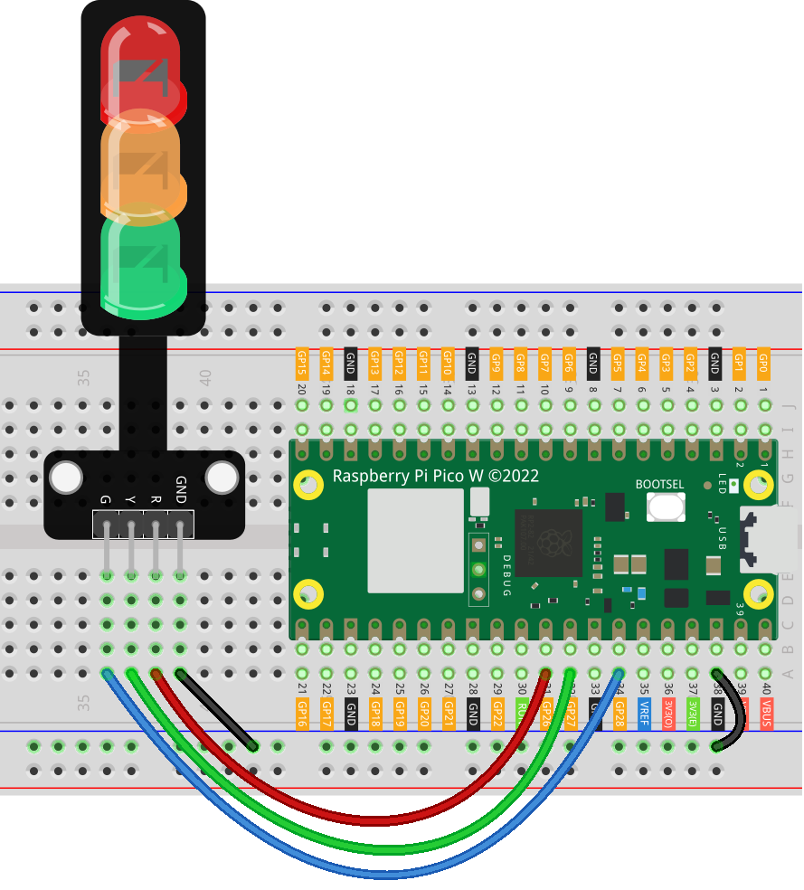

.. note:: 

    Bonjour et bienvenue dans la communauté des passionnés de SunFounder Raspberry Pi, Arduino et ESP32 sur Facebook ! Explorez plus en profondeur le Raspberry Pi, Arduino et ESP32 avec d'autres passionnés.

    **Pourquoi nous rejoindre ?**

    - **Support d'experts** : Résolvez vos problèmes après-vente et défis techniques grâce à l'aide de notre communauté et de notre équipe.
    - **Apprendre et partager** : Échangez des astuces et des tutoriels pour améliorer vos compétences.
    - **Aperçus exclusifs** : Accédez en avant-première aux annonces de nouveaux produits et aperçus.
    - **Réductions spéciales** : Profitez de réductions exclusives sur nos derniers produits.
    - **Promotions festives et concours** : Participez à des concours et promotions lors des fêtes.

    👉 Prêt à explorer et créer avec nous ? Cliquez sur [|link_sf_facebook|] et rejoignez-nous dès aujourd'hui !

.. _pico_lesson29_traffic_light_module:

Leçon 29 : Module Feu de Circulation
========================================

Dans cette leçon, vous apprendrez à créer un système de feu de circulation en utilisant le Raspberry Pi Pico W. Vous programmerez le Pico W pour contrôler trois LEDs – rouge, jaune et verte – simulant ainsi un vrai feu de circulation. Ce projet offre une introduction pratique à l'utilisation de la modulation de largeur d'impulsion (PWM) pour le contrôle de la luminosité des LEDs et aux structures de contrôle de base en MicroPython. Il est idéal pour les débutants qui souhaitent explorer le traitement du signal numérique et renforcer leur confiance en la programmation sur la plateforme Raspberry Pi Pico W.

Composants Requis
--------------------------

Dans ce projet, nous avons besoin des composants suivants. 

Il est définitivement plus pratique d'acheter un kit complet, voici le lien : 

.. list-table::
    :widths: 20 20 20
    :header-rows: 1

    *   - Nom	
        - Éléments dans ce kit
        - Lien
    *   - Universal Maker Sensor Kit
        - 94
        - |link_umsk|

Vous pouvez également les acheter séparément via les liens ci-dessous.

.. list-table::
    :widths: 30 20
    :header-rows: 1

    *   - Introduction des composants
        - Lien d'achat

    *   - Raspberry Pi Pico W
        - \-
    *   - :ref:`cpn_traffic`
        - |link_traffic_light_module_buy|
    *   - :ref:`cpn_breadboard`
        - |link_breadboard_buy|

Câblage
---------------------------

Code
---------------------------

.. code-block:: python

   from machine import Pin, PWM
   import time
   
   # Initialiser les broches pour les LEDs
   red = PWM(Pin(26), freq=1000)  # LED rouge
   yellow = PWM(Pin(27), freq=1000)  # LED jaune
   green = PWM(Pin(28), freq=1000)  # LED verte
   
   
   # Fonction pour régler la luminosité d'une LED (0-100%)
   def set_brightness(led, brightness):
       if brightness < 0 or brightness > 100:
           raise ValueError("Brightness should be between 0 and 100")
       led.duty_u16(int(brightness / 100 * 65535))
   
   
   try:
       # Séquence exemple
       while True:
           
           # Feu vert pendant 5 secondes
           set_brightness(green, 100)
           time.sleep(5)
           set_brightness(green, 0)
   
           # Clignotement du feu jaune
           set_brightness(yellow, 100)
           time.sleep(0.5)
           set_brightness(yellow, 0)
           time.sleep(0.5)
           set_brightness(yellow, 100)
           time.sleep(0.5)
           set_brightness(yellow, 0)
           time.sleep(0.5)
           set_brightness(yellow, 100)
           time.sleep(0.5)
           set_brightness(yellow, 0)
           time.sleep(0.5)
           
           # Feu rouge pendant 5 secondes
           set_brightness(red, 100)
           time.sleep(5)
           set_brightness(red, 0)
           
   except KeyboardInterrupt:
       # Éteindre les LEDs en cas d'interruption
       set_brightness(red, 0)
       set_brightness(yellow, 0)
       set_brightness(green, 0)

Analyse du Code
---------------------------

1. Importation des Bibliothèques

   La bibliothèque ``machine`` est utilisée pour contrôler les composants matériels, et ``time`` est utilisée pour créer des délais.

   .. code-block:: python

      from machine import Pin, PWM
      import time

2. Initialisation des Broches des LEDs

   Ici, nous initialisons les broches connectées aux LEDs. La PWM est utilisée pour contrôler la luminosité des LEDs.

   .. code-block:: python

      red = PWM(Pin(26), freq=1000)  # LED rouge
      yellow = PWM(Pin(27), freq=1000)  # LED jaune
      green = PWM(Pin(28), freq=1000)  # LED verte

3. Définition de la Fonction de Luminosité

   .. note::  
      Étant donné que les broches du Raspberry Pi Pico ne peuvent délivrer qu'une tension maximale de 3,3V, la LED verte apparaîtra relativement faible.

   Cette fonction règle la luminosité des LEDs. Elle prend deux paramètres : la LED et le niveau de luminosité désiré (0-100%). La méthode ``duty_u16`` est utilisée pour définir le rapport cyclique PWM.

   .. code-block:: python

      def set_brightness(led, brightness):
          if brightness < 0 or brightness > 100:
              raise ValueError("Brightness should be between 0 and 100")
          led.duty_u16(int(brightness / 100 * 65535))

4. Boucle Principale et Séquence du Feu de Circulation

   La boucle ``while True`` permet d'exécuter le code de manière continue. Elle contrôle la séquence du feu de circulation : vert, jaune (clignotant) et rouge.

   .. code-block:: python

      try:
          while True:
              # Feu vert pendant 5 secondes
              set_brightness(green, 100)
              time.sleep(5)
              set_brightness(green, 0)
              ...

5. Gestion de l'Interruption du Clavier

   Le bloc ``except KeyboardInterrupt`` est utilisé pour gérer une interruption manuelle (comme Ctrl+C). Il éteint toutes les LEDs lorsque le script est interrompu.

   .. code-block:: python

      except KeyboardInterrupt:
          set_brightness(red, 0)
          set_brightness(yellow, 0)
          set_brightness(green, 0)