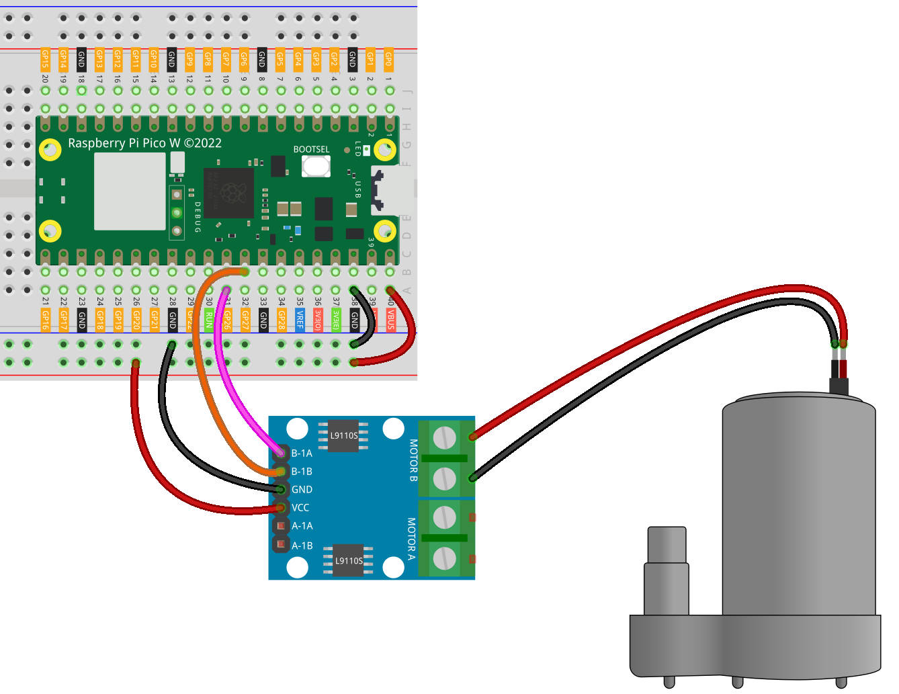

.. note:: 

    ¡Hola, bienvenido a la comunidad de entusiastas de Raspberry Pi, Arduino y ESP32 de SunFounder en Facebook! Profundiza en Raspberry Pi, Arduino y ESP32 con otros entusiastas.

    **¿Por qué unirse?**

    - **Soporte Experto**: Resuelve problemas post-venta y desafíos técnicos con la ayuda de nuestra comunidad y equipo.
    - **Aprende y Comparte**: Intercambia consejos y tutoriales para mejorar tus habilidades.
    - **Avances Exclusivos**: Obtén acceso anticipado a anuncios de nuevos productos y avances.
    - **Descuentos Especiales**: Disfruta de descuentos exclusivos en nuestros productos más nuevos.
    - **Promociones Festivas y Sorteos**: Participa en sorteos y promociones de temporada.

    👉 ¿Listo para explorar y crear con nosotros? Haz clic en [|link_sf_facebook|] y únete hoy mismo!

.. _pico_lesson31_pump:

Lección 31: Bomba Centrífuga
==================================

En esta lección, aprenderás a operar una bomba centrífuga utilizando el Raspberry Pi Pico W y una placa de control de motor L9110. Te guiaremos a través del proceso de configurar dos pines PWM (Modulación por Ancho de Pulso) para controlar el motor. Configurarás la bomba para que funcione durante 5 segundos y luego se apague. Este ejercicio práctico ofrece una valiosa oportunidad para profundizar en los mecanismos de control de motores y señales PWM, aspectos clave en la programación de microcontroladores.

Componentes Requeridos
--------------------------

En este proyecto, necesitamos los siguientes componentes.

Es muy conveniente comprar un kit completo, aquí tienes el enlace:

.. list-table::
    :widths: 20 20 20
    :header-rows: 1

    *   - Nombre
        - ARTÍCULOS EN ESTE KIT
        - ENLACE
    *   - Kit Sensor Universal Maker
        - 94
        - |link_umsk|

También puedes comprarlos por separado desde los siguientes enlaces.

.. list-table::
    :widths: 30 20
    :header-rows: 1

    *   - Introducción del componente
        - Enlace de compra

    *   - Raspberry Pi Pico W
        - \-
    *   - :ref:`cpn_pump`
        - \-
    *   - :ref:`cpn_l9110`
        - \-
    *   - :ref:`cpn_breadboard`
        - |link_breadboard_buy|

Conexión
---------------------------

Código
---------------------------

.. code-block:: python

   from machine import Pin, PWM
   import time
   
   pump_a = PWM(Pin(26), freq=1000)
   pump_b = PWM(Pin(27), freq=1000)
   
   # encender la bomba
   pump_a.duty_u16(0)
   pump_b.duty_u16(65535)  # velocidad (0-65535)
   
   time.sleep(5)
   
   # apagar la bomba
   pump_a.duty_u16(0)
   pump_b.duty_u16(0)

Análisis del Código
---------------------------

#. Importación de Bibliotecas

   - Se importa el módulo ``machine`` para interactuar con los pines GPIO y las funcionalidades PWM del Raspberry Pi Pico W.
   - Se importa el módulo ``time`` para crear retrasos en el código.

   .. raw:: html

       

   .. code-block:: python

      from machine import Pin, PWM
      import time

#. Inicialización de Objetos PWM

   - Se crean dos objetos PWM, ``pump_a`` y ``pump_b``, que corresponden a los pines GPIO 26 y 27, respectivamente.
   - La frecuencia para PWM se establece en 1000 Hz, una frecuencia común para el control de motores.

   .. raw:: html

       

   .. code-block:: python

      pump_a = PWM(Pin(26), freq=1000)
      pump_b = PWM(Pin(27), freq=1000)

#. Encender la Bomba

   - ``pump_a.duty_u16(0)`` establece el ciclo de trabajo del pin ``pump_a`` en 0, mientras que ``pump_b.duty_u16(65535)`` establece el ciclo de trabajo del pin ``pump_b`` en 65535, haciendo funcionar el motor a su máxima velocidad. Para más detalles, consulta :ref:`el principio de funcionamiento del L9110 <cpn_l9110_principle>`.
   - La bomba funciona durante 5 segundos, controlada por ``time.sleep(5)``.

   .. raw:: html

       

   .. code-block:: python

      # encender la bomba
      pump_a.duty_u16(0)
      pump_b.duty_u16(65535)  # velocidad (0-65535)
      time.sleep(5)

#. Apagar la Bomba

   Ambos ``pump_a`` y ``pump_b`` se establecen en un ciclo de trabajo de 0, deteniendo el motor.

   .. code-block:: python

      # apagar la bomba
      pump_a.duty_u16(0)
      pump_b.duty_u16(0)