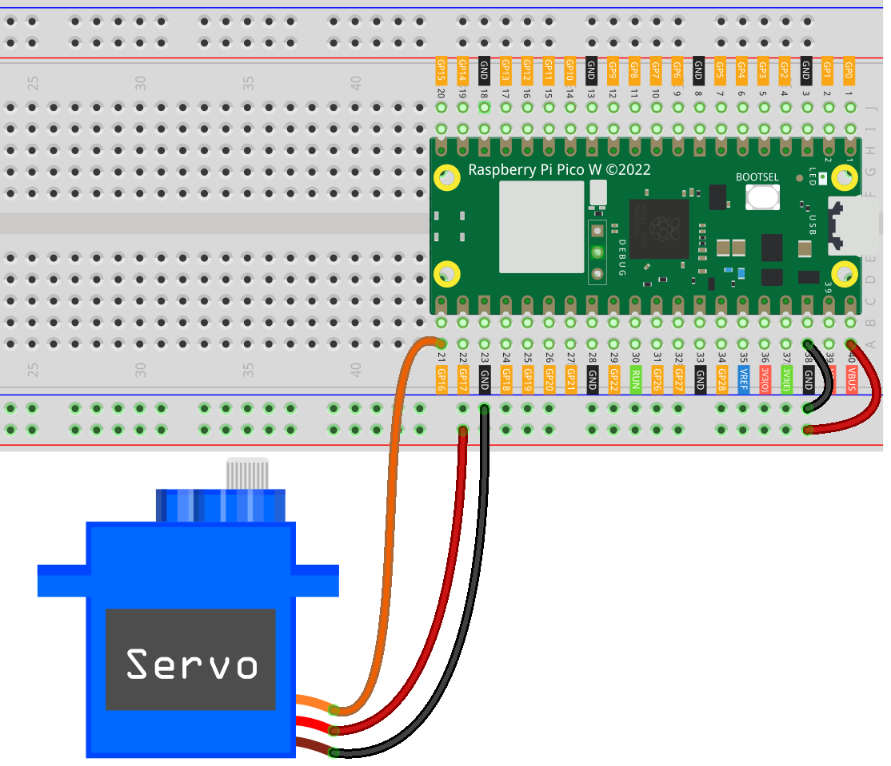

.. note::

    Ciao, benvenuto nella Community Facebook degli appassionati di SunFounder Raspberry Pi, Arduino e ESP32! Approfondisci Raspberry Pi, Arduino ed ESP32 insieme ad altri appassionati.

    **Perché unirsi?**

    - **Supporto Esperto**: Risolvi problemi post-vendita e sfide tecniche con il supporto della nostra community e del nostro team.
    - **Impara e Condividi**: Scambia consigli e tutorial per migliorare le tue competenze.
    - **Anteprime Esclusive**: Ottieni accesso anticipato agli annunci dei nuovi prodotti e anteprime esclusive.
    - **Sconti Speciali**: Approfitta di sconti esclusivi sui nostri prodotti più recenti.
    - **Promozioni e Giveaway Festivi**: Partecipa a promozioni festive e giveaway.

    👉 Pronto a esplorare e creare con noi? Clicca su [|link_sf_facebook|] ed entra a far parte della community oggi stesso!

.. _pico_lesson33_servo:

Lezione 33: Servomotore (SG90)
==================================

In questa lezione imparerai a controllare un servomotore (SG90) utilizzando il Raspberry Pi Pico W. Verranno introdotti i concetti di modulazione della larghezza di impulso (PWM) per gestire l’angolo del servomotore. La lezione include la scrittura di uno script in MicroPython per far compiere al servo un movimento fluido lungo tutto il suo intervallo, da 0 a 180 gradi e ritorno.

Componenti Necessari
--------------------------

Per questo progetto, avrai bisogno dei seguenti componenti.

Acquistare un kit completo è sicuramente comodo, ecco il link:

.. list-table::
    :widths: 20 20 20
    :header-rows: 1

    *   - Nome	
        - COMPONENTI INCLUSI
        - LINK
    *   - Universal Maker Sensor Kit
        - 94
        - |link_umsk|

Puoi anche acquistare i componenti singolarmente dai link qui sotto.

.. list-table::
    :widths: 30 20
    :header-rows: 1

    *   - Descrizione Componente
        - Link Acquisto

    *   - Raspberry Pi Pico W
        - |link_picow_buy|
    *   - :ref:`cpn_servo`
        - |link_servo_buy|
    *   - :ref:`cpn_breadboard`
        - |link_breadboard_buy|

Collegamenti
---------------------------

Codice
---------------------------

.. code-block:: python

   import machine
   import time
   
   # Inizializza il PWM sul pin 16 per il controllo del servo
   servo = machine.PWM(machine.Pin(16))
   servo.freq(50)  # Imposta la frequenza PWM a 50Hz, comune per i servo

   def interval_mapping(x, in_min, in_max, out_min, out_max):
       """
       Maps a value from one range to another.
       This function is useful for converting servo angle to pulse width.
       """
       return (x - in_min) * (out_max - out_min) / (in_max - in_min) + out_min

   def servo_write(pin, angle):
       """
       Moves the servo to a specific angle.
       The angle is converted to a suitable duty cycle for the PWM signal.
       """
       pulse_width = interval_mapping(
           angle, 0, 180, 0.5, 2.5
       )  # Map angle to pulse width in ms
       duty = int(
           interval_mapping(pulse_width, 0, 20, 0, 65535)
       )  # Map pulse width to duty cycle
       pin.duty_u16(duty)  # Set PWM duty cycle

   # Ciclo principale per il movimento continuo del servo
   while True:
       # Movimento da 0 a 180 gradi
       for angle in range(180):
           servo_write(servo, angle)
           time.sleep_ms(20)  # Short delay for smooth movement

       # Movimento da 180 a 0 gradi
       for angle in range(180, -1, -1):
           servo_write(servo, angle)
           time.sleep_ms(20)  # Short delay for smooth movement

Analisi del Codice
---------------------------

#. Importazione dei Moduli e Inizializzazione del Servo:

   Il modulo ``machine`` è essenziale per accedere alle funzionalità PWM necessarie al controllo del servo, mentre ``time`` serve per i ritardi temporali. Il servo è inizializzato sul pin 16 con frequenza di 50Hz, tipica per questo tipo di motori.

   .. code-block:: python

      import machine
      import time
      servo = machine.PWM(machine.Pin(16))
      servo.freq(50)

#. Funzioni di Mappatura e Controllo del Servo:

   La funzione ``interval_mapping`` converte l’angolo desiderato in una larghezza d’impulso PWM. ``servo_write`` trasforma questa larghezza in duty cycle per posizionare il servo. Queste funzioni sono fondamentali per convertire un angolo in segnale PWM.

   Consulta :ref:`Work Pulse <cpn_servo_pulse>` per dettagli sul funzionamento degli impulsi del servo.

   .. code-block:: python

      def interval_mapping(x, in_min, in_max, out_min, out_max):
          return (x - in_min) * (out_max - out_min) / (in_max - in_min) + out_min

      def servo_write(pin, angle):
          pulse_width = interval_mapping(angle, 0, 180, 0.5, 2.5)
          duty = int(interval_mapping(pulse_width, 0, 20, 0, 65535))
          pin.duty_u16(duty)

#. Ciclo Principale per il Movimento Continuo:

   Il ciclo principale comanda il servo affinché oscilli da 0 a 180 gradi e ritorno, con piccoli ritardi per assicurare un movimento fluido.

   .. code-block:: python

      while True:
          for angle in range(180):
              servo_write(servo, angle)
              time.sleep_ms(20)
          for angle in range(180, -1, -1):
              servo_write(servo, angle)
              time.sleep_ms(20)