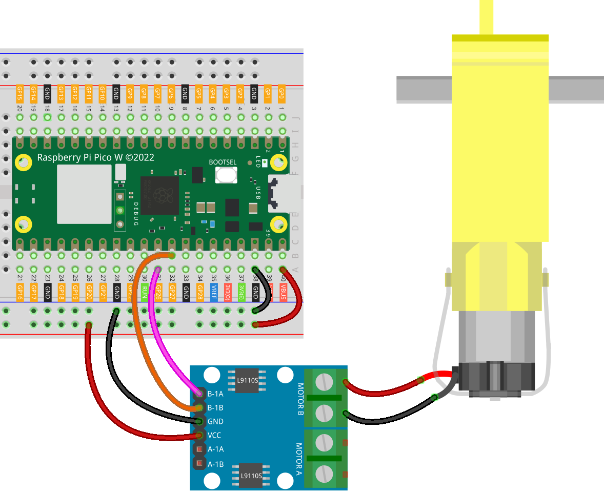

 
.. note::

   Hallo und willkommen in der SunFounder Raspberry Pi & Arduino & ESP32 Enthusiasten-Gemeinschaft auf Facebook! Tauchen Sie tiefer ein in die Welt von Raspberry Pi, Arduino und ESP32 mit anderen Enthusiasten.

   **Warum beitreten?**

   - **Expertenunterstützung**: Lösen Sie Nachverkaufsprobleme und technische Herausforderungen mit Hilfe unserer Gemeinschaft und unseres Teams.
   - **Lernen & Teilen**: Tauschen Sie Tipps und Anleitungen aus, um Ihre Fähigkeiten zu verbessern.
   - **Exklusive Vorschauen**: Erhalten Sie frühzeitigen Zugang zu neuen Produktankündigungen und exklusiven Einblicken.
   - **Spezialrabatte**: Genießen Sie exklusive Rabatte auf unsere neuesten Produkte.
   - **Festliche Aktionen und Gewinnspiele**: Nehmen Sie an Gewinnspielen und Feiertagsaktionen teil.

   👉 Sind Sie bereit, mit uns zu erkunden und zu erschaffen? Klicken Sie auf [|link_sf_facebook|] und treten Sie heute bei!

.. _pico_lesson34_motor:

Lektion 34: TT-Motor
==================================

In dieser Lektion lernen Sie, wie Sie einen TT-Motor mit dem Raspberry Pi Pico W und einem L9110 Motorsteuerungsboard betreiben. Wir werden Sie durch den Prozess der Konfiguration von zwei PWM (Pulsweitenmodulation) Pins führen, um den Motor zu steuern. Sie werden den Motor einrichten, um 5 Sekunden lang zu laufen und dann auszuschalten. Diese praktische Übung bietet eine wertvolle Gelegenheit, sich mit Motorsteuerungsmechanismen und PWM-Signalen vertraut zu machen, die für die Programmierung von Mikrocontrollern entscheidend sind.

Benötigte Komponenten
--------------------------

Für dieses Projekt benötigen wir die folgenden Komponenten.

Es ist definitiv praktisch, ein ganzes Kit zu kaufen. Hier ist der Link:

.. list-table::
    :widths: 20 20 20
    :header-rows: 1

    *   - Name	
        - ITEMS IN THIS KIT
        - LINK
    *   - Universal Maker Sensor Kit
        - 94
        - |link_umsk|

Sie können sie auch separat über die folgenden Links kaufen.

.. list-table::
    :widths: 30 20
    :header-rows: 1

    *   - Component Introduction
        - Purchase Link

    *   - Raspberry Pi Pico W
        - |link_picow_buy|
    *   - :ref:`cpn_ttmotor`
        - \-
    *   - :ref:`cpn_l9110`
        - \-
    *   - :ref:`cpn_breadboard`
        - |link_breadboard_buy|

Verkabelung
---------------------------

Code
---------------------------

.. code-block:: python

   from machine import Pin, PWM
   import time
   
   motor_a = PWM(Pin(26), freq=1000)
   motor_b = PWM(Pin(27), freq=1000)
   
   # turn on motor
   motor_a.duty_u16(0)
   motor_b.duty_u16(65535)  # speed(0-65535)
   
   time.sleep(5)
   
   # turn off motor
   motor_a.duty_u16(0)
   motor_b.duty_u16(0)

Code-Analyse
---------------------------

#. Bibliotheken importieren

   - Das Modul ``machine`` wird importiert, um mit den GPIO-Pins und PWM-Funktionalitäten des Raspberry Pi Pico W zu interagieren.
   - Das Modul ``time`` wird verwendet, um Verzögerungen im Code zu erzeugen.

   .. raw:: html

       

   .. code-block:: python

      from machine import Pin, PWM
      import time

#. Initialisierung von PWM-Objekten

   - Zwei PWM-Objekte, ``motor_a`` und ``motor_b``, werden erstellt. Sie entsprechen den GPIO-Pins 26 und 27.
   - Die Frequenz für PWM wird auf 1000 Hz eingestellt, eine übliche Frequenz für die Motorsteuerung.

   .. raw:: html

       

   .. code-block:: python

      motor_a = PWM(Pin(26), freq=1000)
      motor_b = PWM(Pin(27), freq=1000)

#. Einschalten des Motors

   - ``motor_a.duty_u16(0)`` setzt die Tastverhältnis des Pins ``motor_a`` auf 0, während ``motor_b.duty_u16(65535)`` das Tastverhältnis des Pins ``motor_b`` auf 65535 setzt, was den Motor mit voller Geschwindigkeit laufen lässt. Weitere Details finden Sie unter :ref:`the working principle of L9110 <cpn_l9110_principle>`.
   - Der Motor läuft 5 Sekunden lang, gesteuert durch ``time.sleep(5)``.

   .. raw:: html

       

   .. code-block:: python

      # turn on motor
      motor_a.duty_u16(0)
      motor_b.duty_u16(65535)  # speed(0-65535)
      time.sleep(5)

#. Ausschalten des Motors

   Sowohl ``motor_a`` als auch ``motor_b`` werden auf ein Tastverhältnis von 0 gesetzt, wodurch der Motor gestoppt wird.

   .. code-block:: python

      # turn off motor
      motor_a.duty_u16(0)
      motor_b.duty_u16(0)