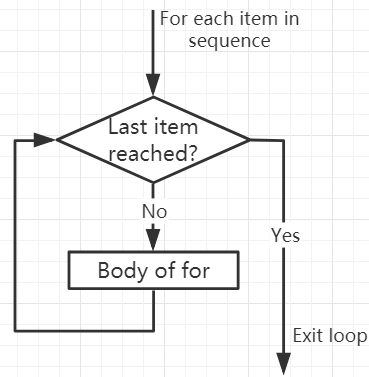

.. note::

    Ciao, benvenuto nella Comunità degli appassionati di SunFounder Raspberry Pi & Arduino & ESP32 su Facebook! Scopri più a fondo Raspberry Pi, Arduino e ESP32 insieme ad altri appassionati.

    **Perché Unirsi?**

    - **Supporto Esperto**: Risolvi problemi post-vendita e sfide tecniche con l'aiuto della nostra comunità e del nostro team.
    - **Impara & Condividi**: Scambia consigli e tutorial per migliorare le tue competenze.
    - **Anteprime Esclusive**: Ottieni accesso anticipato agli annunci di nuovi prodotti e anteprime esclusive.
    - **Sconti Speciali**: Goditi sconti esclusivi sui nostri prodotti più recenti.
    - **Promozioni Festive e Giveaway**: Partecipa a giveaway e promozioni festive.

    👉 Pronto per esplorare e creare con noi? Clicca [|link_sf_facebook|] e unisciti oggi!

.. _syntax_forloop:

Cicli For
============

Il ciclo ``for`` può attraversare qualsiasi sequenza di elementi, come una lista o una stringa.

Il formato della sintassi del ciclo for è il seguente:

.. code-block:: python

    for val in sequence:
        Body of for

Qui, ``val`` è una variabile che ottiene il valore dell'elemento nella sequenza in ogni iterazione.

Il ciclo continua fino a quando non raggiungiamo l'ultimo elemento nella sequenza. Usa l'indentazione per separare il corpo del ciclo ``for`` dal resto del codice.

**Flusso del ciclo For**

.. code-block:: python

    numbers = [1, 2, 3, 4]
    sum = 0

    for val in numbers:
        sum = sum+val
        
    print("The sum is", sum)

>>> %Run -c $EDITOR_CONTENT
The sum is 10

Istruzione break
-------------------------

Con l'istruzione break possiamo fermare il ciclo prima che abbia attraversato tutti gli elementi:

.. code-block:: python

    numbers = [1, 2, 3, 4]
    sum = 0

    for val in numbers:
        sum = sum+val
        if sum == 6:
            break
    print("The sum is", sum)

>>> %Run -c $EDITOR_CONTENT
The sum is 6

Istruzione continue
--------------------------------------------

Con l'istruzione ``continue`` possiamo fermare l'iterazione corrente del ciclo e continuare con la successiva:

.. code-block:: python

    numbers = [1, 2, 3, 4]

    for val in numbers:
        if val == 3:
            continue
        print(val)

>>> %Run -c $EDITOR_CONTENT
1
2
4

Funzione range()
--------------------------------------------

Possiamo usare la funzione range() per generare una sequenza di numeri. range(6) produrrà numeri tra 0 e 5 (6 numeri).

Possiamo anche definire inizio, fine e dimensione del passo come range(start, stop, step_size). Se non fornito, step_size ha come default 1.

In un certo senso di range, l'oggetto è "pigro" perché quando creiamo l'oggetto, non genera ogni numero che "contiene". Tuttavia, questo non è un iteratore perché supporta le operazioni in, len e ``__getitem__``.

Questa funzione non memorizzerà tutti i valori nella memoria; sarebbe inefficiente. Quindi si ricorderà l'inizio, la fine, la dimensione del passo e genererà il numero successivo durante il percorso.

Per forzare questa funzione a produrre tutti gli elementi, possiamo usare la funzione list().

.. code-block:: python

    print(range(6))

    print(list(range(6)))

    print(list(range(2, 6)))

    print(list(range(2, 10, 2)))

>>> %Run -c $EDITOR_CONTENT
range(0, 6)
[0, 1, 2, 3, 4, 5]
[2, 3, 4, 5]
[2, 4, 6, 8]

Possiamo usare ``range()`` in un ciclo ``for`` per iterare su una sequenza di numeri. Può essere combinato con la funzione len() per utilizzare l'indice per attraversare la sequenza.

.. code-block:: python

    fruits = ['pear', 'apple', 'grape']

    for i in range(len(fruits)):
        print("I like", fruits[i])
        
>>> %Run -c $EDITOR_CONTENT
I like pear
I like apple
I like grape

Else nel ciclo For
--------------------------------

Il ciclo ``for`` può avere anche un blocco ``else`` opzionale. Se gli elementi nella sequenza utilizzata per il ciclo sono esauriti, viene eseguita la parte ``else``.

La parola chiave ``break`` può essere usata per fermare il ciclo ``for``. In questo caso, la parte ``else`` sarà ignorata.

Pertanto, se non si verifica nessuna interruzione, la parte ``else`` del ciclo ``for`` verrà eseguita.

.. code-block:: python

    for val in range(5):
        print(val)
    else:
        print("Finished")

>>> %Run -c $EDITOR_CONTENT
0
1
2
3
4
Finished

Il blocco else NON verrà eseguito se il ciclo viene interrotto da un'istruzione break.

.. code-block:: python

    for val in range(5):
        if val == 2: break
        print(val)
    else:
        print("Finished")

>>> %Run -c $EDITOR_CONTENT
0
1

