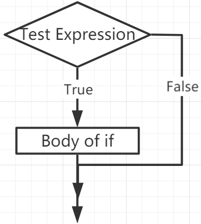
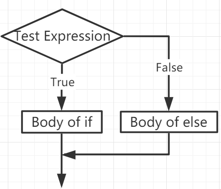
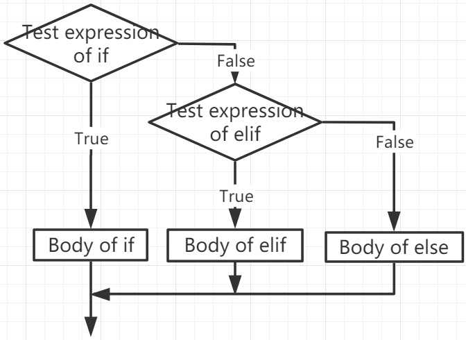

.. note::

    Ciao, benvenuto nella Comunità degli appassionati di SunFounder Raspberry Pi & Arduino & ESP32 su Facebook! Immergiti più a fondo in Raspberry Pi, Arduino e ESP32 con altri appassionati.

    **Perché Unirsi?**

    - **Supporto Esperto**: Risolvi problemi post-vendita e sfide tecniche con l'aiuto della nostra comunità e del nostro team.
    - **Impara & Condividi**: Scambia consigli e tutorial per potenziare le tue competenze.
    - **Anteprime Esclusive**: Ottieni accesso anticipato agli annunci di nuovi prodotti e anteprime esclusive.
    - **Sconti Speciali**: Goditi sconti esclusivi sui nostri prodotti più recenti.
    - **Promozioni Festive e Giveaway**: Partecipa a giveaway e promozioni festive.

    👉 Pronto per esplorare e creare con noi? Clicca [|link_sf_facebook|] e unisciti oggi!

Se Altro
=============

La presa di decisioni è necessaria quando vogliamo eseguire un codice solo se una certa condizione è soddisfatta.

if
--------------------
.. code-block:: python

    if test expression:
        statement(s)

Qui, il programma valuta l'``test expression`` ed esegue l'``statement`` solo quando l'``test expression`` è True.

Se l'``test expression`` è False, allora l'``statement(s)`` non verrà eseguita.

In MicroPython, l'indentazione indica il corpo dell'istruzione ``if``. Il corpo inizia con un'indentazione e finisce con la prima riga non indentata.

Python interpreta i valori non zero come "True". None e 0 sono interpretati come "False".

**Flusso dell'istruzione if**

**Esempio**

.. code-block:: python

    num = 8
    if num > 0:
        print(num, "is a positive number.")
    print("End with this line")

>>> %Run -c $EDITOR_CONTENT
8 is a positive number.
End with this line

if...else
-----------------------

.. code-block:: python

    if test expression:
        Body of if
    else:
        Body of else

L'istruzione ``if..else`` valuta l'``test expression`` ed eseguirà il corpo di ``if`` solo quando la condizione di test è ``True``.

Se la condizione è ``False``, viene eseguito il corpo di ``else``. L'indentazione è usata per separare i blocchi.

**Flusso dell'istruzione if...else**

**Esempio**

.. code-block:: python

    num = -8
    if num > 0:
        print(num, "is a positive number.")
    else:
        print(num, "is a negative number.")

>>> %Run -c $EDITOR_CONTENT
-8 is a negative number.

if...elif...else
--------------------

.. code-block:: python

    if test expression:
        Body of if
    elif test expression:
        Body of elif
    else: 
        Body of else

``Elif`` è l'abbreviazione di ``else if``. Ci permette di verificare più espressioni.

Se la condizione del ``if`` è False, viene verificata la condizione del blocco elif successivo, e così via.

Se tutte le condizioni sono ``False``, viene eseguito il corpo di ``else``.

Solo uno dei vari blocchi ``if...elif...else`` viene eseguito secondo le condizioni.

Il blocco ``if`` può avere solo un blocco ``else``. Ma può avere più blocchi ``elif``.

**Flusso dell'istruzione if...elif...else**

**Esempio**

.. code-block:: python

    x = 10
    y = 9

    if x > y:
        print("x is greater than y")
    elif x == y:
        print("x and y are equal")
    else:
        print("x is greater than y")

>>> %Run -c $EDITOR_CONTENT
x is greater than y

if annidato
---------------------

Possiamo inserire un'istruzione if all'interno di un'altra istruzione if, che viene quindi chiamata istruzione if annidato.

**Esempio**

.. code-block:: python

    x = 67

    if x > 10:
        print("Above ten,")
        if x > 20:
            print("and also above 20!")
        else:
            print("but not above 20.")

>>> %Run -c $EDITOR_CONTENT
Above ten,
and also above 20!