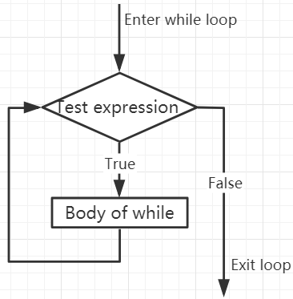

.. note::

    Ciao, benvenuto nella Comunità di appassionati di SunFounder Raspberry Pi & Arduino & ESP32 su Facebook! Immergiti più a fondo in Raspberry Pi, Arduino e ESP32 con altri entusiasti.

    **Perché Unirsi?**

    - **Supporto Esperto**: Risolvi problemi post-vendita e sfide tecniche con l'aiuto della nostra comunità e del nostro team.
    - **Impara & Condividi**: Scambia consigli e tutorial per arricchire le tue competenze.
    - **Anteprime Esclusive**: Ottieni un accesso anticipato agli annunci di nuovi prodotti e anteprime esclusive.
    - **Sconti Speciali**: Goditi sconti esclusivi sui nostri prodotti più recenti.
    - **Promozioni Festive e Giveaway**: Partecipa a giveaway e promozioni festive.

    👉 Pronto per esplorare e creare con noi? Clicca [|link_sf_facebook|] e unisciti oggi!

.. _py_syntax_while:

Cicli While
====================

Il comando ``while`` è utilizzato per eseguire un programma in un ciclo, ovvero per eseguire ripetutamente un programma sotto certe condizioni per gestire un compito che necessita di essere processato più volte.

La sua forma base è:

.. code-block:: python

    while test expression:
        Body of while

Nel ciclo ``while``, prima si verifica l'``test expression``. Solo quando l'``test expression`` è valutata come ``True``, si entra nel corpo del while. Dopo una iterazione, si verifica nuovamente l'``test expression``. Questo processo continua fino a quando l'``test expression`` è valutata come ``False``.

In MicroPython, il corpo del ciclo ``while`` è determinato dall'indentazione.

Il corpo inizia con un'indentazione e finisce con la prima linea senza indentazione.

Python interpreta qualsiasi valore non zero come ``True``. None e 0 sono interpretati come ``False``.

**Flusso del ciclo while**

.. code-block:: python

    x = 10

    while x > 0:
        print(x)
        x -= 1

>>> %Run -c $EDITOR_CONTENT
10
9
8
7
6
5
4
3
2
1

Comando Break
--------------------

Con il comando break possiamo interrompere il ciclo anche se la condizione del while è vera:

.. code-block:: python

    x = 10

    while x > 0:
        print(x)
        if x == 6:
            break
        x -= 1

>>> %Run -c $EDITOR_CONTENT
10
9
8
7
6

Ciclo While con Else
----------------------

Come il ciclo ``if``, anche il ciclo ``while`` può avere un blocco ``else`` opzionale.

Se la condizione nel ciclo ``while`` è valutata come ``False``, viene eseguita la parte ``else``.

.. code-block:: python

    x = 10

    while x > 0:
        print(x)
        x -= 1
    else:
        print("Game Over")

>>> %Run -c $EDITOR_CONTENT
10
9
8
7
6
5
4
3
2
1
Game Over