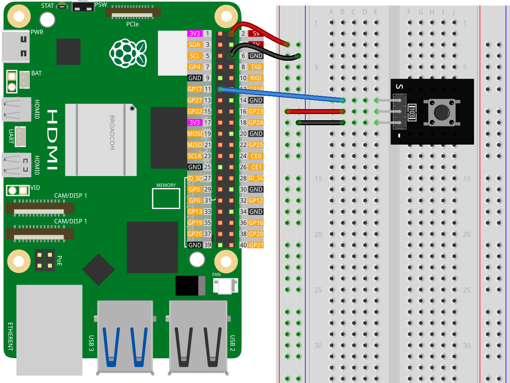

.. note:: 

    ¡Hola, bienvenido a la comunidad de entusiastas de Raspberry Pi, Arduino y ESP32 de SunFounder en Facebook! Profundiza en Raspberry Pi, Arduino y ESP32 junto a otros entusiastas.

    **¿Por qué unirse?**

    - **Soporte experto**: Resuelve problemas postventa y desafíos técnicos con la ayuda de nuestra comunidad y equipo.
    - **Aprende y comparte**: Intercambia consejos y tutoriales para mejorar tus habilidades.
    - **Avances exclusivos**: Obtén acceso anticipado a anuncios de nuevos productos y adelantos.
    - **Descuentos especiales**: Disfruta de descuentos exclusivos en nuestros productos más nuevos.
    - **Promociones festivas y sorteos**: Participa en sorteos y promociones de temporada.

    👉 ¿Listo para explorar y crear con nosotros? Haz clic en [|link_sf_facebook|] y únete hoy mismo!

.. _pi_lesson01_button:

Lección 01: Módulo de Botón
==================================

En esta lección, aprenderás los conceptos básicos de cómo utilizar un botón con Raspberry Pi. Te mostraremos cómo conectar un botón al pin GPIO 17 y escribir un script simple en Python para monitorear su estado. Aprenderás cómo programar la Raspberry Pi para detectar cuándo se presiona y se suelta el botón, y responder con los mensajes correspondientes. Este proyecto introductorio es una excelente manera de familiarizarse con la interacción de GPIO y la programación básica en Python, lo que lo hace ideal para principiantes que comienzan su camino en Raspberry Pi y programación de hardware.

Componentes necesarios
--------------------------

Para este proyecto, necesitamos los siguientes componentes.

Es conveniente comprar un kit completo, aquí tienes el enlace:

.. list-table::
    :widths: 20 20 20
    :header-rows: 1

    *   - Nombre	
        - ARTÍCULOS EN ESTE KIT
        - ENLACE
    *   - Universal Maker Sensor Kit
        - 94
        - |link_umsk|

También puedes comprarlos por separado en los enlaces a continuación.

.. list-table::
    :widths: 30 20
    :header-rows: 1

    *   - Introducción al componente
        - Enlace de compra

    *   - Raspberry Pi 5
        - |link_rpi5_buy|
    *   - :ref:`cpn_button`
        - \-
    *   - :ref:`cpn_breadboard`
        - |link_breadboard_buy|

Conexiones
---------------------------

Código
---------------------------

.. code-block:: python

   from gpiozero import Button

   # Inicializa el botón conectado al pin GPIO 17
   button = Button(17)

   # Verifica continuamente el estado del botón
   while True:
      if button.is_pressed:
         print("Button is pressed")  # Imprime cuando el botón está presionado
      else:
         print("Button is not pressed")  # Imprime cuando el botón no está presionado

Análisis del código
---------------------------

#. Importar la librería
   
   Importa la clase ``Button`` de la librería ``gpiozero`` para controlar el botón.

   .. code-block:: python

      from gpiozero import Button

#. Inicializar el botón
   
   Crea un objeto ``Button`` conectado al pin GPIO 17.

   .. code-block:: python

      button = Button(17)

#. Monitorear el estado del botón continuamente
   
   Utiliza un bucle ``while True`` para verificar continuamente el estado del botón. Si el botón está presionado (``button.is_pressed``), imprime "El botón está presionado". De lo contrario, imprime "El botón no está presionado".

   .. code-block:: python

      while True:
          if button.is_pressed:
              print("Button is pressed")
          else:
              print("Button is not pressed")