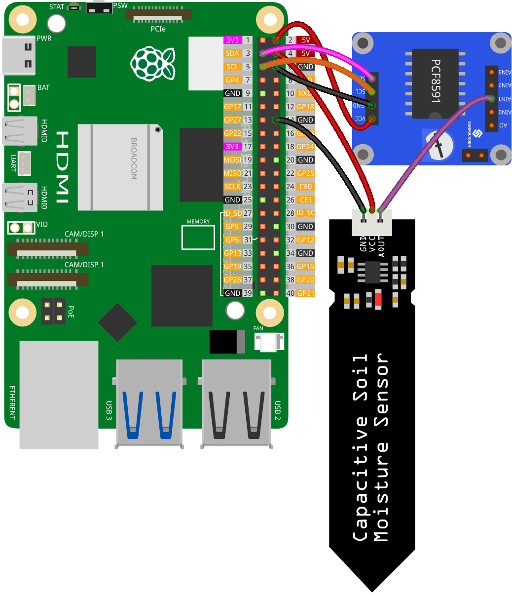

.. note:: 

    Ciao, benvenuto nella Comunità degli Appassionati di Raspberry Pi, Arduino & ESP32 di SunFounder su Facebook! Approfondisci la tua conoscenza su Raspberry Pi, Arduino e ESP32 insieme ad altri appassionati.

    **Why Join?**

    - **Expert Support**: Risolvi problemi post-vendita e sfide tecniche con l'aiuto della nostra comunità e del nostro team.
    - **Learn & Share**: Scambia consigli e tutorial per migliorare le tue competenze.
    - **Exclusive Previews**: Accedi in anteprima agli annunci di nuovi prodotti e alle anticipazioni esclusive.
    - **Special Discounts**: Godi di sconti esclusivi sui nostri prodotti più recenti.
    - **Festive Promotions and Giveaways**: Partecipa a giveaway e promozioni festivi.

    👉 Pronto per esplorare e creare con noi? Clicca [|link_sf_facebook|] e unisciti oggi!

.. _pi_lesson02_soil_moisture:

Lezione 02: Modulo di Umidità del Terreno Capacitivo
========================================================

.. note::
   Il Raspberry Pi non dispone di capacità di input analogico, quindi necessita di un modulo come :ref:`cpn_pcf8591` per leggere i segnali analogici da elaborare.

In questo tutorial, esploreremo come monitorare i livelli di umidità del suolo utilizzando un Raspberry Pi. Imparerai a configurare un sensore di umidità del suolo capacitivo con il modulo PCF8591 per la conversione analogico-digitale e a utilizzare Python per tracciare continuamente il contenuto di umidità del suolo. Questo progetto è un'introduzione pratica ai sensori, agli ADC (convertitori analogico-digitali) e al monitoraggio dei dati in tempo reale su Raspberry Pi.

Componenti Necessari
-----------------------------

In questo progetto, abbiamo bisogno dei seguenti componenti.

È sicuramente conveniente acquistare un kit completo, ecco il link:

.. list-table::
    :widths: 20 20 20
    :header-rows: 1

    *   - Nome	
        - ARTICOLI IN QUESTO KIT
        - LINK
    *   - Kit Sensori Universale per Makers
        - 94
        - |link_umsk|

Puoi anche acquistarli separatamente dai link qui sotto.

.. list-table::
    :widths: 30 20
    :header-rows: 1

    *   - Introduzione al Componente
        - Link Acquisto

    *   - Raspberry Pi 5
        - |link_rpi5_buy|
    *   - :ref:`cpn_soil`
        - |link_soil_moisture_buy|
    *   - :ref:`cpn_pcf8591`
        - |link_pcf8591_module_buy|

Cablaggio
---------------------------

Codice
---------------------------

.. code-block:: Python

   import PCF8591 as ADC  # Import PCF8591 module
   import time  # Import time for delay
   
   ADC.setup(0x48)  # Initialize PCF8591 at address 0x48
   
   try:
       while True:  # Continuously read and print moisture level
           print(ADC.read(1))  # Read from Soil Moisture Sensor at AIN1
           time.sleep(0.2)  # Delay of 0.2 seconds
   except KeyboardInterrupt:
       print("Exit")  # Exit on CTRL+C

Analisi del Codice
---------------------------

1. **Importazione delle Librerie**:

   Questa sezione importa le necessarie librerie Python. La libreria ``PCF8591`` è utilizzata per interagire con il modulo PCF8591, e ``time`` per implementare ritardi nel codice.

   .. code-block:: python

      import PCF8591 as ADC  # Importa il modulo PCF8591
      import time  # Importa time per il ritardo

2. **Inizializzazione del Modulo PCF8591**:

   Qui, il modulo PCF8591 viene inizializzato. L'indirizzo ``0x48`` è l'indirizzo I²C del modulo PCF8591. Questo è necessario per la comunicazione tra il Raspberry Pi e il modulo.

   .. code-block:: python

      ADC.setup(0x48)  # Inizializza PCF8591 all'indirizzo 0x48

3. **Ciclo Principale e Lettura dei Dati**:

   Il blocco ``try`` include un ciclo continuo che legge costantemente i dati dal modulo di umidità del suolo capacitivo. La funzione ``ADC.read(1)`` cattura l'input analogico dal sensore connesso al canale 1 (AIN1) del modulo PCF8591. Inserire un ``time.sleep(0.2)`` crea una pausa di 0.2 secondi tra ogni lettura. Questo aiuta non solo a ridurre l'uso della CPU su Raspberry Pi evitando eccessive richieste di elaborazione dei dati, ma anche a prevenire che il terminale sia sopraffatto da informazioni che scorrono rapidamente, facilitando il monitoraggio e l'analisi dell'output.

   .. code-block:: python

      try:
          while True:  # Leggi e stampa continuamente il livello di umidità
              print(ADC.read(1))  # Leggi dal sensore di umidità del suolo su AIN1
              time.sleep(0.2)  # Ritardo di 0.2 secondi

4. **Gestione dell'Interruzione da Tastiera**:

   Il blocco ``except`` è progettato per intercettare un KeyboardInterrupt (come premere CTRL+C). Quando si verifica quest'interruzione, lo script stampa "uscita" e smette di funzionare. Questo è un modo comune per uscire con eleganza da uno script che si esegue continuamente in Python.

   .. code-block:: python

      except KeyboardInterrupt:
          print("exit")  # Esci con CTRL+C