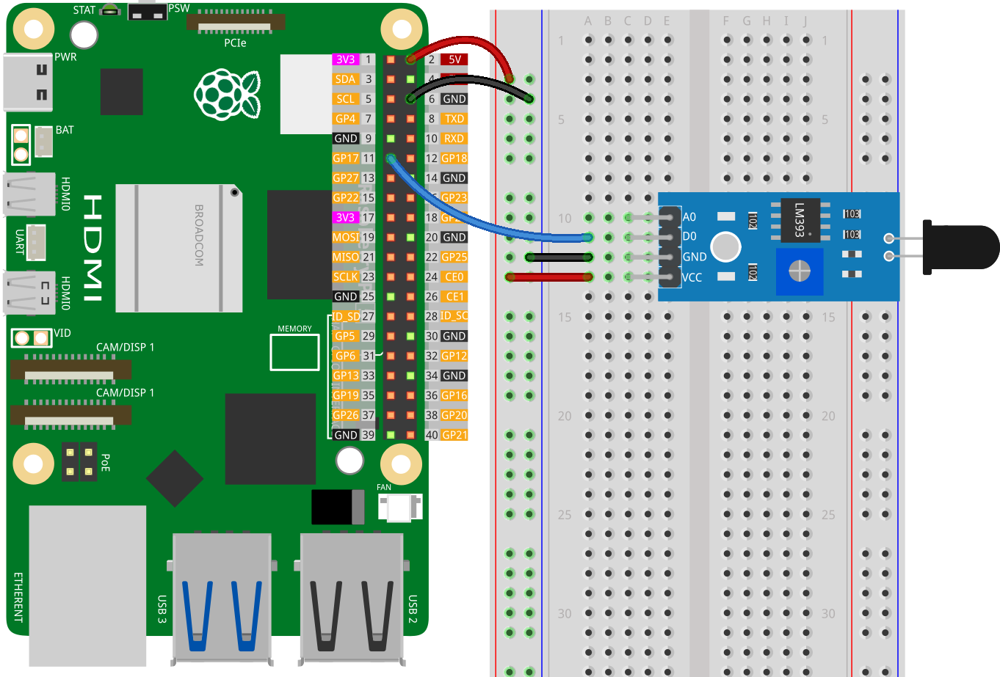

.. note:: 

    Bonjour et bienvenue dans la communauté des passionnés de Raspberry Pi, Arduino et ESP32 de SunFounder sur Facebook ! Explorez plus en profondeur le Raspberry Pi, Arduino et ESP32 avec d'autres passionnés.

    **Pourquoi nous rejoindre ?**

    - **Support d'experts** : Résolvez vos problèmes après-vente et défis techniques grâce à l'aide de notre communauté et de notre équipe.
    - **Apprendre et partager** : Échangez des astuces et des tutoriels pour améliorer vos compétences.
    - **Aperçus exclusifs** : Accédez en avant-première aux annonces de nouveaux produits et aperçus.
    - **Réductions spéciales** : Profitez de réductions exclusives sur nos produits les plus récents.
    - **Promotions festives et concours** : Participez à des concours et promotions lors des fêtes.

    👉 Prêt à explorer et créer avec nous ? Cliquez sur [|link_sf_facebook|] et rejoignez-nous dès aujourd'hui !

.. _pi_lesson03_flame:

Leçon 03 : Module de capteur de flamme
=========================================

Dans cette leçon, vous apprendrez à utiliser un capteur de flamme avec le Raspberry Pi pour la détection de feu. Nous vous montrerons comment connecter le capteur de flamme à la broche GPIO17 et écrire un script Python pour lire ses sorties. Vous apprendrez à identifier quand le capteur détecte une flamme, ce qui est indiqué par un changement d'état du capteur. Ce projet pratique vous initie aux bases de l'interface des capteurs et de la programmation en Python sur Raspberry Pi, adapté aux débutants intéressés par des projets liés à la sécurité.

Composants nécessaires
---------------------------

Pour ce projet, nous avons besoin des composants suivants.

Il est certainement pratique d'acheter un kit complet, voici le lien :

.. list-table::
    :widths: 20 20 20
    :header-rows: 1

    *   - Nom
        - ARTICLES DANS CE KIT
        - Lien
    *   - Kit de capteurs Universal Maker
        - 94
        - |link_umsk|

Vous pouvez aussi les acheter séparément via les liens ci-dessous.

.. list-table::
    :widths: 30 20
    :header-rows: 1

    *   - Introduction des composants
        - Lien d'achat

    *   - Raspberry Pi 5
        - \-
    *   - :ref:`cpn_flame`
        - |link_flame_sensor_module_buy|
    *   - :ref:`cpn_breadboard`
        - |link_breadboard_buy|

Câblage
---------------------------

Code
---------------------------

.. code-block:: python

   from gpiozero import InputDevice
   import time

   # Connecter la sortie numérique du capteur de flamme à la broche GPIO17 du Raspberry Pi
   flame_sensor = InputDevice(17)

   # Boucle continue pour lire les données du capteur
   while True:
       # Vérifier si le capteur est actif (pas de flamme détectée)
       if flame_sensor.is_active:
           print("No flame detected.")
       else:
           # Lorsque le capteur est inactif (flamme détectée)
           print("Flame detected!")
       # Attendre 1 seconde avant de lire à nouveau le capteur
       time.sleep(1)

Analyse du code
---------------------------

#. Importation des bibliothèques

   Le script commence par importer les classes nécessaires de la bibliothèque gpiozero ainsi que le module time de la bibliothèque standard de Python.

   .. code-block:: python

      from gpiozero import InputDevice
      import time

#. Initialisation du capteur de flamme

   Un objet ``InputDevice`` nommé ``flame_sensor`` est créé, représentant le capteur de flamme connecté à la broche GPIO17 du Raspberry Pi. Cette configuration suppose que la sortie numérique du capteur de flamme est connectée à GPIO17.

   .. code-block:: python

      flame_sensor = InputDevice(17)

#. Boucle de lecture continue

   - Le script utilise une boucle ``while True:`` pour lire en continu les données du capteur. Cette boucle s'exécutera indéfiniment.
   - À l'intérieur de la boucle, une instruction ``if`` vérifie l'état du capteur de flamme en utilisant la propriété ``is_active``.
   - Si ``flame_sensor.is_active`` est ``True``, cela signifie qu'aucune flamme n'est détectée et le message "Aucune flamme détectée." est affiché.
   - Si ``flame_sensor.is_active`` est ``False``, cela signifie qu'une flamme est détectée, et le message "Flamme détectée !" est affiché.
   - La commande ``time.sleep(1)`` met la boucle en pause pendant 1 seconde entre chaque lecture du capteur, ce qui permet d'éviter une surcharge du processeur.

   .. raw:: html

       

   .. code-block:: python

      while True:
          if flame_sensor.is_active:
              print("No flame detected.")
          else:
              print("Flame detected!")
          time.sleep(1)