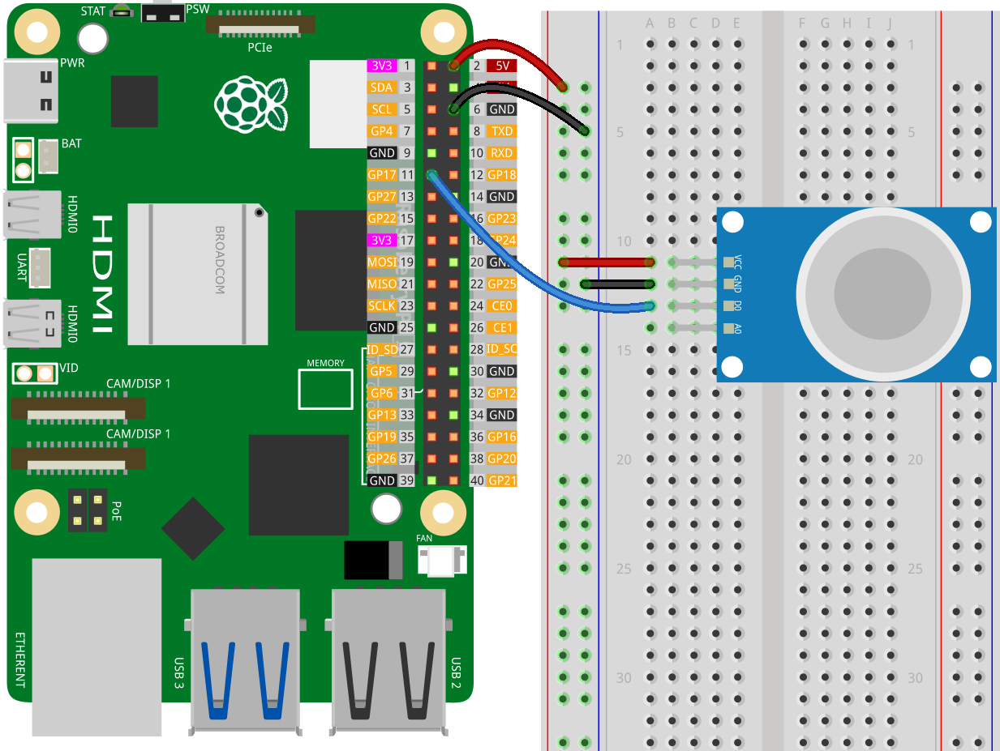

.. note:: 

    Bonjour et bienvenue dans la communauté des passionnés de Raspberry Pi, Arduino et ESP32 de SunFounder sur Facebook ! Explorez plus en profondeur le Raspberry Pi, Arduino et ESP32 avec d'autres passionnés.

    **Pourquoi nous rejoindre ?**

    - **Support d'experts** : Résolvez vos problèmes après-vente et défis techniques grâce à l'aide de notre communauté et de notre équipe.
    - **Apprendre et partager** : Échangez des astuces et des tutoriels pour améliorer vos compétences.
    - **Aperçus exclusifs** : Accédez en avant-première aux annonces de nouveaux produits et aperçus.
    - **Réductions spéciales** : Profitez de réductions exclusives sur nos produits les plus récents.
    - **Promotions festives et concours** : Participez à des concours et promotions lors des fêtes.

    👉 Prêt à explorer et créer avec nous ? Cliquez sur [|link_sf_facebook|] et rejoignez-nous dès aujourd'hui !

.. _pi_lesson04_mq2:

Leçon 04 : Module de capteur de gaz (MQ-2)
============================================

Dans cette leçon, vous apprendrez à utiliser le capteur de gaz MQ2 avec le Raspberry Pi pour la détection de gaz. Le cours couvre la connexion du capteur MQ2 à la broche GPIO17 et la programmation du Raspberry Pi en Python pour lire la sortie du capteur. Vous apprendrez à détecter la présence de gaz, un signal faible du capteur indiquant la détection de gaz. Ce projet constitue une introduction pratique à l'utilisation des capteurs et à la programmation en Python sur le Raspberry Pi, idéal pour les débutants intéressés par la surveillance environnementale et les applications de sécurité.

Composants nécessaires
--------------------------

Pour ce projet, nous avons besoin des composants suivants.

Il est certainement pratique d'acheter un kit complet, voici le lien :

.. list-table::
    :widths: 20 20 20
    :header-rows: 1

    *   - Nom
        - ARTICLES DANS CE KIT
        - Lien
    *   - Kit de capteurs Universal Maker
        - 94
        - |link_umsk|

Vous pouvez aussi les acheter séparément via les liens ci-dessous.

.. list-table::
    :widths: 30 20
    :header-rows: 1

    *   - Introduction des composants
        - Lien d'achat

    *   - Raspberry Pi 5
        - \-
    *   - :ref:`cpn_gas`
        - |link_mq2_gas_sensor_module_buy|
    *   - :ref:`cpn_breadboard`
        - |link_breadboard_buy|

Câblage
---------------------------

Code
---------------------------

.. code-block:: python

   from gpiozero import DigitalInputDevice
   import time
 
   # Initialiser le capteur MQ2 sur GPIO17
   mq2 = DigitalInputDevice(17)
 
   while True:
      # Détecter la présence de gaz (un signal bas indique la présence de gaz)
      if mq2.value == 0:
         print("Gas detected!")
      else:
         print("No gas detected.")
 
      # Délai entre les lectures
      time.sleep(1)

Analyse du code
---------------------------

#. Importation des bibliothèques

   .. code-block:: python
       
      from gpiozero import DigitalInputDevice
      import time

   Cette section importe les bibliothèques nécessaires. ``gpiozero`` est utilisée pour interagir avec les broches GPIO du Raspberry Pi, et ``time`` est utilisée pour gérer les tâches liées au temps, comme les délais.

#. Initialisation du capteur MQ2

   .. code-block:: python

      mq2 = DigitalInputDevice(17)

   Ici, le capteur MQ2 est initialisé en tant que dispositif d'entrée numérique sur la broche GPIO17 du Raspberry Pi. La classe ``DigitalInputDevice`` de gpiozero est utilisée à cet effet.

#. Boucle infinie de lecture du capteur

   .. code-block:: python

      while True:
         if mq2.value == 0:
            print("Gas detected!")
         else:
            print("No gas detected.")
         time.sleep(1)

   Dans cette section :

   .. note::
      La broche DO du module de capteur MQ-2 indique la présence de gaz combustibles. Lorsque la concentration de gaz dépasse la valeur de seuil (réglée à l'aide du potentiomètre du module), la sortie D0 devient basse (LOW) ; sinon, elle reste haute (HIGH).
   
   - Une boucle infinie est créée à l'aide de ``while True``. Cette boucle continuera de tourner jusqu'à ce que le programme soit arrêté manuellement.
   - À l'intérieur de la boucle, la valeur du capteur MQ2 est vérifiée à l'aide de ``mq2.value``. Si la valeur est 0, cela indique la présence de gaz, et le message "Gaz détecté !" est affiché. Sinon, le message "Aucun gaz détecté." est affiché.
   - La commande ``time.sleep(1)`` crée un délai de 1 seconde entre chaque lecture, ce qui réduit la fréquence des vérifications du capteur et des messages de sortie.
