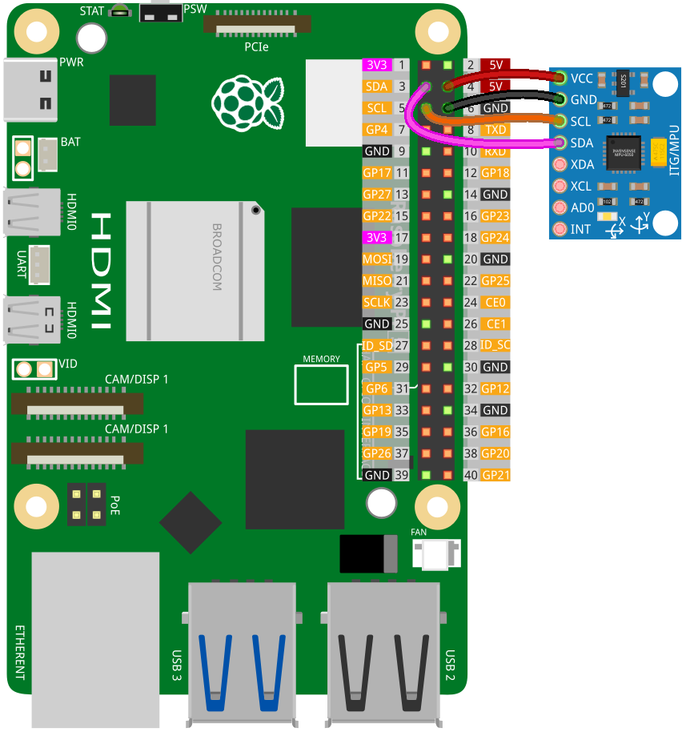

.. note:: 

    Ciao, benvenuto nella Comunità degli Appassionati di Raspberry Pi, Arduino & ESP32 di SunFounder su Facebook! Immergiti più a fondo in Raspberry Pi, Arduino e ESP32 insieme ad altri appassionati.

    **Why Join?**

    - **Expert Support**: Risolvi problemi post-vendita e sfide tecniche con l'aiuto della nostra comunità e del nostro team.
    - **Learn & Share**: Scambia consigli e tutorial per migliorare le tue competenze.
    - **Exclusive Previews**: Ottieni accesso anticipato agli annunci di nuovi prodotti e anteprime esclusive.
    - **Special Discounts**: Goditi sconti esclusivi sui nostri prodotti più recenti.
    - **Festive Promotions and Giveaways**: Partecipa a giveaway e promozioni festive.

    👉 Pronto per esplorare e creare con noi? Clicca [|link_sf_facebook|] e unisciti oggi!

.. _pi_lesson05_mpu6050:

Lezione 05: Modulo Giroscopio & Accelerometro (MPU6050)
==========================================================

In questa lezione, imparerai a interfacciare il Raspberry Pi con l'MPU6050, un sensore che integra un giroscopio a 3 assi e un accelerometro. Esplorerai come misurare l'accelerazione, l'orientamento e la rotazione. Questo progetto offre esperienza pratica nella lettura dei dati dei sensori, utilizzando Python per l'interazione hardware e comprendendo i fondamenti della comunicazione I2C. Imparerai anche a catturare continuamente l'accelerazione sui tre assi, la velocità rotazionale e la temperatura dal sensore. È un punto di partenza ideale per i principianti desiderosi di immergersi nei sensori e nel tracciamento del movimento utilizzando il Raspberry Pi.

Componenti Necessari
--------------------------

Per questo progetto, abbiamo bisogno dei seguenti componenti.

È decisamente conveniente acquistare un kit completo, ecco il link:

.. list-table::
    :widths: 20 20 20
    :header-rows: 1

    *   - Nome	
        - ARTICOLI IN QUESTO KIT
        - LINK
    *   - Kit Sensori Universale per Makers
        - 94
        - |link_umsk|

Puoi anche acquistarli separatamente dai link qui sotto.

.. list-table::
    :widths: 30 20
    :header-rows: 1

    *   - Introduzione al Componente
        - Link Acquisto

    *   - Raspberry Pi 5
        - |link_rpi5_buy|
    *   - :ref:`cpn_mpu6050`
        - |link_mpu6050_buy|

Cablaggio
---------------------------

Codice
---------------------------

.. code-block:: python

   # Importa la classe mpu6050 e la funzione sleep dai rispettivi moduli.
   from mpu6050 import mpu6050
   from time import sleep
   
   # Inizializza il sensore MPU-6050 con l'indirizzo I2C 0x68.
   sensor = mpu6050(0x68)
   
   # Ciclo infinito per leggere continuamente i dati dal sensore.
   while True:
       # Recupera i dati dell'accelerometro dal sensore.
       accel_data = sensor.get_accel_data()
       # Recupera i dati del giroscopio dal sensore.
       gyro_data = sensor.get_gyro_data()
       # Recupera i dati della temperatura dal sensore.
       temp = sensor.get_temp()
   
       # Stampa i dati dell'accelerometro.
       print("Accelerometer data")
       print("x: " + str(accel_data['x']))
       print("y: " + str(accel_data['y']))
       print("z: " + str(accel_data['z']))
   
       # Stampa i dati del giroscopio.
       print("Gyroscope data")
       print("x: " + str(gyro_data['x']))
       print("y: " + str(gyro_data['y']))
       print("z: " + str(gyro_data['z']))
   
       # Stampa la temperatura in gradi Celsius.
       print("Temp: " + str(temp) + " C")
   
       # Pausa di 0,5 secondi prima del prossimo ciclo di lettura.
       sleep(0.5)
   

Analisi del Codice
---------------------------

1. Importazione delle Librerie

   La classe ``mpu6050`` viene importata dalla libreria ``mpu6050`` e la funzione ``sleep`` dal modulo ``time``. Queste importazioni sono necessarie per interagire con il sensore MPU-6050 e introdurre ritardi nel codice.

   Per maggiori informazioni sulla libreria ``mpu6050``, visita |link_mpu6050_python_driver|.

   .. code-block:: python

      from mpu6050 import mpu6050
      from time import sleep

2. Inizializzazione del Sensore

   Viene creata un'istanza della classe ``mpu6050`` con l'indirizzo I2C 0x68 (l'indirizzo predefinito del sensore MPU-6050). Questo passaggio inizializza il sensore per la lettura dei dati.

   .. code-block:: python

      sensor = mpu6050(0x68)

3. Ciclo Infinito per la Lettura Continua

   Un ciclo infinito (``while True``) viene utilizzato per leggere continuamente i dati dal sensore. Questa è una pratica comune per le applicazioni basate su sensori dove è richiesto un monitoraggio costante.

   .. code-block:: python

      while True:

4. Lettura dei Dati del Sensore

   All'interno del ciclo, i dati dall'accelerometro, dal giroscopio e dal sensore di temperatura vengono letti utilizzando i metodi ``get_accel_data``, ``get_gyro_data``, e ``get_temp`` dell'istanza della classe ``mpu6050``. Questi metodi restituiscono i dati del sensore in un formato accessibile all'utente.

   .. code-block:: python

      accel_data = sensor.get_accel_data()
      gyro_data = sensor.get_gyro_data()
      temp = sensor.get_temp()

5. Stampa dei Dati del Sensore

   I dati recuperati vengono quindi stampati. I dati dell'accelerometro e del giroscopio sono accessibili come valori di dizionario (assi x, y, z), e la temperatura viene stampata direttamente come valore in gradi Celsius.

   .. code-block:: python

      print("Accelerometer data")
      print("x: " + str(accel_data['x']))
      print("y: " + str(accel_data['y']))
      print("z: " + str(accel_data['z']))

      print("Gyroscope data")
      print("x: " + str(gyro_data['x']))
      print("y: " + str(gyro_data['y']))
      print("z: " + str(gyro_data['z']))

      print("Temp: " + str(temp) + " C")

6. Ritardo tra le Letture

   Infine, viene introdotto un ritardo di mezzo secondo utilizzando ``sleep(0.5)``. Questo ritardo è cruciale per evitare di sovraccaricare il Raspberry Pi con letture continue dei dati.

   .. code-block:: python

      sleep(0.5)