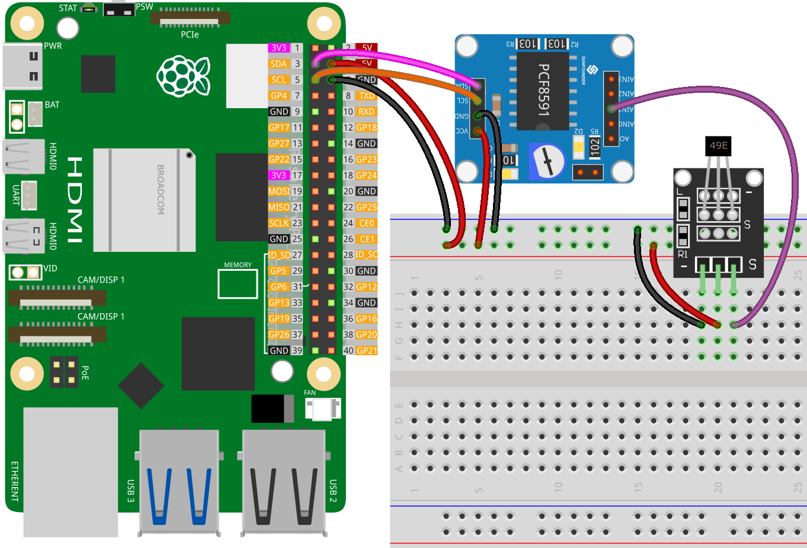

.. note::

   Hallo und willkommen in der SunFounder Raspberry Pi & Arduino & ESP32 Enthusiasten-Gemeinschaft auf Facebook! Tauchen Sie tiefer ein in die Welt von Raspberry Pi, Arduino und ESP32 mit anderen Enthusiasten.

   **Warum beitreten?**

   - **Expertenunterstützung**: Lösen Sie Nachverkaufsprobleme und technische Herausforderungen mit Hilfe unserer Gemeinschaft und unseres Teams.
   - **Lernen & Teilen**: Tauschen Sie Tipps und Anleitungen aus, um Ihre Fähigkeiten zu verbessern.
   - **Exklusive Vorschauen**: Erhalten Sie frühzeitigen Zugang zu neuen Produktankündigungen und exklusiven Einblicken.
   - **Spezialrabatte**: Genießen Sie exklusive Rabatte auf unsere neuesten Produkte.
   - **Festliche Aktionen und Gewinnspiele**: Nehmen Sie an Gewinnspielen und Feiertagsaktionen teil.

   👉 Sind Sie bereit, mit uns zu erkunden und zu erschaffen? Klicken Sie auf [|link_sf_facebook|] und treten Sie heute bei!

.. _pi_lesson06_hall_sensor:

Lektion 06: Hallsensormodul
==================================

.. note::
   Der Raspberry Pi verfügt nicht über analoge Eingabemöglichkeiten, daher benötigt er ein Modul wie den :ref:`cpn_pcf8591`, um analoge Signale zur Verarbeitung zu lesen.

In dieser Lektion lernen wir, wie man mit einem Raspberry Pi von einem Hallsensormodul liest. Sie lernen, wie man ein Fotowiderstandsmodul an den PCF8591 für die Analog-Digital-Umwandlung anschließt und dessen Ausgang in Echtzeit mit Python überwacht. Außerdem werden Sie erkunden, wie man analoge Werte liest und interpretiert, um das Vorhandensein und die Art von Magnetpolen zu erkennen.

Benötigte Komponenten
--------------------------

In diesem Projekt benötigen wir die folgenden Komponenten.

Es ist definitiv praktisch, ein ganzes Kit zu kaufen, hier ist der Link:

.. list-table::
    :widths: 20 20 20
    :header-rows: 1

    *   - Name	
        - ITEMS IN THIS KIT
        - LINK
    *   - Universal Maker Sensor Kit
        - 94
        - |link_umsk|

Sie können sie auch einzeln über die unten stehenden Links kaufen.

.. list-table::
    :widths: 30 20
    :header-rows: 1

    *   - Component Introduction
        - Purchase Link

    *   - Raspberry Pi 5
        - |link_rpi5_buy|
    *   - :ref:`cpn_hall`
        - \-
    *   - :ref:`cpn_pcf8591`
        - |link_pcf8591_module_buy|
    *   - :ref:`cpn_breadboard`
        - |link_breadboard_buy|

Verkabelung
---------------------------

Code
---------------------------

.. code-block:: python

   import PCF8591 as ADC  # Import PCF8591 module
   import time  # Import time for delay
   
   ADC.setup(0x48)  # Initialize PCF8591 at address 0x48
   
   try:
       while True:  # Continuously read and print
           sensor_value = ADC.read(1) # Read from hall sensor module at AIN1
           print(sensor_value,end="")  # Print the sensor raw data
   
           # Determine the polarity of the magnet
           if sensor_value >= 180:
               print(" - South pole detected")   # Determined as South pole.
           elif sensor_value <= 80:
               print(" - North pole detected")   # Determined as North pole.
   
           time.sleep(0.2)  # Wait for 0.2 seconds before the next read
   
   except KeyboardInterrupt:
       print("Exit")  # Exit on CTRL+C

Code-Analyse
---------------------------

#. **Bibliotheken importieren**:

   .. code-block:: python
      
      import PCF8591 as ADC  # Import PCF8591 module
      import time  # Import time for delay

   Diese Importe sind notwendig. ``PCF8591`` wird zur Interaktion mit dem ADC-Modul verwendet, und ``time`` dient zur Implementierung von Verzögerungen in der Schleife.

#. **ADC-Modul initialisieren**:

   .. code-block:: python
      
      ADC.setup(0x48)  # Initialize PCF8591 at address 0x48

   Das PCF8591-Modul wird eingerichtet. ``0x48`` ist die I2C-Adresse des PCF8591-Moduls. Diese Zeile bereitet den Raspberry Pi auf die Kommunikation mit dem Modul vor.

#. **Hauptschleife zur Sensorabfrage**:

   .. code-block:: python

      try:
          while True:  # Continuously read and print
              sensor_value = ADC.read(1) # Read from hall sensor module at AIN1
              print(sensor_value, end="")  # Print the sensor raw data

   In dieser Schleife wird ``sensor_value`` kontinuierlich vom Hallsensor (angeschlossen an AIN1 des PCF8591) gelesen. Die ``print``-Anweisung gibt die Rohdaten des Sensors aus.

#. **Magnetpolarität bestimmen**:

   .. code-block:: python
      
              # Determine the polarity of the magnet
              if sensor_value >= 180:
                  print(" - South pole detected")   # Determined as South pole.
              elif sensor_value <= 80:
                  print(" - North pole detected")   # Determined as North pole.

   Hier bestimmt der Code die Polarität des Magneten. Wenn ``sensor_value`` 180 oder höher ist, wird er als Südpol identifiziert. Wenn er 80 oder niedriger ist, wird er als Nordpol betrachtet. Diese Schwellenwerte sollten basierend auf Ihren tatsächlichen Messergebnissen angepasst werden.

   Das Hallsensormodul ist mit einem 49E linearen Halleffekt-Sensor ausgestattet, der die Polarität der Magnetfeld-Nord- und Südpole sowie die relative Stärke des Magnetfelds messen kann. Wenn Sie den Südpol eines Magneten in die Nähe der mit 49E gekennzeichneten Seite (die Seite mit der Gravur) bringen, erhöht sich der vom Code gelesene Wert linear proportional zur angelegten Magnetfeldstärke. Umgekehrt sinkt der gelesene Wert linear proportional zur Magnetfeldstärke, wenn Sie einen Nordpol in die Nähe dieser Seite bringen. Weitere Details finden Sie unter :ref:`cpn_hall`.

#. **Verzögerung und Ausnahmebehandlung**:

   .. code-block:: python

      time.sleep(0.2)  # Wait for 0.2 seconds before the next read

      except KeyboardInterrupt:
          print("Exit")  # Exit on CTRL+C

   ``time.sleep(0.2)`` erzeugt eine Verzögerung von 0,2 Sekunden zwischen jeder Schleifeniteration, um eine übermäßige Abtastrate zu verhindern. Der ``except``-Block fängt eine Tastaturunterbrechung (STRG+C) ab, um das Programm sauber zu beenden.
