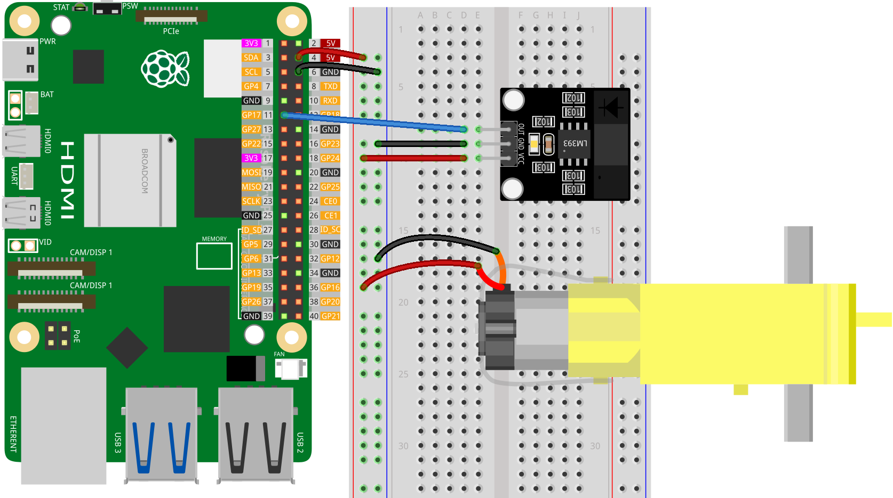

.. note:: 

    ¡Hola, bienvenidos a la Comunidad de Entusiastas de Raspberry Pi, Arduino y ESP32 de SunFounder en Facebook! Profundiza más en Raspberry Pi, Arduino y ESP32 junto con otros entusiastas.

    **¿Por qué unirse?**

    - **Soporte experto**: Resuelve problemas postventa y desafíos técnicos con la ayuda de nuestra comunidad y equipo.
    - **Aprender y compartir**: Intercambia consejos y tutoriales para mejorar tus habilidades.
    - **Avances exclusivos**: Obtén acceso anticipado a anuncios de nuevos productos y adelantos.
    - **Descuentos especiales**: Disfruta de descuentos exclusivos en nuestros productos más nuevos.
    - **Promociones festivas y sorteos**: Participa en sorteos y promociones de temporada.

    👉 ¿Estás listo para explorar y crear con nosotros? Haz clic en [|link_sf_facebook|] y únete hoy mismo!

.. _pi_lesson07_speed:

Lección 07: Módulo Sensor de Velocidad Infrarrojo
====================================================

En esta lección, aprenderás a medir la velocidad de rotación utilizando una Raspberry Pi y un sensor simple. Conectaremos un sensor de entrada digital al pin GPIO 17 y utilizaremos Python para monitorear los cambios de estado. El enfoque estará en calcular las revoluciones por segundo contando las activaciones del sensor durante un período de tiempo específico. Escribirás una función en Python para capturar con precisión estos datos y convertirlos en una velocidad medible. Este proyecto práctico es una introducción directa y útil a la recolección de datos del mundo real y el análisis con Raspberry Pi, ideal para principiantes interesados en la programación aplicada en Python e interacción con hardware.

Componentes requeridos
--------------------------

En este proyecto, necesitamos los siguientes componentes. 

Es definitivamente conveniente comprar un kit completo, aquí tienes el enlace:

.. list-table::
    :widths: 20 20 20
    :header-rows: 1

    *   - Nombre  
        - ELEMENTOS EN ESTE KIT
        - ENLACE
    *   - Kit de Sensor Universal Maker
        - 94
        - |link_umsk|

También puedes comprarlos por separado en los enlaces a continuación.

.. list-table::
    :widths: 30 20
    :header-rows: 1

    *   - Introducción al componente
        - Enlace de compra

    *   - Raspberry Pi 5
        - |link_rpi5_buy|
    *   - :ref:`cpn_speed`
        - |link_speed_sensor_module_buy|
    *   - :ref:`cpn_ttmotor`
        - \-
    *   - :ref:`cpn_breadboard`
        - |link_breadboard_buy|

Conexión
---------------------------

Código
---------------------------

.. code-block:: python

   from gpiozero import DigitalInputDevice
   from time import time

   # Inicializar el sensor
   sensor = DigitalInputDevice(17)  # Suponiendo que el sensor está conectado al GPIO17

   def calculate_rps(sample_time=1, steps_per_revolution=20):
       """
       Calculate Revolutions Per Second (RPS)

       :param sample_time: Sampling time in seconds
       :param steps_per_revolution: Number of steps in each complete revolution
       :return: Revolutions per second
       """
       start_time = time()
       end_time = start_time + sample_time
       steps = 0
       last_state = False

       while time() < end_time:
           current_state = sensor.is_active
           if current_state and not last_state:
               # Detect a transition from inactive to active state
               steps += 1
           last_state = current_state

       # Calculate RPS
       rps = steps / steps_per_revolution
       return rps

   # Example usage
   print("Measuring RPS...")

   try:
       while True:
           rps = calculate_rps()  # Default sampling for 1 second
           print(f"RPS: {rps}")
   except KeyboardInterrupt:
       # Salir de manera segura cuando se detecta una interrupción por teclado
       pass

Análisis del código
---------------------------

#. Importación de bibliotecas

   El script comienza importando ``DigitalInputDevice`` de gpiozero para interactuar con el sensor y ``time`` para la gestión del tiempo.

   .. code-block:: python

      from gpiozero import DigitalInputDevice
      from time import time

#. Inicialización del sensor

   Se crea un objeto ``DigitalInputDevice`` llamado ``sensor``, conectado al pin GPIO 17. Esta configuración asume que el sensor digital está conectado a GPIO17.

   .. code-block:: python

      sensor = DigitalInputDevice(17)

#. Definición de la función ``calculate_rps``

   - Esta función calcula las Revoluciones Por Segundo (RPS) de un objeto en rotación.
   - ``sample_time`` es la duración en segundos durante la cual se muestrea la salida del sensor.
   - ``steps_per_revolution`` representa el número de activaciones del sensor por cada revolución completa.
   - La función utiliza un bucle while para contar el número de pasos (activaciones del sensor) dentro del tiempo de muestreo.
   - Detecta las transiciones de estado inactivo a activo e incrementa el contador de ``steps`` en consecuencia.
   - El RPS se calcula como el número de pasos dividido entre ``steps_per_revolution``.

   .. raw:: html

       

   .. code-block:: python

      def calculate_rps(sample_time=1, steps_per_revolution=20):
          """
          Calculate Revolutions Per Second (RPS)
      
          :param sample_time: Sampling time in seconds
          :param steps_per_revolution: Number of steps in each complete revolution
          :return: Revolutions per second
          """
          start_time = time()
          end_time = start_time + sample_time
          steps = 0
          last_state = False
      
          while time() < end_time:
              current_state = sensor.is_active
              if current_state and not last_state:
                  # Detect a transition from inactive to active state
                  steps += 1
              last_state = current_state
      
          # Calculate RPS
          rps = steps / steps_per_revolution
          return rps

#. Ejecutando el bucle principal:

   - El script entra en un bucle continuo donde llama a ``calcular_rps`` para calcular e imprimir el RPS.
   - El bucle se ejecuta indefinidamente hasta que se detecta una interrupción por teclado (Ctrl+C).
   - Se utiliza un bloque ``try-except`` para manejar la interrupción de manera adecuada, permitiendo una salida segura.

   .. code-block:: python

      try:
          while True:
              rps = calcular_rps()  # Muestreo por defecto durante 1 segundo
              print(f"RPS: {rps}")
      except KeyboardInterrupt:
          pass

