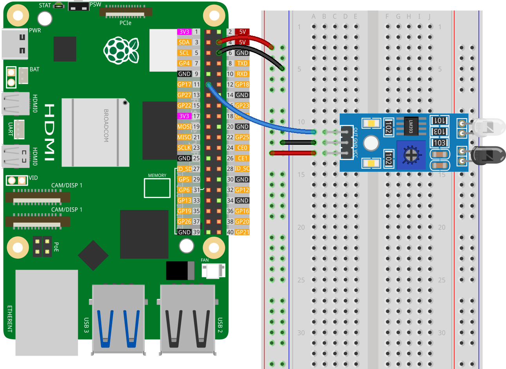

.. note:: 

    Ciao, benvenuto nella Comunità degli Appassionati di Raspberry Pi, Arduino & ESP32 di SunFounder su Facebook! Immergiti più a fondo in Raspberry Pi, Arduino e ESP32 insieme ad altri appassionati.

    **Why Join?**

    - **Expert Support**: Risolvi problemi post-vendita e sfide tecniche con l'aiuto della nostra comunità e del nostro team.
    - **Learn & Share**: Scambia consigli e tutorial per migliorare le tue competenze.
    - **Exclusive Previews**: Ottieni accesso anticipato agli annunci di nuovi prodotti e anteprime esclusive.
    - **Special Discounts**: Goditi sconti esclusivi sui nostri prodotti più recenti.
    - **Festive Promotions and Giveaways**: Partecipa a giveaway e promozioni festive.

    👉 Pronto per esplorare e creare con noi? Clicca [|link_sf_facebook|] e unisciti oggi!

.. _pi_lesson08_ir_obstacle_avoidance:

Lezione 08: Modulo Sensore di Rilevamento Ostacoli IR
===========================================================

In questa lezione, imparerai come rilevare ostacoli utilizzando un sensore con il Raspberry Pi. Ti guideremo nel collegamento di un sensore di input digitale al pin GPIO 17. Imparerai a scrivere uno script Python che monitora continuamente il sensore per determinare la presenza di un ostacolo. Il programma emetterà un messaggio che indica se un ostacolo è stato rilevato o meno. Questo progetto semplice ma pratico è un ottimo modo per iniziare con l'interfacciamento GPIO e la programmazione Python, rendendolo ideale per i principianti interessati all'esplorazione dell'integrazione dei sensori con il Raspberry Pi.

Componenti Necessari
------------------------------

Per questo progetto, abbiamo bisogno dei seguenti componenti.

È decisamente conveniente acquistare un kit completo, ecco il link:

.. list-table::
    :widths: 20 20 20
    :header-rows: 1

    *   - Nome	
        - ARTICOLI IN QUESTO KIT
        - LINK
    *   - Kit Sensori Universale per Makers
        - 94
        - |link_umsk|

Puoi anche acquistarli separatamente dai link qui sotto.

.. list-table::
    :widths: 30 20
    :header-rows: 1

    *   - Introduzione al Componente
        - Link Acquisto

    *   - Raspberry Pi 5
        - |link_rpi5_buy|
    *   - :ref:`cpn_ir_obstacle`
        - |link_obstacle_avoidance_module_buy|
    *   - :ref:`cpn_breadboard`
        - |link_breadboard_buy|

Cablaggio
---------------------------

Codice
---------------------------

.. code-block:: python

   from gpiozero import InputDevice
   from time import sleep

   # Inizializza il sensore come dispositivo di input digitale su GPIO 17
   sensor = InputDevice(17)

   while True:
      if sensor.is_active:
         print("No obstacle detected")  # Stampa quando non viene rilevato alcun ostacolo
      else:
         print("Obstacle detected")     # Stampa quando viene rilevato un ostacolo
      sleep(0.5)

Analisi del Codice
---------------------------

1. Importazione delle Librerie
   
   Lo script inizia importando la classe ``InputDevice`` dalla libreria gpiozero per interagire con il sensore, e la funzione ``sleep`` dal modulo time di Python per mettere in pausa l'esecuzione.

   .. code-block:: python

      from gpiozero import InputDevice
      from time import sleep

2. Inizializzazione del Sensore
   
   Un oggetto ``InputDevice`` denominato ``sensor`` è creato, collegato al pin GPIO 17. Questa linea assume che il sensore degli ostacoli sia collegato a questo specifico pin GPIO.

   .. code-block:: python

      sensor = InputDevice(17)

3. Implementazione del Ciclo di Monitoraggio Continuo
   
   - Lo script utilizza un ciclo ``while True:`` per controllare continuamente lo stato del sensore. Questo ciclo continuerà a eseguirsi fino a quando il programma non viene fermato.
   - All'interno del ciclo, un'istruzione ``if`` controlla la proprietà ``is_active`` del ``sensor``. 
   - Se ``is_active`` è ``True``, indica che non è stato rilevato alcun ostacolo e viene stampato "Nessun ostacolo rilevato".
   - Se ``is_active`` è ``False``, indicando che un ostacolo è stato rilevato, viene stampato "Ostacolo rilevato".
   - ``sleep(0.5)`` mette in pausa il ciclo per 0,5 secondi tra ogni controllo, il che aiuta a ridurre la richiesta di elaborazione dello script e fornisce un ritardo tra le letture consecutive del sensore.

   .. raw:: html

       

   .. code-block:: python

      while True:
          if sensor.is_active:
              print("No obstacle detected")
          else:
              print("Obstacle detected")
          sleep(0.5)

   .. note:: 
   
      Se il sensore non funziona correttamente, regola il trasmettitore IR e il ricevitore per renderli paralleli. Inoltre, puoi regolare il range di rilevamento usando il potenziometro incorporato.