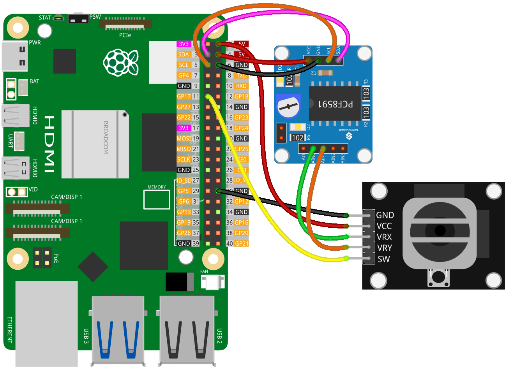

.. note:: 

    Ciao, benvenuto nella Comunità degli Appassionati di Raspberry Pi, Arduino & ESP32 di SunFounder su Facebook! Immergiti più a fondo in Raspberry Pi, Arduino e ESP32 insieme ad altri appassionati.

    **Why Join?**

    - **Expert Support**: Risolvi problemi post-vendita e sfide tecniche con l'aiuto della nostra comunità e del nostro team.
    - **Learn & Share**: Scambia consigli e tutorial per migliorare le tue competenze.
    - **Exclusive Previews**: Ottieni accesso anticipato agli annunci di nuovi prodotti e anteprime esclusive.
    - **Special Discounts**: Goditi sconti esclusivi sui nostri prodotti più recenti.
    - **Festive Promotions and Giveaways**: Partecipa a giveaway e promozioni festive.

    👉 Pronto per esplorare e creare con noi? Clicca [|link_sf_facebook|] e unisciti oggi!

.. _pi_lesson09_joystick:

Lezione 09: Modulo Joystick
==================================

.. note::
   Il Raspberry Pi non ha capacità di input analogico, quindi necessita di un modulo come :ref:`cpn_pcf8591` per leggere i segnali analogici da elaborare.

In questa lezione, imparerai come interfacciare un Raspberry Pi con un modulo joystick usando l'ADC PCF8591. Sarai in grado di leggere le posizioni X e Y del joystick dai suoi output analogici e rilevare le pressioni dei pulsanti. Questa configurazione dimostra come gestire sia gli input analogici che digitali su un Raspberry Pi.

Componenti Necessari
--------------------------

Per questo progetto, abbiamo bisogno dei seguenti componenti.

È decisamente conveniente acquistare un kit completo, ecco il link:

.. list-table::
    :widths: 20 20 20
    :header-rows: 1

    *   - Nome	
        - ARTICOLI IN QUESTO KIT
        - LINK
    *   - Kit Sensori Universale per Makers
        - 94
        - |link_umsk|

Puoi anche acquistarli separatamente dai link qui sotto.

.. list-table::
    :widths: 30 20
    :header-rows: 1

    *   - Introduzione al Componente
        - Link Acquisto

    *   - Raspberry Pi 5
        - |link_rpi5_buy|
    *   - :ref:`cpn_joystick`
        - |link_joystick_buy|
    *   - :ref:`cpn_pcf8591`
        - |link_pcf8591_module_buy|

Cablaggio
---------------------------

.. note::
   In questo progetto, abbiamo utilizzato il pin AIN0 del modulo PCF8591, che è collegato a un potenziometro sul modulo tramite un tappo a jumper. **Per prevenire interferenze nei dati, si prega di scollegare il tappo a jumper dal modulo.** Per maggiori dettagli, si prega di fare riferimento allo schema del modulo PCF8591 :ref:`schematic <cpn_pcf8591_sch>`.

Codice
---------------------------

.. code-block:: python

   import PCF8591 as ADC  # Importa il modulo ADC per input analogico
   import time  # Importa il modulo time per creare dei ritardi
   from gpiozero import Button  # Importa Button per input del pulsante
   
   ADC.setup(0x48)  # Configura il modulo PCF8591 all'indirizzo I2C 0x48
   
   button = Button(17)  # Inizializza il pulsante collegato al GPIO 17
   
   try:
       while True:  # Ciclo continuo
           print("x:", ADC.read(0))  # Leggi il valore analogico dal canale AIN0
           print("y:", ADC.read(1))  # Leggi il valore analogico dal canale AIN1
           print("sw:", button.is_active)  # Controlla se il pulsante è premuto
           time.sleep(0.2)  # Attendi 0.2 secondi prima del prossimo ciclo
   except KeyboardInterrupt:
       print("Exit")  # Termina il programma all'interruzione da tastiera

Analisi del Codice
---------------------------

1. **Importazione delle Librerie**:

   Lo script inizia importando le librerie necessarie per il progetto.

   .. code-block:: python

      import PCF8591 as ADC  # Importa il modulo ADC per input analogico
      import time  # Importa il modulo time per creare dei ritardi
      from gpiozero import Button  # Importa Button per input del pulsante

2. **Configurazione del Modulo PCF8591**:

   Il modulo PCF8591 è configurato all'indirizzo I2C 0x48 che permette al Raspberry Pi di comunicare con esso.

   .. code-block:: python

      ADC.setup(0x48)  # Configura il modulo PCF8591 all'indirizzo I2C 0x48

3. **Inizializzazione del Pulsante**:

   Un pulsante è inizializzato, collegato al pin GPIO 17 sul Raspberry Pi.

   .. code-block:: python

      button = Button(17)  # Inizializza il pulsante collegato al GPIO 17

4. **Ciclo Principale**:

   La parte principale dello script è un ciclo infinito che legge continuamente i valori analogici da due canali del PCF8591 (AIN0 e AIN1) e controlla se il pulsante è premuto. AIN0 e AIN1 sono i pin analogici per gli assi X e Y del joystick.

   .. code-block:: python

      try:
          while True:  # Ciclo continuo
              print("x:", ADC.read(0))  # Leggi il valore analogico dal canale AIN0
              print("y:", ADC.read(1))  # Leggi il valore analogico dal canale AIN1
              print("sw:", button.is_active)  # Controlla se il pulsante è premuto
              time.sleep(0.2)  # Attendi 0.2 secondi prima del prossimo ciclo

5. **Gestione delle Interruzioni**:

   Lo script può essere terminato in modo ordinato utilizzando un'interruzione da tastiera (CTRL+C), pratica comune in Python per fermare un ciclo infinito.

   .. code-block:: python

      except KeyboardInterrupt:
          print("Exit")  # Termina il programma all'interruzione da tastiera