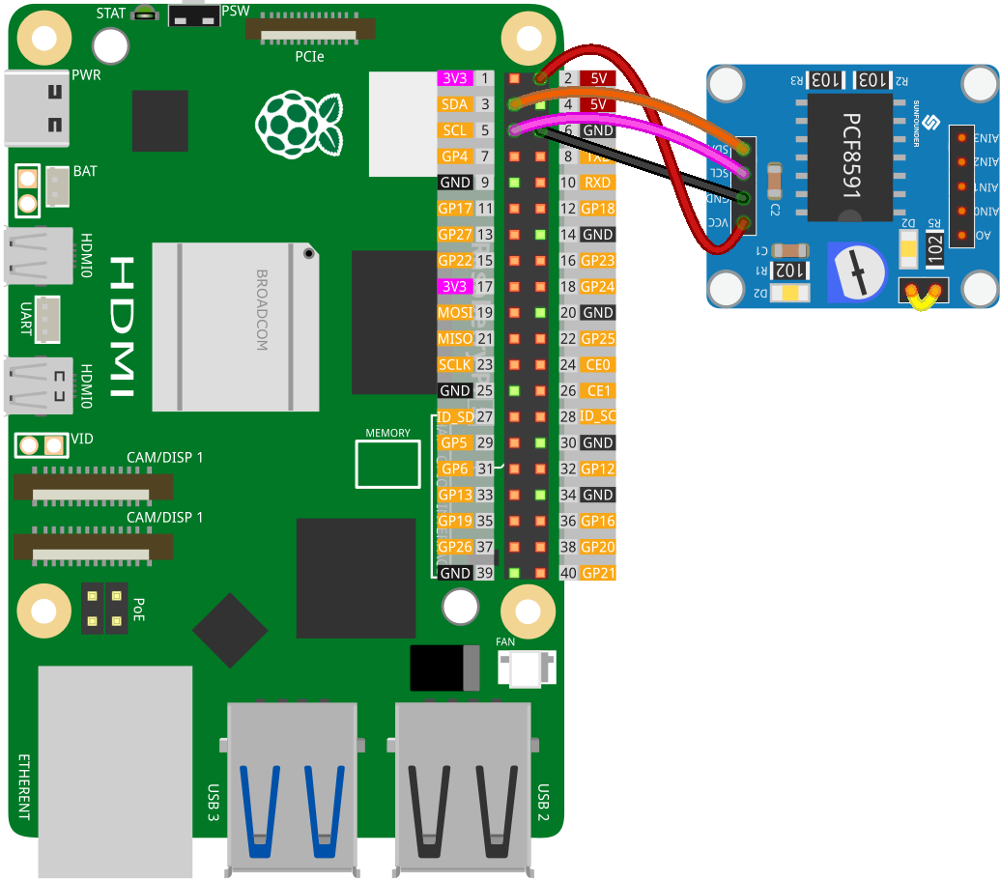

.. note:: 

    Ciao, benvenuto nella Comunità degli Appassionati di Raspberry Pi, Arduino & ESP32 di SunFounder su Facebook! Immergiti più a fondo in Raspberry Pi, Arduino e ESP32 insieme ad altri appassionati.

    **Why Join?**

    - **Expert Support**: Risolvi problemi post-vendita e sfide tecniche con l'aiuto della nostra comunità e del nostro team.
    - **Learn & Share**: Scambia consigli e tutorial per migliorare le tue competenze.
    - **Exclusive Previews**: Ottieni accesso anticipato agli annunci di nuovi prodotti e anteprime esclusive.
    - **Special Discounts**: Goditi sconti esclusivi sui nostri prodotti più recenti.
    - **Festive Promotions and Giveaways**: Partecipa a giveaway e promozioni festive.

    👉 Pronto per esplorare e creare con noi? Clicca [|link_sf_facebook|] e unisciti oggi!

.. _pi_lesson10_pcf8591:

Lezione 10: Modulo Convertitore ADC DAC PCF8591
==================================================

.. note::
   Il Raspberry Pi non ha capacità di input analogico, quindi necessita di un modulo come :ref:`cpn_pcf8591` per leggere i segnali analogici da elaborare.

In questa lezione, imparerai come usare un Raspberry Pi per interagire con il modulo PCF8591 per la conversione analogico-digitale e digitale-analogico. Copriremo la lettura dei valori analogici dall'input AIN0, inviando questi valori al DAC (AOUT). Il potenziometro del modulo è collegato ad AIN0 tramite cappucci a ponticello, e il LED D2 sul modulo è collegato ad AOUT, quindi puoi vedere che la luminosità del LED D2 cambia quando ruoti il potenziometro.

Componenti Necessari
--------------------------

Per questo progetto, abbiamo bisogno dei seguenti componenti.

È decisamente conveniente acquistare un kit completo, ecco il link:

.. list-table::
    :widths: 20 20 20
    :header-rows: 1

    *   - Nome	
        - ARTICOLI IN QUESTO KIT
        - LINK
    *   - Kit Sensori Universale per Makers
        - 94
        - |link_umsk|

Puoi anche acquistarli separatamente dai link qui sotto.

.. list-table::
    :widths: 30 20
    :header-rows: 1

    *   - Introduzione al Componente
        - Link Acquisto

    *   - Raspberry Pi 5
        - |link_rpi5_buy|
    *   - :ref:`cpn_pcf8591`
        - |link_pcf8591_module_buy|
    *   - :ref:`cpn_breadboard`
        - |link_breadboard_buy|

Cablaggio
---------------------------

.. note::
   In questo progetto, abbiamo utilizzato il pin AIN0 del modulo PCF8591, che è collegato a un potenziometro sul modulo tramite un cappuccio a ponticello. **Assicurati che il cappuccio a ponticello sul modulo sia correttamente posizionato.** Per maggiori dettagli, si prega di fare riferimento allo schema del modulo PCF8591 :ref:`schematic <cpn_pcf8591_sch>`.

Codice
---------------------------

.. code-block:: Python

   import PCF8591 as ADC  # Import the library for the PCF8591 module
   import time  # Import the time library for adding delays
   
   # Initialize the PCF8591 module at I2C address 0x48.
   # This address is used for communication with the Raspberry Pi.
   ADC.setup(0x48)
   
   try:
       while True:  # Start an infinite loop to continuously monitor the sensor.
           # Read the analog value from the potentiometer connected to AIN0.
           # Channel range from 0 to 3 represents AIN0 to AIN3.
           # The potentiometer's rotation alters the voltage, which is read by the PCF8591.
           potentiometer_value = ADC.read(0)
           print(potentiometer_value)
   
           # Write the value back to AOUT. This will change the brightness of the D2 LED on the module.
           # LED won't light up below 80, so convert '0-255' to '80-255'
           # As the potentiometer is adjusted, the LED's brightness varies proportionally.
           tmp = potentiometer_value*(255-80)/255+80
           ADC.write(tmp)
   
           # Add a short delay of 0.2 seconds to make the loop more manageable.
           time.sleep(0.2)
   
   except KeyboardInterrupt:
       # If a KeyboardInterrupt (CTRL+C) is detected, exit the loop and end the program.
       print("Exit")

Analisi del Codice
---------------------------

1. **Importazione delle Librerie**:

   Lo script inizia importando le librerie richieste. La libreria ``PCF8591`` è usata per interagire con il modulo ADC/DAC, e ``time`` è per creare ritardi.

   .. code-block:: python

      import PCF8591 come ADC  # Importa la libreria per il modulo PCF8591
      import time  # Importa la libreria time per aggiungere ritardi

2. **Inizializzazione del Modulo PCF8591**:

   Il modulo PCF8591 è inizializzato all'indirizzo I²C 0x48. Questo passaggio è fondamentale per impostare la comunicazione tra il Raspberry Pi e il modulo.

   .. code-block:: python

      ADC.setup(0x48)  # Inizializza il modulo PCF8591 all'indirizzo I2C 0x48

3. **Lettura dal Potenziometro e Scrittura al LED**:

   All'interno di un blocco ``try``, un ciclo ``while True`` continuo legge il valore dal potenziometro collegato ad AIN0 e scrive questo valore al DAC collegato ad AOUT. I cappucci a ponticello collegano il potenziometro del modulo ad AIN0, e il LED D2 è collegato ad AOUT; si prega di fare riferimento allo schema del modulo PCF8591 :ref:`schematic <cpn_pcf8591_sch>` per i dettagli. La luminosità del LED cambia man mano che il potenziometro viene ruotato.

   - Usa ``ADC.read(channel)`` per leggere l'input analogico del canale specifico. La gamma del canale da 0 a 3 rappresenta da AIN0 ad AIN3.

   - Usa ``ADC.write(Value)`` per impostare l'output analogico del pin AOUT con una gamma di Valore da 0 a 255.

   .. raw:: html

       

   .. code-block:: python

      try:
          while True:  # Avvia un ciclo infinito per monitorare continuamente il sensore.
              potentiometer_value = ADC.read(0)
              print(potentiometer_value)
              tmp = potentiometer_value * (255-80) / 255 + 80
              ADC.write(tmp)
              time.sleep(0.2)

4. **Gestione delle Interruzioni da Tastiera**:

   Un ``KeyboardInterrupt`` (come premere CTRL+C) consente di uscire in modo ordinato dal ciclo senza generare errori.

   .. code-block:: python

      except KeyboardInterrupt:
          print("Exit")