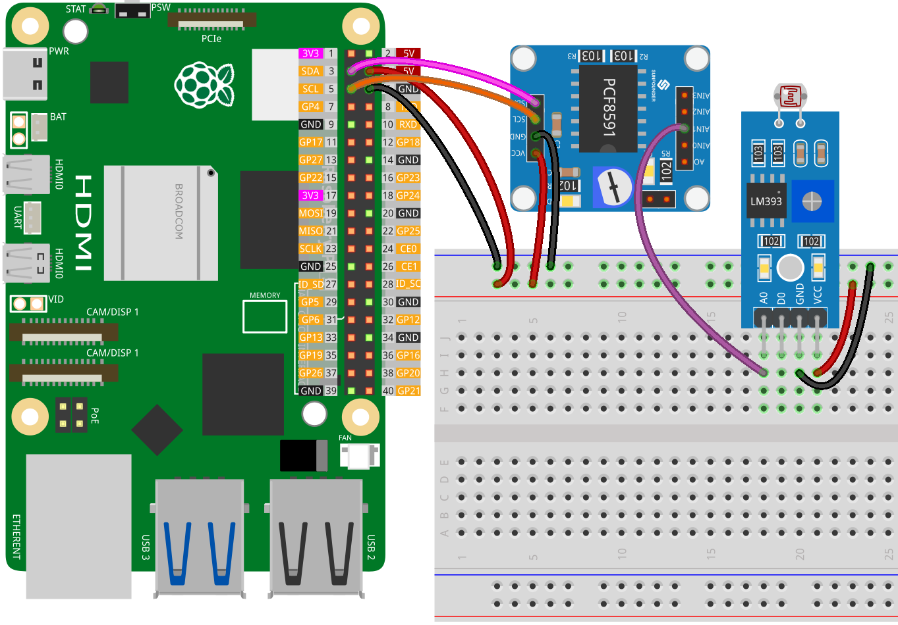

.. note:: 

    Bonjour et bienvenue dans la communauté des passionnés de Raspberry Pi, Arduino et ESP32 de SunFounder sur Facebook ! Explorez davantage le Raspberry Pi, l'Arduino et l'ESP32 avec d'autres passionnés.

    **Pourquoi nous rejoindre ?**

    - **Support d'experts** : Résolvez vos problèmes après-vente et défis techniques avec l'aide de notre communauté et de notre équipe.
    - **Apprendre & partager** : Échangez des astuces et des tutoriels pour améliorer vos compétences.
    - **Aperçus exclusifs** : Bénéficiez d'un accès anticipé aux annonces de nouveaux produits et des aperçus exclusifs.
    - **Réductions spéciales** : Profitez de réductions exclusives sur nos produits les plus récents.
    - **Promotions festives et concours** : Participez à des concours et des promotions pendant les fêtes.

    👉 Prêt à explorer et créer avec nous ? Cliquez sur [|link_sf_facebook|] et rejoignez-nous aujourd'hui !

.. _pi_lesson11_photoresistor:

Leçon 11 : Module Photorésistance
====================================

.. note::
   Le Raspberry Pi ne dispose pas de capacités d'entrée analogique, il lui faut donc un module tel que le :ref:`cpn_pcf8591` pour lire les signaux analogiques à des fins de traitement.

Dans cette leçon, nous apprendrons à lire un module photorésistance à l'aide d'un Raspberry Pi. Vous découvrirez comment connecter un module photorésistance au PCF8591 pour effectuer une conversion analogique-numérique et surveiller sa sortie en temps réel avec Python.

Composants nécessaires
----------------------------

Pour ce projet, nous avons besoin des composants suivants.

Il est très pratique d'acheter un kit complet, voici le lien :

.. list-table::
    :widths: 20 20 20
    :header-rows: 1

    *   - Nom	
        - ARTICLES DANS CE KIT
        - Lien
    *   - Kit de capteurs Universal Maker
        - 94
        - |link_umsk|

Vous pouvez également les acheter séparément via les liens ci-dessous.

.. list-table::
    :widths: 30 20
    :header-rows: 1

    *   - Introduction des composants
        - Lien d'achat

    *   - Raspberry Pi 5
        - \-
    *   - :ref:`cpn_photoresistor`
        - |link_photoresistor_sensor_module_buy|
    *   - :ref:`cpn_pcf8591`
        - |link_pcf8591_module_buy|
    *   - :ref:`cpn_breadboard`
        - |link_breadboard_buy|

Câblage
---------------------------

Code
---------------------------

.. code-block:: python

   import PCF8591 as ADC  # Importation du module PCF8591
   import time  # Importation de time pour les délais
   
   ADC.setup(0x48)  # Initialisation du PCF8591 à l'adresse 0x48
   
   try:
       while True:  # Lecture et affichage en continu
           print(ADC.read(1))  # Lecture de la photorésistance sur AIN1
           time.sleep(0.2)  # Délai de 0,2 secondes
   except KeyboardInterrupt:
       print("Exit")  # Sortie lors de CTRL+C

Analyse du code
---------------------------

1. **Importation des bibliothèques** :

   Cette section importe les bibliothèques Python nécessaires. La bibliothèque ``PCF8591`` est utilisée pour interagir avec le module PCF8591, et ``time`` permet d'implémenter des délais dans le code.

   .. code-block:: python

      import PCF8591 as ADC  # Importation du module PCF8591
      import time  # Importation de time pour les délais

2. **Initialisation du module PCF8591** :

   Ici, le module PCF8591 est initialisé. L'adresse ``0x48`` est l'adresse I²C du module PCF8591. Cette étape est nécessaire pour que le Raspberry Pi puisse communiquer avec le module.

   .. code-block:: python

      ADC.setup(0x48)  # Initialisation du PCF8591 à l'adresse 0x48

3. **Boucle principale et lecture des données** :

   Le bloc ``try`` inclut une boucle continue qui lit les données du module photorésistance. La fonction ``ADC.read(1)`` capture l'entrée analogique du capteur connecté au canal 1 (AIN1) du module PCF8591. L'ajout de ``time.sleep(0.2)`` crée une pause de 0,2 secondes entre chaque lecture. Cela permet non seulement de réduire l'utilisation du CPU du Raspberry Pi en évitant des demandes de traitement excessives, mais aussi d'éviter que le terminal ne soit saturé d'informations défilant trop rapidement, facilitant ainsi la surveillance et l'analyse des résultats.

   .. code-block:: python

      try:
          while True:  # Lecture et affichage en continu
              print(ADC.read(1))  # Lecture de la photorésistance sur AIN1
              time.sleep(0.2)  # Délai de 0,2 secondes

4. **Gestion des interruptions clavier** :

   Le bloc ``except`` est conçu pour capter une interruption clavier (comme la pression de CTRL+C). Lorsque cette interruption se produit, le script affiche "Sortie" et s'arrête. C'est une manière courante de quitter proprement un script en cours d'exécution en Python.

   .. code-block:: python

      except KeyboardInterrupt:
          print("exit")  # Sortie lors de CTRL+C
