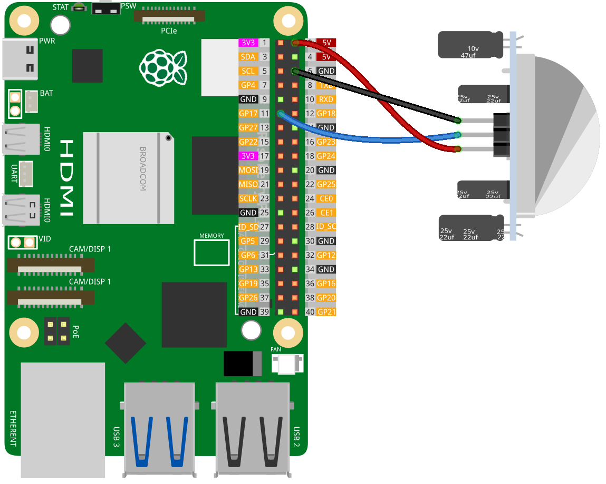

.. note:: 

    Ciao, benvenuto nella Comunità degli Appassionati di Raspberry Pi, Arduino & ESP32 di SunFounder su Facebook! Immergiti più a fondo in Raspberry Pi, Arduino e ESP32 insieme ad altri appassionati.

    **Why Join?**

    - **Expert Support**: Risolvi problemi post-vendita e sfide tecniche con l'aiuto della nostra comunità e del nostro team.
    - **Learn & Share**: Scambia consigli e tutorial per migliorare le tue competenze.
    - **Exclusive Previews**: Ottieni accesso anticipato agli annunci di nuovi prodotti e anteprime esclusive.
    - **Special Discounts**: Goditi sconti esclusivi sui nostri prodotti più recenti.
    - **Festive Promotions and Giveaways**: Partecipa a giveaway e promozioni festive.

    👉 Pronto per esplorare e creare con noi? Clicca [|link_sf_facebook|] e unisciti oggi!

.. _pi_lesson12_pir_motion:

Lezione 12: Modulo Sensore di Movimento PIR (HC-SR501)
=============================================================

In questa lezione, imparerai come configurare e utilizzare un sensore di movimento con il Raspberry Pi. Ti guideremo nel collegamento di un sensore di movimento digitale al pin GPIO 17. Scriverai uno script Python per controllare continuamente lo stato del sensore, stampando un messaggio quando viene rilevato un movimento e un altro quando l'area è libera. Questo tutorial pratico è focalizzato sulle competenze pratiche in circuiti elettronici e programmazione Python, rendendolo perfetto per i principianti che vogliono esplorare applicazioni reali del Raspberry Pi in progetti di monitoraggio e automazione.

Componenti Necessari
--------------------------

Per questo progetto, abbiamo bisogno dei seguenti componenti.

È decisamente conveniente acquistare un kit completo, ecco il link:

.. list-table::
    :widths: 20 20 20
    :header-rows: 1

    *   - Nome	
        - ARTICOLI IN QUESTO KIT
        - LINK
    *   - Kit Sensori Universale per Makers
        - 94
        - |link_umsk|

Puoi anche acquistarli separatamente dai link qui sotto.

.. list-table::
    :widths: 30 20
    :header-rows: 1

    *   - Introduzione al Componente
        - Link Acquisto

    *   - Raspberry Pi 5
        - |link_rpi5_buy|
    *   - :ref:`cpn_pir_motion`
        - \-
    *   - :ref:`cpn_breadboard`
        - |link_breadboard_buy|

Cablaggio
---------------------------

Codice
---------------------------

.. code-block:: python

   from gpiozero import DigitalInputDevice
   from time import sleep

   # Inizializza il sensore di movimento come dispositivo di input digitale sul pin GPIO 17
   motion_sensor = DigitalInputDevice(17)

   # Monitoraggio continuo dello stato del sensore di movimento
   while True:
       if motion_sensor.is_active:
           print("Somebody here!")
       else:
           print("Monitoring...")

       # Attesa di 0,5 secondi prima del prossimo controllo del sensore
       sleep(0.5)

Analisi del Codice
---------------------------

#. Importazione delle Librerie
   
   Lo script inizia importando la classe ``DigitalInputDevice`` dalla libreria gpiozero per interfacciarsi con il sensore di movimento, e la funzione ``sleep`` dal modulo time per introdurre ritardi.

   .. code-block:: python

      from gpiozero import DigitalInputDevice
      from time import sleep

#. Inizializzazione del Sensore di Movimento
   
   Un oggetto ``DigitalInputDevice`` denominato ``motion_sensor`` è creato, collegato al pin GPIO 17. Questo presuppone che il sensore di movimento sia collegato a questo pin GPIO del Raspberry Pi.

   .. code-block:: python

      motion_sensor = DigitalInputDevice(17)

#. Implementazione del Ciclo di Monitoraggio Continuo
   
   - Lo script utilizza un ciclo ``while True:`` per il monitoraggio continuo.
   - All'interno del ciclo, un'istruzione ``if`` controlla la proprietà ``is_active`` del ``motion_sensor``. 
   - Se ``is_active`` è ``True``, suggerisce che il movimento è stato rilevato e viene stampato "Qualcuno qui!".
   - Se ``is_active`` è ``False``, suggerendo che non è stato rilevato alcun movimento, viene stampato "Monitoraggio...".
   - La funzione ``sleep(0.5)`` è utilizzata per mettere in pausa il ciclo per 0,5 secondi tra ogni controllo del sensore, riducendo la richiesta di elaborazione e controllando la frequenza di interrogazione del sensore.

   .. raw:: html

       

   .. code-block:: python

      while True:
          if motion_sensor.is_active:
              print("Somebody here!")
          else:
              print("Monitoring...")
          sleep(0.5)

