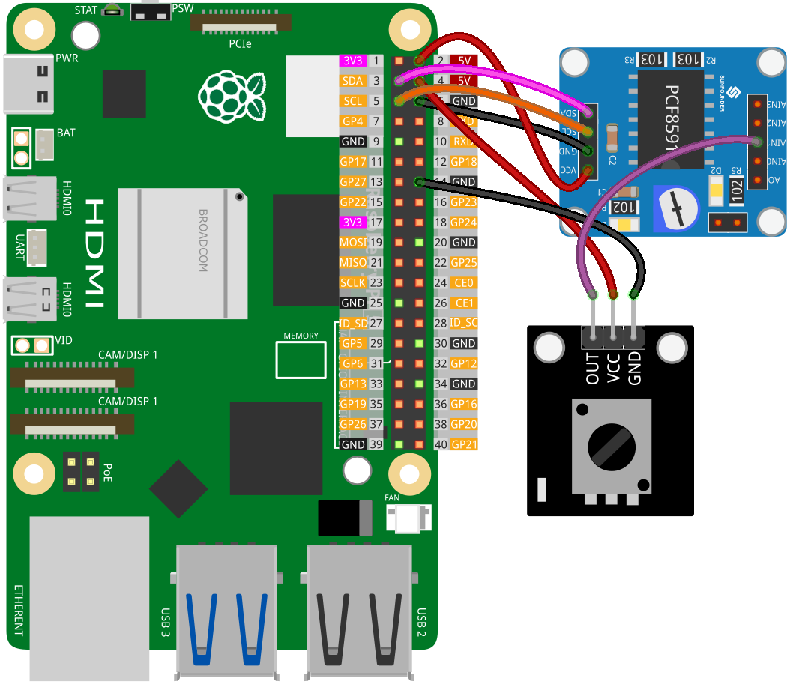

.. note:: 

    ¡Hola, bienvenido a la Comunidad de Entusiastas de Raspberry Pi, Arduino y ESP32 de SunFounder en Facebook! Profundiza en Raspberry Pi, Arduino y ESP32 con otros entusiastas.

    **¿Por qué unirte?**

    - **Soporte experto**: Resuelve problemas postventa y desafíos técnicos con la ayuda de nuestra comunidad y equipo.
    - **Aprende y comparte**: Intercambia consejos y tutoriales para mejorar tus habilidades.
    - **Preestrenos exclusivos**: Accede anticipadamente a anuncios de nuevos productos y adelantos.
    - **Descuentos especiales**: Disfruta de descuentos exclusivos en nuestros productos más recientes.
    - **Promociones festivas y sorteos**: Participa en sorteos y promociones de temporada.

    👉 ¿Listo para explorar y crear con nosotros? Haz clic en [|link_sf_facebook|] y únete hoy mismo!

.. _pi_lesson13_potentiometer:

Lección 13: Módulo de Potenciómetro
=======================================

.. note:: 
   El Raspberry Pi no tiene capacidades de entrada analógica, por lo que necesita un módulo como el :ref:`cpn_pcf8591` para leer señales analógicas y procesarlas.

En esta lección, aprenderás cómo leer un módulo de potenciómetro utilizando un Raspberry Pi. Verás cómo conectar un módulo de potenciómetro al PCF8591 para la conversión de analógico a digital y cómo monitorear su salida en tiempo real con Python.

Componentes Requeridos
------------------------

En este proyecto, necesitamos los siguientes componentes.

Es definitivamente conveniente comprar un kit completo, aquí está el enlace:

.. list-table::
    :widths: 20 20 20
    :header-rows: 1

    *   - Nombre
        - ARTÍCULOS EN ESTE KIT
        - ENLACE
    *   - Kit Universal Maker Sensor
        - 94
        - |link_umsk|

También puedes comprarlos por separado desde los enlaces a continuación.

.. list-table::
    :widths: 30 20
    :header-rows: 1

    *   - Introducción al Componente
        - Enlace de Compra

    *   - Raspberry Pi 5
        - |link_rpi5_buy|
    *   - :ref:`cpn_potentiometer`
        - |link_potentiometer_sensor_module_buy|
    *   - :ref:`cpn_pcf8591`
        - |link_pcf8591_module_buy|

Cableado
------------

Código
--------

.. code-block:: python

   import PCF8591 as ADC  # Importar módulo PCF8591
   import time  # Importar módulo de tiempo para agregar retrasos
   
   ADC.setup(0x48)  # Inicializar PCF8591 en la dirección 0x48
   
   try:
       while True:  # Leer y mostrar continuamente
           print(ADC.read(1))  # Leer desde el Potenciómetro en AIN1
           time.sleep(0.2)  # Retraso de 0.2 segundos
   except KeyboardInterrupt:
       print("Exit")  # Salir con CTRL+C

Análisis del Código
------------------------

1. **Importación de Bibliotecas**:

   Esta sección importa las bibliotecas necesarias en Python. La biblioteca ``PCF8591`` se utiliza para interactuar con el módulo PCF8591, y ``time`` se utiliza para implementar retrasos en el código.

   .. code-block:: python

      import PCF8591 as ADC  # Importar módulo PCF8591
      import time  # Importar módulo de tiempo para agregar retrasos

2. **Inicialización del Módulo PCF8591**:

   Aquí, se inicializa el módulo PCF8591. La dirección ``0x48`` es la dirección I²C del módulo PCF8591. Este paso es necesario para que el Raspberry Pi pueda comunicarse con el módulo.

   .. code-block:: python

      ADC.setup(0x48)  # Inicializar PCF8591 en la dirección 0x48

3. **Bucle Principal y Lectura de Datos**:

   El bloque ``try`` incluye un bucle continuo que lee datos del módulo de potenciómetro. La función ``ADC.read(1)`` captura la entrada analógica del sensor conectado al canal 1 (AIN1) del módulo PCF8591. Incluir un ``time.sleep(0.2)`` crea una pausa de 0.2 segundos entre cada lectura. Esto ayuda no solo a reducir el uso de la CPU en el Raspberry Pi al evitar demandas excesivas de procesamiento de datos, sino también a evitar que la terminal se sobrecargue con información de desplazamiento rápido, lo que facilita monitorear y analizar la salida.

   .. code-block:: python

      try:
          while True:  # Leer y mostrar continuamente
              print(ADC.read(1))  # Leer desde el Potenciómetro en AIN1
              time.sleep(0.2)  # Retraso de 0.2 segundos

4. **Manejo de Interrupciones por Teclado**:

   El bloque ``except`` está diseñado para capturar una interrupción por teclado (como al presionar CTRL+C). Cuando ocurre esta interrupción, el script imprime "Salir" y deja de ejecutarse. Este es un método común para salir de manera elegante de un script en ejecución continua en Python.

   .. code-block:: python

      except KeyboardInterrupt:
          print("exit")  # Salir con CTRL+C