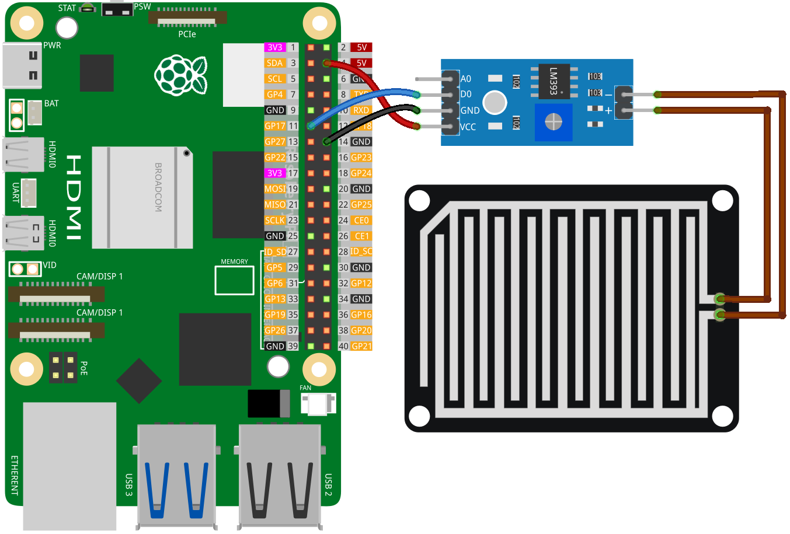

.. note:: 

    ¡Hola, bienvenido a la Comunidad de Entusiastas de Raspberry Pi, Arduino y ESP32 de SunFounder en Facebook! Profundiza en Raspberry Pi, Arduino y ESP32 con otros entusiastas.

    **¿Por qué unirte?**

    - **Soporte experto**: Resuelve problemas postventa y desafíos técnicos con la ayuda de nuestra comunidad y equipo.
    - **Aprende y comparte**: Intercambia consejos y tutoriales para mejorar tus habilidades.
    - **Preestrenos exclusivos**: Accede anticipadamente a anuncios de nuevos productos y adelantos.
    - **Descuentos especiales**: Disfruta de descuentos exclusivos en nuestros productos más recientes.
    - **Promociones festivas y sorteos**: Participa en sorteos y promociones de temporada.

    👉 ¿Listo para explorar y crear con nosotros? Haz clic en [|link_sf_facebook|] y únete hoy mismo!

.. _pi_lesson15_raindrop:

Lección 15: Módulo de Detección de Lluvia
===========================================

En esta lección, aprenderás a detectar lluvia utilizando un sensor digital de lluvia con Raspberry Pi. Te guiaremos para conectar un sensor de lluvia al pin GPIO 17 de tu Raspberry Pi. Aprenderás a programar la Raspberry Pi usando Python para monitorear continuamente el estado del sensor. El programa identificará si está lloviendo o no y mostrará un mensaje en consecuencia. Este proyecto práctico es una excelente introducción al monitoreo ambiental, la interfaz GPIO y la programación en Python, lo que lo convierte en una opción ideal para principiantes interesados en proyectos relacionados con el clima usando Raspberry Pi.

Componentes Requeridos
--------------------------

En este proyecto, necesitamos los siguientes componentes.

Es definitivamente conveniente comprar un kit completo, aquí está el enlace:

.. list-table::
    :widths: 20 20 20
    :header-rows: 1

    *   - Nombre
        - ARTÍCULOS EN ESTE KIT
        - ENLACE
    *   - Kit Universal Maker Sensor
        - 94
        - |link_umsk|

También puedes comprarlos por separado desde los enlaces a continuación.

.. list-table::
    :widths: 30 20
    :header-rows: 1

    *   - Introducción al Componente
        - Enlace de Compra

    *   - Raspberry Pi 5
        - |link_rpi5_buy|
    *   - :ref:`cpn_raindrop`
        - |link_raindrop_sensor_module_buy|
    *   - :ref:`cpn_breadboard`
        - |link_breadboard_buy|

Cableado
---------------------------

Código
---------------------------

.. code-block:: python

   from gpiozero import DigitalInputDevice  
   from time import sleep  

   # Inicializar el sensor como un dispositivo de entrada digital en el pin GPIO 17
   rain_sensor = DigitalInputDevice(17)

   while True:  # Bucle infinito para verificar continuamente el estado del sensor
       if rain_sensor.is_active:  # Verificar si el sensor está activo (sin lluvia)
           print("No rain detected.")  # Imprimir mensaje si no hay lluvia detectada
       else:
           print("Rain detected!")  # Imprimir mensaje si se detecta lluvia
       sleep(1)  # Esperar 1 segundo antes de la siguiente verificación

Análisis del Código
---------------------------

1. Importación de Bibliotecas*:

   El script comienza importando la clase ``DigitalInputDevice`` de la librería gpiozero para interactuar con el sensor de lluvia, y la función ``sleep`` del módulo time para introducir pausas.

   .. code-block:: python

      from gpiozero import DigitalInputDevice  
      from time import sleep  

2. Inicialización del Sensor de Lluvia:

   Se crea un objeto ``DigitalInputDevice`` llamado ``rain_sensor``, conectado al pin GPIO 17. Esta línea configura el sensor de lluvia para comunicarse con la Raspberry Pi a través de este pin GPIO.

   .. code-block:: python

      rain_sensor = DigitalInputDevice(17)

3. Implementación del Bucle de Monitoreo Continuo:

   - Se establece un bucle infinito (``while True:``) para monitorear continuamente el sensor de lluvia.
   - Dentro del bucle, una sentencia ``if`` verifica la propiedad ``is_active`` del ``rain_sensor``.
   - Si ``is_active`` es ``True``, indica que no se detecta lluvia, y se imprime "No se detecta lluvia."
   - Si ``is_active`` es ``False``, indica que se detecta lluvia, y se imprime "¡Lluvia detectada!"
   - La función ``sleep(1)`` pausa el bucle durante 1 segundo entre cada verificación, controlando la frecuencia de la consulta del sensor y reduciendo el uso de la CPU.

   .. raw:: html

       

   .. code-block:: python

      while True:
          if rain_sensor.is_active:
              print("No rain detected.")
          else:
              print("Rain detected!")
          sleep(1)

