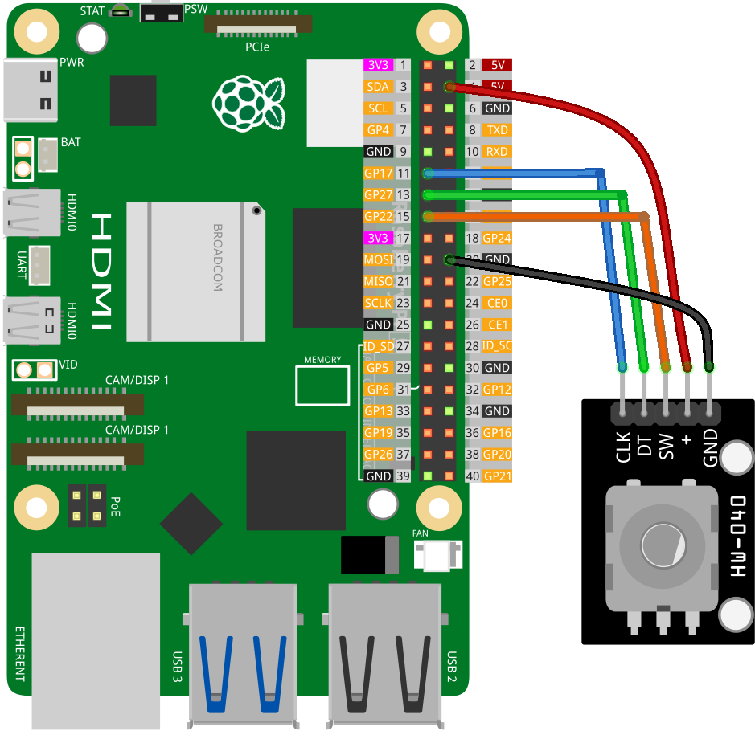

.. note::

    こんにちは、SunFounder Raspberry Pi & Arduino & ESP32 Enthusiasts Communityへようこそ！Facebook上で、仲間と一緒にRaspberry Pi、Arduino、ESP32をさらに深く探求しましょう。

    **なぜ参加するのか？**

    - **専門的なサポート**：購入後の問題や技術的な課題をコミュニティやチームの助けを借りて解決。
    - **学びと共有**：スキルを向上させるためのヒントやチュートリアルを交換。
    - **限定プレビュー**：新製品発表や予告編に早期アクセス。
    - **特別割引**：最新製品の特別割引を楽しむ。
    - **フェスティブプロモーションとプレゼント**：プレゼントやホリデープロモーションに参加。

    👉 私たちと一緒に探索と創造を始める準備はできましたか？[|link_sf_facebook|]をクリックして、今すぐ参加しましょう！
    
.. _pi_lesson17_rotary_encoder:

レッスン17: ロータリーエンコーダーモジュール
=============================================

このレッスンでは、Raspberry Piにロータリーエンコーダーを接続してプログラムする方法を学びます。エンコーダーの位置とボタンの状態を監視し、コンソールに出力を表示するPythonスクリプトの作成手順をステップバイステップで提供します。

必要なコンポーネント
--------------------------

このプロジェクトでは、以下のコンポーネントが必要です。

すべてのキットを購入するのが便利です。リンクはこちら：

.. list-table::
    :widths: 20 20 20
    :header-rows: 1

    *   - Name	
        - ITEMS IN THIS KIT
        - LINK
    *   - Universal Maker Sensor Kit
        - 94
        - |link_umsk|

以下のリンクから個別に購入することもできます。

.. list-table::
    :widths: 30 20
    :header-rows: 1

    *   - Component Introduction
        - Purchase Link

    *   - Raspberry Pi 5
        - |link_rpi5_buy|
    *   - :ref:`cpn_rotary_encoder`
        - \-
    *   - :ref:`cpn_breadboard`
        - |link_breadboard_buy|

配線
---------------------------

コード
---------------------------

.. code-block:: python

   from gpiozero import RotaryEncoder, Button  
   from time import sleep  

   # Initialize the rotary encoder on GPIO pins 17(CLK) and 27(DT) with wrap-around at max_steps of 16
   encoder = RotaryEncoder(a=17, b=27, wrap=True, max_steps=16)
   # Initialize the rotary encoder's SW pin on GPIO pin 22
   button = Button(22)

   last_rotary_value = 0  # Variable to store the last value of rotary encoder

   try:
       while True:  # Infinite loop to continuously monitor the encoder
           current_rotary_value = encoder.steps  # Read current step count from rotary encoder

           # Check if the rotary encoder value has changed
           if last_rotary_value != current_rotary_value:
               print("Result =", current_rotary_value)  # Print the current value
               last_rotary_value = current_rotary_value  # Update the last value

           # Check if the rotary encoder is pressed
           if button.is_pressed:
               print("Button pressed!")  # Print message on button press
               button.wait_for_release()  # Wait until button is released

           sleep(0.1)  # Short delay to prevent excessive CPU usage

   except KeyboardInterrupt:
       print("Program terminated")  # Print message when program is terminated via keyboard interrupt

コード解析
---------------------------

#. ライブラリのインポート
   
   スクリプトは、gpiozeroから ``RotaryEncoder`` と ``Button`` クラスをそれぞれインポートし、timeモジュールから ``sleep`` 関数をインポートすることから始まります。これにより、ロータリーエンコーダーとボタンのインターフェースを設定し、遅延を追加することができます。

   .. code-block:: python

      from gpiozero import RotaryEncoder, Button  
      from time import sleep  

#. ロータリーエンコーダーとボタンの初期化
   
   - この行は、 ``gpiozero`` ライブラリからの ``RotaryEncoder`` オブジェクトを初期化します。エンコーダーはGPIOピン17と27に接続されています。
   - ``wrap=True`` パラメータは、エンコーダーの値が ``max_steps`` （この場合は16）に達するとリセットされ、円形ダイヤルの動作を模倣します。
   - ここでは、GPIOピン22に接続された ``Button`` オブジェクトが作成されます。このオブジェクトは、ロータリーエンコーダーが押されたときに検出するために使用されます。

   .. code-block:: python

      encoder = RotaryEncoder(a=17, b=27, wrap=True, max_steps=16)
      button = Button(22)

#. 監視ループの実装
   
   - 無限ループ（ ``while True:`` ）は、ロータリーエンコーダーを継続的に監視するために使用されます。
   - ロータリーエンコーダーの現在の値を読み取り、最後に記録された値と比較します。変更があれば、新しい値が表示されます。
   - スクリプトは、ロータリーエンコーダーが押されたかどうかを確認します。押されたことを検出すると、メッセージを表示し、ロータリーエンコーダーがリリースされるまで待機します。
   - ``sleep(0.1)`` が含まれており、短い遅延を追加してCPUの使用を過度に防ぎます。

   .. raw:: html

       

   .. code-block:: python

      last_rotary_value = 0

      try:
          while True:
              current_rotary_value = encoder.steps
              if last_rotary_value != current_rotary_value:
                  print("Result =", current_rotary_value)
                  last_rotary_value = current_rotary_value

              if button.is_pressed:
                  print("Button pressed!")
                  button.wait_for_release()

              sleep(0.1)

      except KeyboardInterrupt:
          print("Program terminated")