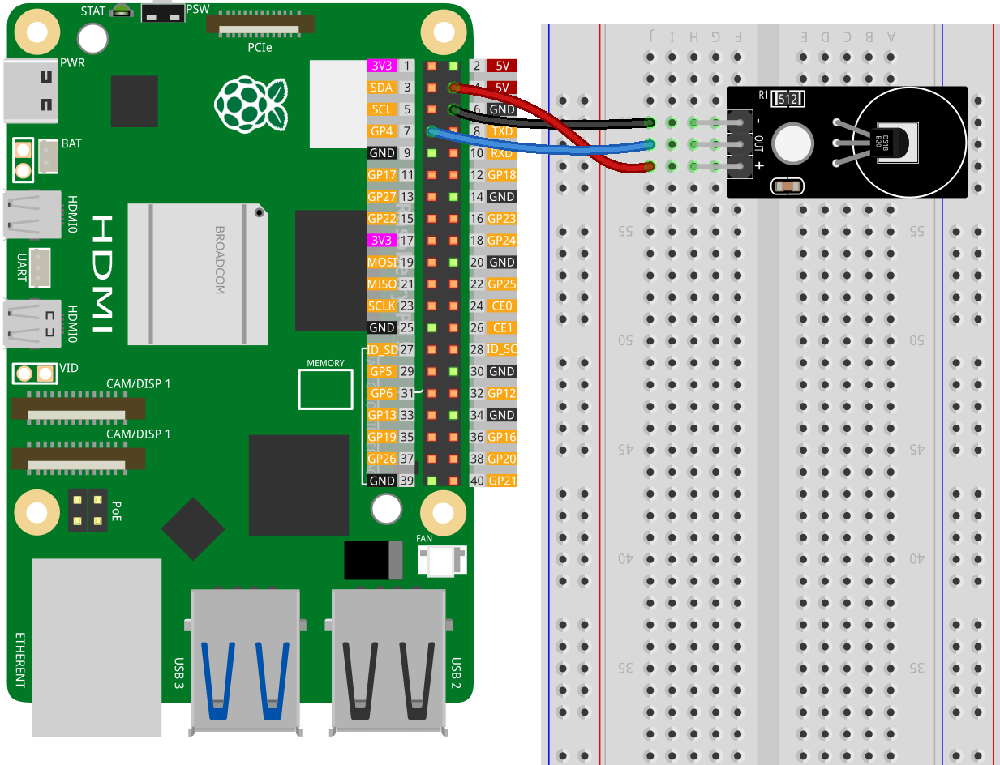

.. note::

    ¡Hola, bienvenido a la Comunidad de Entusiastas de Raspberry Pi, Arduino y ESP32 de SunFounder en Facebook! Profundiza en Raspberry Pi, Arduino y ESP32 con otros entusiastas.

    **¿Por qué unirte?**

    - **Soporte experto**: Resuelve problemas postventa y desafíos técnicos con la ayuda de nuestra comunidad y equipo.
    - **Aprende y comparte**: Intercambia consejos y tutoriales para mejorar tus habilidades.
    - **Preestrenos exclusivos**: Accede anticipadamente a anuncios de nuevos productos y adelantos.
    - **Descuentos especiales**: Disfruta de descuentos exclusivos en nuestros productos más recientes.
    - **Promociones festivas y sorteos**: Participa en sorteos y promociones de temporada.

    👉 ¿Listo para explorar y crear con nosotros? Haz clic en [|link_sf_facebook|] y únete hoy mismo!

.. _pi_lesson18_ds18b20:

Lección 18: Módulo Sensor de Temperatura (DS18B20)
=====================================================

En esta lección, aprenderás a usar un Raspberry Pi para leer datos de temperatura de un sensor DS18B20. Verás cómo localizar el archivo del dispositivo del sensor, leer y analizar sus datos crudos, y convertir estos datos en lecturas en grados Celsius y Fahrenheit.

Componentes Requeridos
--------------------------

En este proyecto, necesitamos los siguientes componentes.

Es definitivamente conveniente comprar un kit completo, aquí está el enlace:

.. list-table::
    :widths: 20 20 20
    :header-rows: 1

    *   - Nombre
        - ARTÍCULOS EN ESTE KIT
        - ENLACE
    *   - Kit Universal Maker Sensor
        - 94
        - |link_umsk|

También puedes comprarlos por separado desde los enlaces a continuación.

.. list-table::
    :widths: 30 20
    :header-rows: 1

    *   - Introducción del componente
        - Enlace de compra

    *   - Raspberry Pi 5
        - |link_rpi5_buy|
    *   - :ref:`cpn_ds18b20`
        - \-
    *   - :ref:`cpn_breadboard`
        - |link_breadboard_buy|

Cableado
---------------------------

Código
---------------------------

.. note::
   El módulo DS18B20 se comunica con el Raspberry Pi utilizando el protocolo onewire. Antes de ejecutar el código, necesitas habilitar la función onewire del Raspberry Pi. Puedes consultar este tutorial: :ref:`pi_enable_1wire`.

.. code-block:: python

   import glob
   import time
   
   # Ruta al directorio que contiene los archivos del dispositivo para los dispositivos 1-wire
   base_dir = "/sys/bus/w1/devices/"
   
   # Encuentra la primera carpeta del dispositivo que comienza con "28", específica para DS18B20
   device_folder = glob.glob(base_dir + "28*")[0]
   
   # Archivo del dispositivo que contiene los datos de temperatura
   device_file = device_folder + "/w1_slave"
   
   
   def read_temp_raw():
       # Lee los datos crudos de temperatura del sensor
       f = open(device_file, "r")
       lines = f.readlines()
       f.close()
       return lines
   
   
   def read_temp():
       # Analiza los datos crudos de temperatura y los convierte a Celsius y Fahrenheit
       lines = read_temp_raw()
       # Espera una lectura válida de temperatura
       while lines[0].strip()[-3:] != "YES":
           time.sleep(0.2)
           lines = read_temp_raw()
       equals_pos = lines[1].find("t=")
       if equals_pos != -1:
           temp_string = lines[1][equals_pos + 2 :]
           temp_c = float(temp_string) / 1000.0  # Convierte a Celsius
           temp_f = temp_c * 9.0 / 5.0 + 32.0  # Convierte a Fahrenheit
           return temp_c, temp_f
   
   
   try:
       # Bucle principal para leer y mostrar la temperatura continuamente
       while True:
           temp_c, temp_f = read_temp()
           formatted_output = f"Temperature: {temp_c:.2f}°C / {temp_f:.2f}°F"
           print(formatted_output)
           time.sleep(1)  # Espera 1 segundo entre lecturas
   except KeyboardInterrupt:
       # Sale del programa de manera segura con CTRL+C
       print("Exit")

Análisis del Código
---------------------------

1. Importación de Bibliotecas

   La biblioteca ``glob`` se utiliza para buscar la carpeta del dispositivo del sensor de temperatura. La biblioteca ``time`` se usa para implementar los retrasos en el programa.

   .. code-block:: python

      import glob
      import time

2. Ubicación del Archivo del Dispositivo de Temperatura

   El código busca el directorio del sensor DS18B20 buscando una carpeta cuyo nombre empiece con "28". El archivo del dispositivo ``w1_slave`` contiene los datos de temperatura.

   .. code-block:: python

      base_dir = "/sys/bus/w1/devices/"
      device_folder = glob.glob(base_dir + "28*")[0]
      device_file = device_folder + "/w1_slave"

3. Lectura de Datos Crudos de Temperatura

   Esta función abre el archivo del dispositivo y lee su contenido. Devuelve los datos crudos de temperatura como una lista de cadenas.

   .. code-block:: python

      def read_temp_raw():
          f = open(device_file, "r")
          lines = f.readlines()
          f.close()
          return lines

4. Análisis y Conversión de los Datos de Temperatura

   La función ``read_temp`` llama a ``read_temp_raw`` para obtener los datos crudos. Luego espera a que la lectura de temperatura sea válida, extrae, analiza y convierte la temperatura a Celsius y Fahrenheit.

   .. code-block:: python

      def read_temp():
          lines = read_temp_raw()
          while lines[0].strip()[-3:] != "YES":
              time.sleep(0.2)
              lines = read_temp_raw()
          equals_pos = lines[1].find("t=")
          if equals_pos != -1:
              temp_string = lines[1][equals_pos + 2 :]
              temp_c = float(temp_string) / 1000.0
              temp_f = temp_c * 9.0 / 5.0 + 32.0
              return temp_c, temp_f

5. Bucle Principal del Programa y Salida Segura

   El bloque ``try`` contiene un bucle infinito para leer y mostrar continuamente la temperatura. El bloque ``except`` captura una interrupción del teclado para salir del programa de manera segura.

   .. code-block:: python

      try:
          while True:
              temp_c, temp_f = read_temp()
              formatted_output = f"Temperature: {temp_c:.2f}°C / {temp_f:.2f}°F"
              print(formatted_output)
              time.sleep(1)
      except KeyboardInterrupt:
          print("Exit")