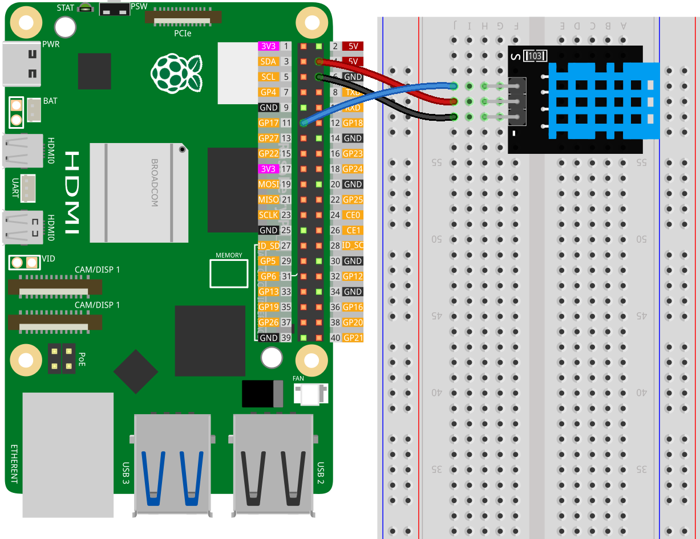
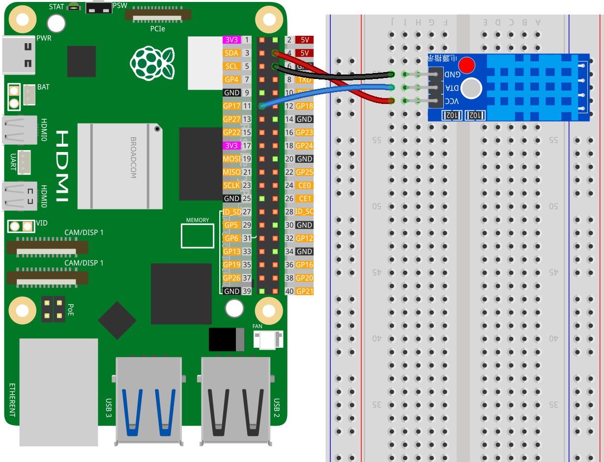

    Bonjour, bienvenue dans la communauté des passionnés de Raspberry Pi, Arduino et ESP32 de SunFounder sur Facebook ! Approfondissez vos connaissances sur Raspberry Pi, Arduino et ESP32 avec d'autres passionnés.

    **Pourquoi rejoindre ?**

    - **Support d'experts** : Résolvez les problèmes après-vente et les défis techniques avec l'aide de notre communauté et de notre équipe.
    - **Apprendre et partager** : Échangez des astuces et des tutoriels pour améliorer vos compétences.
    - **Aperçus exclusifs** : Obtenez un accès anticipé aux annonces de nouveaux produits et aux aperçus.
    - **Réductions spéciales** : Profitez de réductions exclusives sur nos nouveaux produits.
    - **Promotions festives et cadeaux** : Participez à des cadeaux et promotions festives.

    👉 Prêts à explorer et créer avec nous ? Cliquez sur [|link_sf_facebook|] et rejoignez-nous aujourd'hui !

.. _pi_lesson19_dht11:

Leçon 19 : Module de capteur de température et d'humidité (DHT11)
====================================================================

Dans cette leçon, vous apprendrez à connecter et lire les données d'un capteur de température et d'humidité DHT11 à l'aide d'un Raspberry Pi. Vous apprendrez à configurer le capteur, lire la température en Celsius et en Fahrenheit, et obtenir les mesures d'humidité. Ce projet vous initie à l'utilisation de capteurs externes, à la gestion des données en temps réel et aux bases de la gestion des exceptions en Python.

Composants nécessaires
-------------------------

Pour ce projet, nous aurons besoin des composants suivants.

Il est certainement pratique d'acheter un kit complet, voici le lien :

.. list-table::
    :widths: 20 20 20
    :header-rows: 1

    *   - Nom	
        - ÉLÉMENTS DE CE KIT
        - LIEN
    *   - Kit universel de capteurs pour créateurs
        - 94
        - |link_umsk|

Vous pouvez également les acheter séparément via les liens ci-dessous.

.. list-table::
    :widths: 30 10
    :header-rows: 1

    *   - Présentation des composants
        - Lien d'achat

    *   - Raspberry Pi 5
        - \-
    *   - :ref:`cpn_dht11`
        - |link_dht11_humiture_buy|
    *   - :ref:`cpn_breadboard`
        - |link_breadboard_buy|

Câblage
---------

.. note:: 
   Le kit peut contenir différentes versions du module DHT11. Veuillez confirmer la méthode de câblage selon le module que vous avez.

Installation de la bibliothèque
----------------------------------

.. note::
    La bibliothèque adafruit-circuitpython-dht dépend de Blinka, veuillez donc vous assurer que Blinka est installé. Pour installer les bibliothèques, reportez-vous à :ref:`install_blinka`.

Avant d'installer la bibliothèque, veuillez vous assurer que l'environnement Python virtuel est activé :

.. code-block:: bash

   source ~/env/bin/activate

Installez la bibliothèque adafruit-circuitpython-dht :

.. code-block:: bash

   pip install adafruit-circuitpython-dht

Code
------

.. note::
   - Assurez-vous d'avoir installé la bibliothèque Python nécessaire pour exécuter le code conformément aux étapes "Installation de la bibliothèque".
   - Avant d'exécuter le code, assurez-vous que l'environnement Python virtuel avec Blinka installé est activé. Vous pouvez activer l'environnement virtuel en utilisant une commande comme celle-ci :

     .. code-block:: bash
  
        source ~/env/bin/activate

   - Trouvez le code pour cette leçon dans le répertoire ``universal-maker-sensor-kit-main/pi/``, ou copiez et collez directement le code ci-dessous. Exécutez le code en exécutant les commandes suivantes dans le terminal :

     .. code-block:: bash
  
        python 19_dht11_module.py

.. code-block:: python

   import time
   import board
   import adafruit_dht
   
   # Initialiser le dispositif dht, avec la broche de données connectée à :
   dhtDevice = adafruit_dht.DHT11(board.D17)
   
   while True:
       try:
           # Imprimer les valeurs sur le port série
           temperature_c = dhtDevice.temperature
           temperature_f = temperature_c * (9 / 5) + 32
           humidity = dhtDevice.humidity
           print(
               "Temp: {:.1f} F / {:.1f} C    Humidity: {}% ".format(
                   temperature_f, temperature_c, humidity
               )
           )
   
       except RuntimeError as error:
           # Les erreurs sont assez fréquentes, les DHT sont difficiles à lire, continuez simplement
           print(error.args[0])
           time.sleep(2.0)
           continue
       except Exception as error:
           dhtDevice.exit()
           raise error
   
       time.sleep(2.0)

Analyse du code
---------------

#. Importation des bibliothèques :

   Le code commence par importer les bibliothèques nécessaires. ``time`` pour gérer les délais, ``board`` pour accéder aux broches GPIO du Raspberry Pi, et ``adafruit_dht`` pour interagir avec le capteur DHT11. Pour plus de détails sur la bibliothèque ``adafruit_dht``, veuillez vous référer à |Adafruit_CircuitPython_DHT|.

   .. code-block:: python
    
      import time
      import board
      import adafruit_dht

#. Initialisation du capteur :

   Le capteur DHT11 est initialisé avec la broche de données connectée au GPIO 17 du Raspberry Pi. Cette configuration est essentielle pour la communication du capteur avec le Raspberry Pi.

   .. code-block:: python

      dhtDevice = adafruit_dht.DHT11(board.D17)

#. Lecture des données du capteur en boucle :

   La boucle ``while True`` permet au programme de vérifier continuellement le capteur pour de nouvelles données.

   .. code-block:: python

      while True:

#. Blocs try-except :

   À l'intérieur de la boucle, un bloc try-except est utilisé pour gérer les erreurs potentielles d'exécution. Lire les données des capteurs DHT peut souvent entraîner des erreurs dues à des problèmes de temporisation ou à des particularités du capteur.

   .. code-block:: python

      try:
          # Code de lecture des données du capteur ici
      except RuntimeError as error:
          # Gestion des erreurs de lecture courantes
          print(error.args[0])
          time.sleep(2.0)
          continue
      except Exception as error:
          # Gestion des autres exceptions et sortie
          dhtDevice.exit()
          raise error

#. Lecture et affichage des données du capteur :

   La température et l'humidité sont lues à partir du capteur et converties en formats lisibles par l'homme. La température est également convertie de Celsius en Fahrenheit.

   .. code-block:: python

      temperature_c = dhtDevice.temperature
      temperature_f = temperature_c * (9 / 5) + 32
      humidity = dhtDevice.humidity
      print("Temp: {:.1f} F / {:.1f} C    Humidity: {}% ".format(temperature_f, temperature_c, humidity))

#. Gestion des erreurs de lecture :

   Le capteur DHT11 peut souvent renvoyer des erreurs, donc le code utilise un bloc try-except pour les gérer. Si une erreur se produit, le programme attend 2 secondes avant de tenter de lire à nouveau les données du capteur.

   .. code-block:: python

      except RuntimeError as error:
          print(error.args[0])
          time.sleep(2.0)
          continue

#. Gestion générale des exceptions :

   Toutes les autres exceptions qui pourraient survenir sont gérées en sortant en toute sécurité du capteur et en relançant l'erreur. Cela garantit que le programme ne continue pas dans un état instable.

   .. code-block:: python

      except Exception as error:
          dhtDevice.exit()
          raise error

#. Délai entre les lectures :

   Un délai de 2 secondes est ajouté à la fin de la boucle pour éviter une interrogation constante du capteur, ce qui peut conduire à des lectures erronées.

   .. code-block:: python

      time.sleep(2.0)