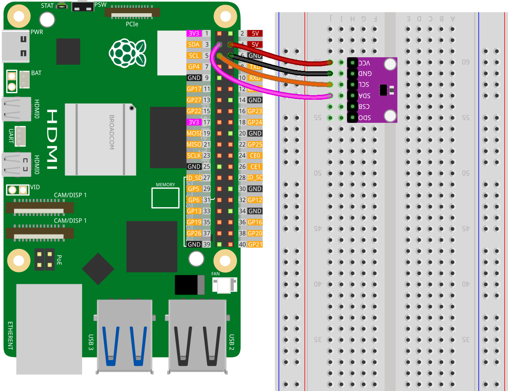

.. note:: 

    Ciao, benvenuto nella Comunità di Appassionati di Raspberry Pi, Arduino & ESP32 di SunFounder su Facebook! Immergiti più a fondo in Raspberry Pi, Arduino e ESP32 con altri entusiasti.

    **Perché Unirsi?**

    - **Supporto Esperto**: Risolvi problemi post-vendita e sfide tecniche con l'aiuto della nostra comunità e del nostro team.
    - **Impara e Condividi**: Scambia consigli e tutorial per migliorare le tue competenze.
    - **Anteprime Esclusive**: Ottieni accesso anticipato agli annunci di nuovi prodotti e alle anteprime.
    - **Sconti Speciali**: Goditi sconti esclusivi sui nostri prodotti più recenti.
    - **Promozioni Festive e Giveaway**: Partecipa ai giveaway e alle promozioni festivi.

    👉 Pronto a esplorare e creare con noi? Clicca [|link_sf_facebook|] e unisciti oggi!

.. _pi_lesson20_bmp280:

Lezione 20: Sensore di Temperatura, Umidità e Pressione (BMP280)
====================================================================

In questa lezione imparerai a collegare e leggere i dati da un sensore BMP280 che misura temperatura, umidità e pressione utilizzando un Raspberry Pi. Configurerai il sensore e scriverai uno script Python per misurare i dati ambientali inclusi temperatura, pressione atmosferica e altitudine.

Componenti Necessari
--------------------------

Per questo progetto sono necessari i seguenti componenti.

È decisamente conveniente acquistare un kit completo, ecco il link: 

.. list-table::
    :widths: 20 20 20
    :header-rows: 1

    *   - Nome	
        - ELEMENTI IN QUESTO KIT
        - LINK
    *   - Kit Sensori Universali
        - 94
        - |link_umsk|

Puoi anche acquistarli separatamente dai link sottostanti.

.. list-table::
    :widths: 30 10
    :header-rows: 1

    *   - Introduzione al Componente
        - Link per l'Acquisto

    *   - Raspberry Pi 5
        - |link_rpi5_buy|
    *   - :ref:`cpn_bmp280`
        - |link_bmp280_module_buy|
    *   - :ref:`cpn_breadboard`
        - |link_breadboard_buy|

Cablaggio
---------------------------

Installazione della Libreria
--------------------------------

.. note::
    La libreria adafruit-circuitpython-bmp280 dipende da Blinka, quindi assicurati che Blinka sia stato installato. Per installare le librerie, fare riferimento a :ref:`install_blinka`.

Prima di installare la libreria, assicurati che l'ambiente Python virtuale sia attivato:

.. code-block:: bash

   source ~/env/bin/activate

Installa la libreria adafruit-circuitpython-bmp280:

.. code-block:: bash

   pip install adafruit-circuitpython-bmp280

Esecuzione del Codice
---------------------------

.. note::
   - Assicurati di aver installato la libreria Python necessaria per eseguire il codice secondo i passaggi di "Installazione della Libreria".
   - Prima di eseguire il codice, assicurati di aver attivato l'ambiente virtuale Python con Blinka installato. Puoi attivare l'ambiente virtuale usando un comando come questo:

     .. code-block:: bash
  
        source ~/env/bin/activate

   - Trova il codice per questa lezione nella directory ``universal-maker-sensor-kit-main/pi/``, oppure copia e incolla direttamente il codice qui sotto. Esegui il codice eseguendo i seguenti comandi nel terminale:

     .. code-block:: bash
  
        python 22_touch_sensor_module.py

.. code-block:: python

   import time
   import board
   
   import adafruit_bmp280
   
   # Crea l'oggetto sensore, comunicando tramite il bus I2C predefinito della scheda
   i2c = board.I2C()  # utilizza board.SCL e board.SDA
   bmp280 = adafruit_bmp280.Adafruit_BMP280_I2C(i2c, indirizzo=0x76)
   
   # modifica questo per corrispondere alla pressione (hPa) a livello del mare della tua località
   bmp280.pressione_a_livello_del_mare = 1013.25
   
   try:
      while True:
         print("\nTemperature: %0.1f C" % bmp280.temperature)
         print("Pressure: %0.1f hPa" % bmp280.pressure)
         print("Altitude = %0.2f meters" % bmp280.altitude)
         time.sleep(2)
   except KeyboardInterrupt:
       print("Exit")  # Uscita con CTRL+C

Analisi del Codice
---------------------------

#. Configurazione del sensore

   Importa le librerie necessarie e crea un oggetto per interagire con il sensore BMP280. ``board.I2C()`` imposta la comunicazione I2C. ``adafruit_bmp280.Adafruit_BMP280_I2C(i2c, indirizzo=0x76)`` inizializza il sensore BMP280 con il suo indirizzo I2C.

   Per maggiori dettagli sulla libreria ``adafruit_bmp280``, si rimanda a |link_Adafruit_CircuitPython_BMP280|.

   .. code-block:: python

      import time
      import board
      import adafruit_bmp280
      i2c = board.I2C()
      bmp280 = adafruit_bmp280.Adafruit_BMP280_I2C(i2c, address=0x76)

#. Configurazione della pressione a livello del mare

   Imposta la proprietà ``sea_level_pressure`` dell'oggetto BMP280. Questo valore è necessario per calcolare l'altitudine.

   .. code-block:: python

      bmp280.sea_level_pressure = 1013.25

#. Lettura dei dati in un ciclo

   Usa un ciclo ``while True`` per leggere continuamente i dati dal sensore. ``bmp280.temperature``, ``bmp280.pressure``, e ``bmp280.altitude`` leggono rispettivamente la temperatura, la pressione e l'altitudine. ``time.sleep(2)`` mette in pausa il ciclo per 2 secondi.

   .. code-block:: python

      try:
         while True:
            print("\nTemperature: %0.1f C" % bmp280.temperature)
            print("Pressure: %0.1f hPa" % bmp280.pressure)
            print("Altitude = %0.2f meters" % bmp280.altitude)
            time.sleep(2)
      except KeyboardInterrupt:
         print("Exit")

#. Gestione delle interruzioni

   Il blocco ``try`` e ``except KeyboardInterrupt:`` permette al programma di uscire in modo pulito quando premi CTRL+C.

   .. code-block:: python

      try:
         # qui il codice del ciclo while
      except KeyboardInterrupt:
         print("Exit")