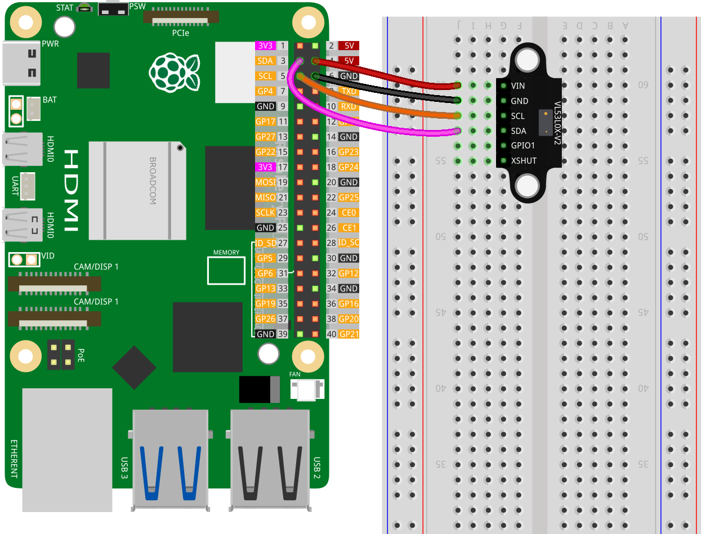

.. note::
    Bonjour, bienvenue dans la communauté des passionnés de SunFounder pour Raspberry Pi, Arduino et ESP32 sur Facebook ! Explorez en profondeur Raspberry Pi, Arduino et ESP32 avec d'autres passionnés.

    **Pourquoi rejoindre ?**

    - **Support d'experts** : Résolvez les problèmes post-vente et les défis techniques avec l'aide de notre communauté et de notre équipe.
    - **Apprendre et partager** : Échangez des astuces et des tutoriels pour améliorer vos compétences.
    - **Aperçus exclusifs** : Bénéficiez d'un accès anticipé aux annonces de nouveaux produits et aux avant-premières.
    - **Réductions spéciales** : Profitez de réductions exclusives sur nos produits les plus récents.
    - **Promotions festives et cadeaux** : Participez à des tirages au sort et à des promotions de fêtes.

    👉 Prêts à explorer et créer avec nous ? Cliquez sur [|link_sf_facebook|] et rejoignez-nous aujourd'hui !

.. _pi_lesson21_vl53l0x:

Leçon 21 : Capteur de distance Micro-LIDAR à temps de vol (VL53L0X)
====================================================================

Dans cette leçon, vous apprendrez à utiliser un Raspberry Pi pour se connecter à un capteur de distance Micro-LIDAR à temps de vol (VL53L0X). Vous serez guidé à travers l'installation du capteur, l'initialisation de la communication I2C, et la mesure des distances en temps réel. Ce projet renforcera votre compréhension de la connexion du matériel avec le Raspberry Pi et de l'utilisation de Python pour des applications pratiques. De plus, vous explorerez l'ajustement des paramètres de mesure pour répondre à différents besoins de précision et de vitesse.

Composants nécessaires
-------------------------

Pour ce projet, nous aurons besoin des composants suivants.

Il est certainement pratique d'acheter un kit complet, voici le lien :

.. list-table::
    :widths: 20 20 20
    :header-rows: 1

    *   - Nom	
        - ÉLÉMENTS DE CE KIT
        - LIEN
    *   - Kit universel de capteurs pour créateurs
        - 94
        - |link_umsk|

Vous pouvez également les acheter séparément via les liens ci-dessous.

.. list-table::
    :widths: 30 10
    :header-rows: 1

    *   - Présentation des composants
        - Lien d'achat

    *   - Raspberry Pi 5
        - \-
    *   - :ref:`cpn_VL53L0X`
        - |link_vl53l0x_module_buy|
    *   - :ref:`cpn_breadboard`
        - |link_breadboard_buy|

Câblage
----------

Installation de la bibliothèque
-------------------------------

.. note::
    La bibliothèque adafruit-circuitpython-vl53l0x dépend de Blinka, donc assurez-vous que Blinka est installé. Pour installer les bibliothèques, référez-vous à :ref:`install_blinka`.

Avant d'installer la bibliothèque, assurez-vous que l'environnement Python virtuel est activé :

.. code-block:: bash

   source ~/env/bin/activate

Installez la bibliothèque adafruit-circuitpython-vl53l0x :

.. code-block:: bash

   pip3 install adafruit-circuitpython-vl53l0x

Exécution du code
--------------------

.. note::
   - Assurez-vous d'avoir installé la bibliothèque Python nécessaire pour exécuter le code selon les étapes "Installation de la bibliothèque".
   - Avant d'exécuter le code, assurez-vous que l'environnement Python virtuel avec Blinka est activé. Vous pouvez activer l'environnement virtuel en utilisant une commande comme celle-ci :

     .. code-block:: bash
  
        source ~/env/bin/activate

   - Trouvez le code pour cette leçon dans le répertoire ``universal-maker-sensor-kit-main/pi/`` ou copiez et collez directement le code ci-dessous. Exécutez le code en exécutant les commandes suivantes dans le terminal :

     .. code-block:: bash
  
        python 21_vl53l0x_module.py

.. code-block:: python

   # Copyright 2021 par ladyada pour Adafruit Industries
   # Sous licence MIT
   
   # Démonstration simple du capteur de distance VL53L0X.
   # Affichera la portée/distance mesurée chaque seconde.
   import time
   
   import board
   import busio
   
   import adafruit_vl53l0x
   
   # Initialisation du bus I2C et du capteur.
   i2c = busio.I2C(board.SCL, board.SDA)
   vl53 = adafruit_vl53l0x.VL53L0X(i2c)
   
   # Ajustement facultatif du budget de temps de mesure pour changer la vitesse et la précision.
   # Voir l'exemple ici pour plus de détails :
   #   https://github.com/pololu/vl53l0x-arduino/blob/master/examples/Single/Single.ino
   # Par exemple, un budget de temps plus rapide mais moins précis de 20 ms :
   # vl53.measurement_timing_budget = 20000
   # Ou un budget de temps plus lent mais plus précis de 200 ms :
   # vl53.measurement_timing_budget = 200000
   # Le budget de temps par défaut est de 33 ms, un bon compromis entre vitesse et précision.
   
   try:
       # La boucle principale lira la portée et l'affichera chaque seconde.
       while True:
           print("Range: {0}mm".format(vl53.range))
           time.sleep(1.0)
   except KeyboardInterrupt:
       print("Exit")  # Sortie sur CTRL+C

Analyse du code
------------------

#. **Importation des bibliothèques**

   .. code-block:: python
   
       import time
       import board
       import busio
       import adafruit_vl53l0x

   - ``time`` : Utilisé pour implémenter des délais.
   - ``board`` : Donne accès aux broches physiques sur le Raspberry Pi.
   - ``busio`` : Gère la communication I2C entre le Pi et le capteur.
   - ``adafruit_vl53l0x`` : La bibliothèque spécifique pour le capteur VL53L0X. Pour plus de détails sur la bibliothèque ``adafruit_vl53l0x``, veuillez vous référer à |link_Adafruit_CircuitPython_VL53L0X|.
 
      .. raw:: html
      
       

#. **Initialisation du capteur**

   .. code-block:: python
   
       # Initialisation du bus I2C et du capteur.
       i2c = busio.I2C(board.SCL, board.SDA)
       vl53 = adafruit_vl53l0x.VL53L0X(i2c)

   - Ceci établit la communication I2C en utilisant les broches SCL (ligne d'horloge) et SDA (ligne de données).
   - Le capteur VL53L0X est ensuite initialisé avec ce bus I2C.

   .. raw:: html
      
       

#. **Configuration (Facultative)**

   .. code-block:: python
   
       # Ajustement facultatif du budget de temps de mesure...
       # vl53.measurement_timing_budget = 20000
       # ...

   Cette partie du code, qui est commentée, permet d'ajuster le budget de temps de mesure du capteur, affectant l'équilibre entre vitesse et précision.

#. **Boucle principale**

   .. code-block:: python
      
       try:
           while True:
               print("Range: {0}mm".format(vl53.range))
               time.sleep(1.0)
       except KeyboardInterrupt:
           print("Exit")

   - Dans une boucle infinie, la portée du capteur est lue et affichée toutes les secondes.
   - La boucle peut être interrompue avec une interruption CTRL+C, qui est gérée par l'exception KeyboardInterrupt.
