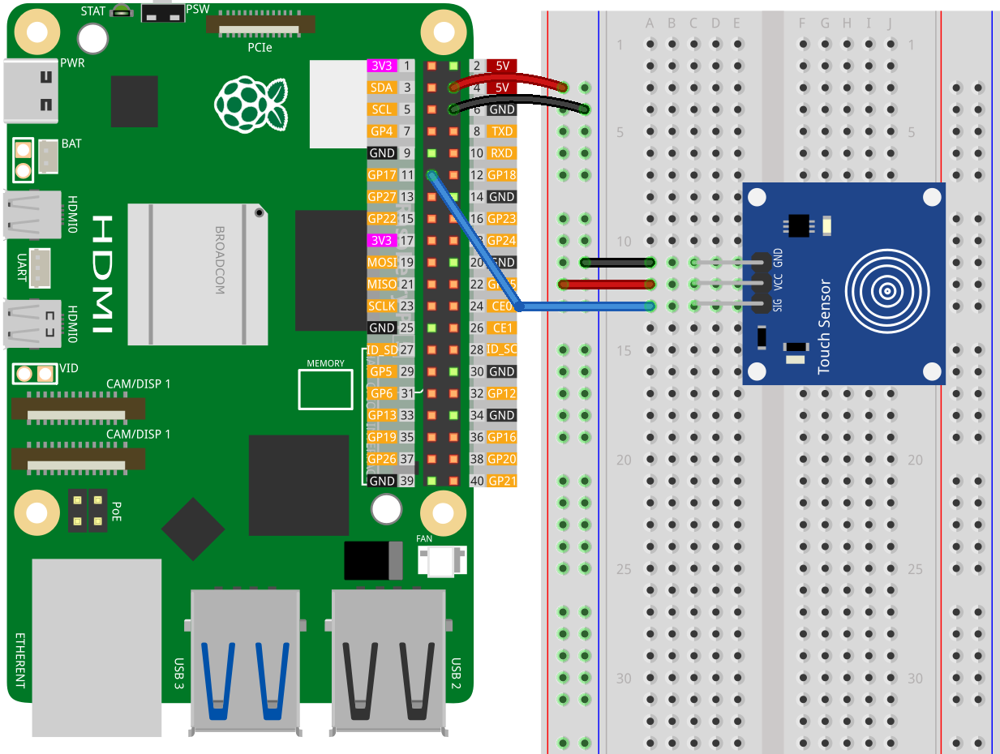

.. note:: 

    Ciao, benvenuto nella Comunità degli Appassionati di Raspberry Pi, Arduino e ESP32 di SunFounder su Facebook! Immergiti più a fondo in Raspberry Pi, Arduino e ESP32 con altri entusiasti.

    **Perché Unirsi?**

    - **Supporto Esperto**: Risolvi problemi post-vendita e sfide tecniche con l'aiuto della nostra comunità e del nostro team.
    - **Impara e Condividi**: Scambia consigli e tutorial per migliorare le tue competenze.
    - **Anteprime Esclusive**: Ottieni accesso anticipato agli annunci di nuovi prodotti e alle anteprime.
    - **Sconti Speciali**: Goditi sconti esclusivi sui nostri prodotti più recenti.
    - **Promozioni Festive e Giveaway**: Partecipa ai giveaway e alle promozioni festive.

    👉 Pronto a esplorare e creare con noi? Clicca [|link_sf_facebook|] e unisciti oggi!

.. _pi_lesson22_touch_sensor:

Lezione 22: Modulo Sensore Tattile
=====================================

In questa lezione imparerai a connettere e programmare un sensore tattile con il Raspberry Pi usando Python. L'attenzione sarà focalizzata sull'impostazione del sensore sul pin GPIO 17 e sulla scrittura di uno script semplice per rilevare e rispondere agli eventi di tocco e rilascio. Questa sessione pratica è volta all'insegnamento delle basi dell'integrazione dei sensori e della gestione degli eventi in Python, fornendoti le competenze necessarie per progetti basati su sensori più avanzati. È un punto di partenza ideale per chi è nuovo nel lavorare con l'elettronica e il Raspberry Pi.

Componenti Necessari
--------------------------

Per questo progetto sono necessari i seguenti componenti.

È decisamente conveniente acquistare un kit completo, ecco il link: 

.. list-table::
    :widths: 20 20 20
    :header-rows: 1

    *   - Nome	
        - ELEMENTI IN QUESTO KIT
        - LINK
    *   - Kit Sensori Universali
        - 94
        - |link_umsk|

Puoi anche acquistarli separatamente dai link sottostanti.

.. list-table::
    :widths: 30 20
    :header-rows: 1

    *   - Introduzione al Componente
        - Link per l'Acquisto

    *   - Raspberry Pi 5
        - |link_rpi5_buy|
    *   - :ref:`cpn_touch`
        - |link_touch_buy|
    *   - :ref:`cpn_breadboard`
        - |link_breadboard_buy|

Cablaggio
---------------------------

Codice
---------------------------

.. code-block:: python

   from gpiozero import Button
   from signal import pause

   # Funzione chiamata quando il sensore è toccato
   def touched():
       # Stampa un messaggio che indica che il sensore è stato toccato
       print("Touched!")   

   # Funzione chiamata quando il sensore non è toccato
   def not_touched():
       # Stampa un messaggio che indica che il sensore non è stato toccato
       print("Not touched!") 

   # Inizializza un oggetto Button per il sensore tattile
   # GPIO 17: pin collegato al sensore
   # pull_up=None: disabilita le resistenze interne di pull-up/pull-down
   # active_state=True: lo stato attivo considera l'alta tensione
   touch_sensor = Button(17, pull_up=None, active_state=True)

   # Assegna funzioni agli eventi del sensore
   touch_sensor.when_pressed = touched
   touch_sensor.when_released = not_touched

   pause()  # Mantieni il programma in esecuzione per rilevare gli eventi di tocco

Analisi del Codice
---------------------------

#. Importazione delle Librerie
   
   Lo script inizia importando la classe ``Button`` da gpiozero per interfacciarsi con il sensore tattile, e ``pause`` dal modulo signal per mantenere il programma in esecuzione e reattivo agli eventi.

   .. code-block:: python

      from gpiozero import Button
      from signal import pause

#. Definizione delle Funzioni di Callback
   
   Due funzioni, ``touched`` e ``not_touched``, sono definite per gestire gli eventi di tocco e rilascio dal sensore. Ogni funzione stampa un messaggio che indica lo stato del sensore.

   .. code-block:: python

      def touched():
          print("Touched!")  

      def not_touched():
          print("Not touched!")  

#. Inizializzazione del Sensore Tattile
   
   Viene creato un oggetto ``Button`` chiamato ``touch_sensor`` per il sensore tattile sul pin GPIO 17. Il parametro ``pull_up`` è impostato su ``None`` per disabilitare le resistenze interne di pull-up/pull-down, e ``active_state`` è impostato su ``True`` per considerare l'alta tensione come stato attivo.

   .. code-block:: python

      touch_sensor = Button(17, pull_up=None, active_state=True)

#. Assegnazione delle Funzioni agli Eventi del Sensore
   
   L'evento ``when_pressed`` del ``touch_sensor`` è collegato alla funzione ``touched``, e l'evento ``when_released`` è collegato alla funzione ``not_touched``. Questa configurazione permette allo script di reagire agli eventi di tocco e rilascio dal sensore.

   .. code-block:: python

      touch_sensor.when_pressed = touched
      touch_sensor.when_released = not_touched

#. Mantenimento dell'Esecuzione del Programma
   
   Viene chiamata la funzione ``pause()`` per mantenere il programma in esecuzione a tempo indeterminato. Questo è necessario per monitorare e rispondere continuamente agli eventi del sensore tattile.

   .. code-block:: python

      pause()