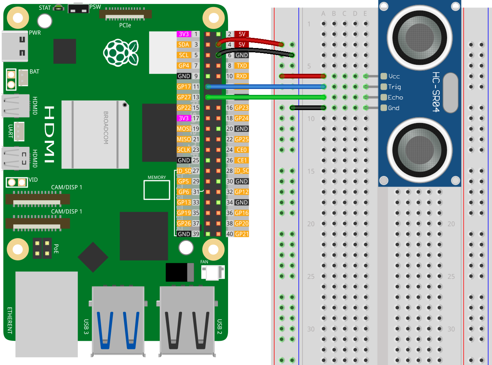

.. note::

    ¡Hola, bienvenido a la Comunidad de Entusiastas de Raspberry Pi, Arduino y ESP32 de SunFounder en Facebook! Profundiza en Raspberry Pi, Arduino y ESP32 con otros entusiastas.

    **¿Por qué unirte?**

    - **Soporte experto**: Resuelve problemas postventa y desafíos técnicos con la ayuda de nuestra comunidad y equipo.
    - **Aprende y comparte**: Intercambia consejos y tutoriales para mejorar tus habilidades.
    - **Preestrenos exclusivos**: Accede anticipadamente a anuncios de nuevos productos y adelantos.
    - **Descuentos especiales**: Disfruta de descuentos exclusivos en nuestros productos más recientes.
    - **Promociones festivas y sorteos**: Participa en sorteos y promociones de temporada.

    👉 ¿Listo para explorar y crear con nosotros? Haz clic en [|link_sf_facebook|] y únete hoy mismo!

.. _pi_lesson23_ultrasonic:

Lección 23: Módulo de Sensor Ultrasónico (HC-SR04)
====================================================

En esta lección, aprenderás cómo conectar un sensor de distancia ultrasónico a un Raspberry Pi y escribir un script en Python para leer las mediciones de distancia. Te guiaremos en el proceso de conectar el pin de disparo del sensor al GPIO 17 y el pin de eco al GPIO 27. El código de Python proporcionado te ayudará a medir distancias y mostrarlas en centímetros.

Componentes Requeridos
--------------------------

En este proyecto, necesitamos los siguientes componentes.

Es definitivamente conveniente comprar un kit completo, aquí está el enlace:

.. list-table::
    :widths: 20 20 20
    :header-rows: 1

    *   - Nombre
        - ARTÍCULOS EN ESTE KIT
        - ENLACE
    *   - Kit Universal Maker Sensor
        - 94
        - |link_umsk|

También puedes comprarlos por separado desde los enlaces a continuación.

.. list-table::
    :widths: 30 20
    :header-rows: 1

    *   - Introducción del Componente
        - Enlace de compra

    *   - Raspberry Pi 5
        - |link_rpi5_buy|
    *   - :ref:`cpn_ultrasonic`
        - |link_ultrasonic_buy|
    *   - :ref:`cpn_breadboard`
        - |link_breadboard_buy|

Cableado
---------------------------

Código
---------------------------

.. code-block:: python

   #!/usr/bin/env python3
   from gpiozero import DistanceSensor
   from time import sleep

   # Inicializa el sensor de distancia utilizando la librería GPIO Zero
   # El pin de disparo está conectado al GPIO 17, el pin de eco al GPIO 27
   sensor = DistanceSensor(echo=27, trigger=17)

   try:
       # Bucle principal para medir continuamente y reportar la distancia
       while True:
           dis = sensor.distance * 100  # Medir la distancia y convertir de metros a centímetros
           print('Distance: {:.2f} cm'.format(dis))  # Imprimir la distancia con dos decimales
           sleep(0.3)  # Esperar 0.3 segundos antes de la siguiente medición

   except KeyboardInterrupt:
       # Manejar KeyboardInterrupt (Ctrl+C) para salir del bucle de forma ordenada
       pass

Análisis del Código
---------------------------

#. Importación de Bibliotecas
   
   El script comienza importando ``DistanceSensor`` desde la librería gpiozero para interactuar con el sensor ultrasónico, y ``sleep`` desde el módulo time para controlar los tiempos.

   .. code-block:: python

      from gpiozero import DistanceSensor
      from time import sleep

#. Inicialización del Sensor de Distancia
   
   Se crea un objeto ``DistanceSensor`` llamado ``sensor`` con los pines ``echo`` y ``trigger`` conectados a los GPIO 27 y GPIO 17, respectivamente. Estos pines se utilizan para enviar y recibir las señales ultrasónicas para medir la distancia.

   .. code-block:: python

      sensor = DistanceSensor(echo=27, trigger=17)

#. Implementación del Bucle de Monitoreo Continuo
   
   - Se utiliza un bloque ``try`` con un bucle infinito (``while True:``) para medir continuamente la distancia.
   - Dentro del bucle, ``sensor.distance`` proporciona la distancia medida en metros, la cual luego se convierte a centímetros y se guarda en ``dis``.
   - La distancia se imprime con una precisión de dos decimales usando el método ``format``.
   - ``sleep(0.3)`` agrega un retraso de 0.3 segundos entre cada medición para controlar la frecuencia de las lecturas y reducir la carga en la CPU.

   .. raw:: html

       

   .. code-block:: python

      try:
          while True:
              dis = sensor.distance * 100
              print('Distance: {:.2f} cm'.format(dis))
              sleep(0.3)

#. Manejo de KeyboardInterrupt para Salida Ordenada
   
   El bloque ``except`` se usa para capturar un KeyboardInterrupt (normalmente Ctrl+C). Cuando esto ocurre, el script sale del bucle de manera ordenada sin realizar ninguna acción adicional.

   .. code-block:: python

      except KeyboardInterrupt:
          pass