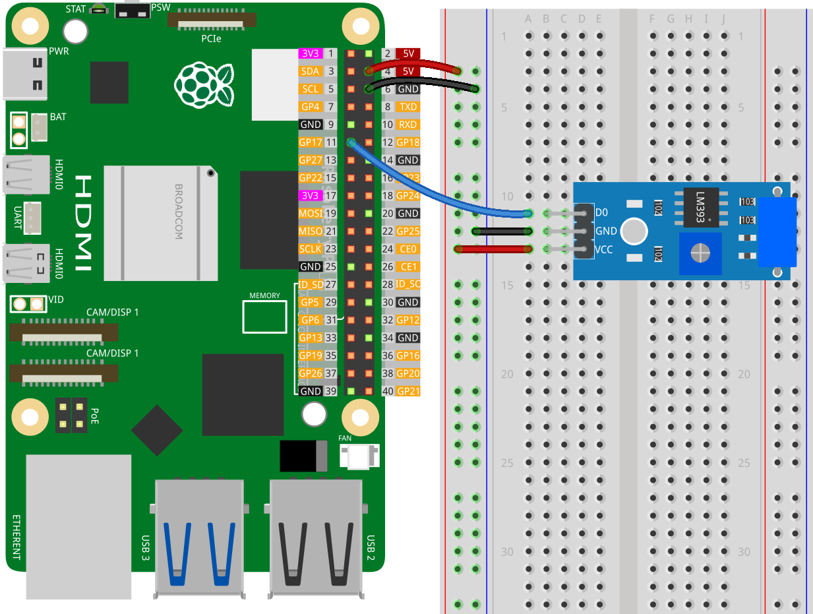

.. note:: 

    Ciao, benvenuto nella Comunità degli Appassionati di Raspberry Pi, Arduino e ESP32 di SunFounder su Facebook! Immergiti più a fondo in Raspberry Pi, Arduino e ESP32 con altri entusiasti.

    **Perché Unirsi?**

    - **Supporto Esperto**: Risolvi problemi post-vendita e sfide tecniche con l'aiuto della nostra comunità e del nostro team.
    - **Impara e Condividi**: Scambia consigli e tutorial per migliorare le tue competenze.
    - **Anteprime Esclusive**: Ottieni accesso anticipato agli annunci di nuovi prodotti e alle anteprime.
    - **Sconti Speciali**: Goditi sconti esclusivi sui nostri prodotti più recenti.
    - **Promozioni Festive e Giveaway**: Partecipa ai giveaway e alle promozioni festive.

    👉 Pronto a esplorare e creare con noi? Clicca [|link_sf_facebook|] e unisciti oggi!

.. _pi_lesson24_vibration_sensor:

Lezione 24: Modulo Sensore di Vibrazione (SW-420)
===================================================

In questa lezione imparerai a utilizzare un sensore di vibrazione con il Raspberry Pi. Ti aiuteremo a collegare il sensore al pin GPIO 17 e ti guideremo nella scrittura di uno script Python semplice. Questo script monitorerà il sensore e stamperà un messaggio ogni volta che viene rilevata una vibrazione. Questa lezione è focalizzata nel fornire ai principianti un'esperienza pratica nel collegare un sensore semplice al Raspberry Pi e scrivere uno script diretto per interagire con esso.

Componenti Necessari
--------------------------

Per questo progetto sono necessari i seguenti componenti.

È decisamente conveniente acquistare un kit completo, ecco il link: 

.. list-table::
    :widths: 20 20 20
    :header-rows: 1

    *   - Nome	
        - ELEMENTI IN QUESTO KIT
        - LINK
    *   - Kit Sensori Universali
        - 94
        - |link_umsk|

Puoi anche acquistarli separatamente dai link sottostanti.

.. list-table::
    :widths: 30 20
    :header-rows: 1

    *   - Introduzione al Componente
        - Link per l'Acquisto

    *   - Raspberry Pi 5
        - |link_rpi5_buy|
    *   - :ref:`cpn_vibration`
        - |link_sw420_vibration_module_buy|
    *   - :ref:`cpn_breadboard`
        - |link_breadboard_buy|

Cablaggio
---------------------------

Codice
---------------------------

.. code-block:: python

   from gpiozero import InputDevice
   import time
   
   # Collega l'uscita digitale del sensore di vibrazione al GPIO17 del Raspberry Pi
   vibration_sensor = InputDevice(17)
   
   # Ciclo continuo per leggere dal sensore
   while True:
       # Controlla se il sensore è attivo (nessuna vibrazione rilevata)
       if vibration_sensor.is_active:
           print("Vibration detected!")
       else:
           # Quando il sensore è inattivo (vibrazione rilevata)
           print("...")
       # Attendi 1 secondo prima di rileggere il sensore
       time.sleep(1)

Analisi del Codice
---------------------------

#. **Importazione delle Librerie**

   Prima, importiamo le librerie necessarie: ``gpiozero`` per interagire con i pin GPIO, e ``time`` per gestire le funzioni legate al tempo.

   .. code-block:: python

      from gpiozero import InputDevice
      import time

#. **Configurazione del Sensore di Vibrazione**

   Inizializziamo il sensore di vibrazione creando un'istanza di ``InputDevice`` dalla libreria ``gpiozero``. Il sensore di vibrazione è collegato al pin GPIO 17 del Raspberry Pi.

   .. code-block:: python

      vibration_sensor = InputDevice(17)

#. **Ciclo di Monitoraggio Continuo**

   Un ciclo ``while True`` è utilizzato per il monitoraggio continuo. Questo ciclo sarà eseguito indefinitamente fino a quando il programma non verrà interrotto manualmente.

   .. code-block:: python

      while True:

#. **Controllo dello Stato del Sensore e Output**

   - All'interno del ciclo, usiamo un'istruzione ``if`` per controllare lo stato del sensore di vibrazione. Se ``vibration_sensor.is_active`` è ``True``, significa che non è stata rilevata nessuna vibrazione e viene stampato "Vibrazione rilevata!".
   - Se ``vibration_sensor.is_active`` è ``False``, indicando la vibrazione, viene stampato "...".
   - Questa distinzione è cruciale per comprendere come l'output del sensore sia interpretato nel codice.

   .. code-block:: python

          if vibration_sensor.is_active:
              print("Vibration detected!")
          else:
              print("...")

#. **Ritardo**

   Infine, ``time.sleep(1)`` aggiunge un ritardo di 1 secondo tra ogni iterazione del ciclo. Questo ritardo è fondamentale per prevenire il sovraccarico della CPU e per rendere l'output leggibile.

   .. code-block:: python

          time.sleep(1)

