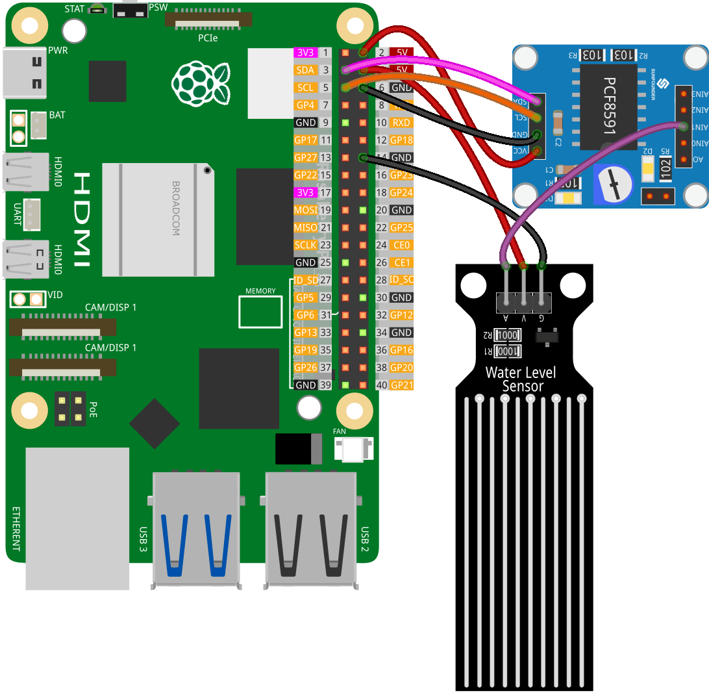

.. note::

    ¡Hola, bienvenido a la Comunidad de Entusiastas de Raspberry Pi, Arduino y ESP32 de SunFounder en Facebook! Profundiza más en Raspberry Pi, Arduino y ESP32 con otros entusiastas.

    **¿Por qué unirse?**

    - **Soporte experto**: Resuelve problemas postventa y desafíos técnicos con la ayuda de nuestra comunidad y equipo.
    - **Aprende y comparte**: Intercambia consejos y tutoriales para mejorar tus habilidades.
    - **Preestrenos exclusivos**: Accede anticipadamente a nuevos anuncios de productos y adelantos.
    - **Descuentos especiales**: Disfruta de descuentos exclusivos en nuestros productos más nuevos.
    - **Promociones festivas y sorteos**: Participa en sorteos y promociones especiales.

    👉 ¿Listo para explorar y crear con nosotros? Haz clic en [|link_sf_facebook|] y únete hoy mismo!

.. _pi_lesson25_water_level:

Lección 25: Módulo Sensor de Nivel de Agua
==============================================

.. note:: 
   La Raspberry Pi no tiene capacidades de entrada analógica, por lo que necesita un módulo como el :ref:`cpn_pcf8591` para leer señales analógicas y procesarlas.

En esta lección, aprenderemos cómo leer desde un sensor de nivel de agua utilizando una Raspberry Pi. Verás cómo conectar un módulo de sensor de nivel de agua al PCF8591 para realizar la conversión de analógico a digital y cómo monitorear su salida en tiempo real con Python.

Componentes Requeridos
--------------------------

En este proyecto, necesitamos los siguientes componentes.

Es muy conveniente comprar un kit completo, aquí tienes el enlace:

.. list-table::
    :widths: 20 20 20
    :header-rows: 1

    *   - Nombre	
        - ARTÍCULOS EN ESTE KIT
        - ENLACE
    *   - Kit de Sensores Universal Maker
        - 94
        - |link_umsk|

También puedes comprarlos por separado desde los enlaces a continuación.

.. list-table::
    :widths: 30 20
    :header-rows: 1

    *   - Introducción del Componente
        - Enlace de compra

    *   - Raspberry Pi 5
        - |link_rpi5_buy|
    *   - :ref:`cpn_water_level`
        - \-
    *   - :ref:`cpn_pcf8591`
        - |link_pcf8591_module_buy|

Conexión
---------------------------

Código
---------------------------

.. code-block:: python

   import PCF8591 as ADC  # Importar módulo PCF8591
   import time  # Importar time para el retraso
   
   ADC.setup(0x48)  # Inicializar PCF8591 en la dirección 0x48
   
   try:
       while True:  # Leer y mostrar continuamente
           print(ADC.read(1))  # Leer del módulo del sensor de nivel de agua en AIN1
           time.sleep(0.2)  # Retraso de 0.2 segundos
   except KeyboardInterrupt:
       print("Exit")  # Salir con CTRL+C

Análisis del Código
---------------------------

1. **Importación de Bibliotecas**:

   Esta sección importa las bibliotecas necesarias de Python. La biblioteca ``PCF8591`` se utiliza para interactuar con el módulo PCF8591, y ``time`` se usa para implementar los retrasos en el código.

   .. code-block:: python

      import PCF8591 as ADC  # Importar módulo PCF8591
      import time  # Importar time para el retraso

2. **Inicialización del Módulo PCF8591**:

   Aquí, se inicializa el módulo PCF8591. La dirección ``0x48`` es la dirección I²C del módulo PCF8591. Esto es necesario para que la Raspberry Pi se comunique con el módulo.

   .. code-block:: python

      ADC.setup(0x48)  # Inicializar PCF8591 en la dirección 0x48

3. **Bucle Principal y Lectura de Datos**:

   El bloque ``try`` incluye un bucle continuo que lee consistentemente los datos del módulo del sensor de nivel de agua. La función ``ADC.read(1)`` captura la entrada analógica del sensor conectado al canal 1 (AIN1) del módulo PCF8591. Al incorporar ``time.sleep(0.2)``, se crea una pausa de 0.2 segundos entre cada lectura. Esto no solo ayuda a reducir el uso de la CPU en la Raspberry Pi evitando demandas excesivas de procesamiento de datos, sino que también evita que el terminal se sobrecargue con información que se desplaza rápidamente, facilitando el monitoreo y análisis de la salida.

   .. code-block:: python

      try:
          while True:  # Leer y mostrar continuamente
              print(ADC.read(1))  # Leer del módulo del sensor de nivel de agua en AIN1
              time.sleep(0.2)  # Retraso de 0.2 segundos

4. **Manejo de Interrupciones del Teclado**:

   El bloque ``except`` está diseñado para capturar una interrupción por teclado (como presionar CTRL+C). Cuando ocurre esta interrupción, el script imprime "Salir" y detiene la ejecución. Esta es una forma común de salir de manera ordenada de un script que se ejecuta continuamente en Python.

   .. code-block:: python

      except KeyboardInterrupt:
          print("exit")  # Salir con CTRL+C