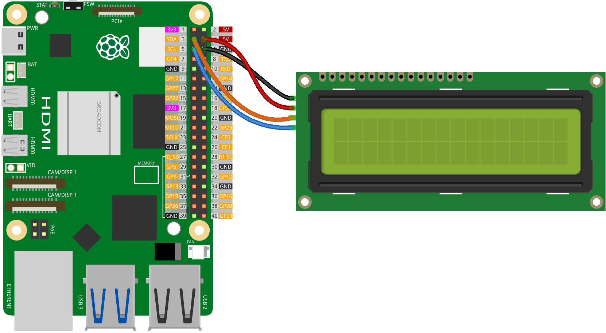

.. note:: 

    ¡Hola, bienvenido a la Comunidad de Entusiastas de SunFounder Raspberry Pi & Arduino & ESP32 en Facebook! Profundiza más en Raspberry Pi, Arduino y ESP32 junto a otros entusiastas.

    **¿Por qué unirse?**

    - **Soporte Experto**: Resuelve problemas postventa y desafíos técnicos con la ayuda de nuestra comunidad y equipo.
    - **Aprender y Compartir**: Intercambia consejos y tutoriales para mejorar tus habilidades.
    - **Avances Exclusivos**: Accede de manera anticipada a anuncios de nuevos productos y adelantos.
    - **Descuentos Especiales**: Disfruta de descuentos exclusivos en nuestros productos más recientes.
    - **Promociones Festivas y Sorteos**: Participa en sorteos y promociones de temporada.

    👉 ¿Listo para explorar y crear con nosotros? Haz clic [|link_sf_facebook|] y únete hoy mismo!

.. _pi_lesson26_lcd:

Lección 26: Módulo LCD I2C 1602
==================================

En esta lección, aprenderás lo básico de cómo mostrar texto en una pantalla LCD utilizando una Raspberry Pi. Comenzaremos mostrándote cómo conectar una LCD estándar a la Raspberry Pi utilizando la interfaz I2C. Aprenderás cómo configurar la LCD con parámetros simples como el modelo de la Raspberry Pi y la dirección I2C. Luego, te guiaremos en la escritura de un script básico en Python para mostrar mensajes como "¡Hola Mundo!" en la pantalla. Este proyecto sencillo está orientado a principiantes, ofreciendo una introducción fundamental a la interacción del hardware con la Raspberry Pi y la programación básica en Python.

Componentes Requeridos
--------------------------

En este proyecto, necesitamos los siguientes componentes.

Definitivamente es conveniente comprar un kit completo, aquí está el enlace:

.. list-table::
    :widths: 20 20 20
    :header-rows: 1

    *   - Nombre
        - ARTÍCULOS EN ESTE KIT
        - ENLACE
    *   - Kit de Sensores Universal Maker
        - 94
        - |link_umsk|

También puedes comprarlos por separado desde los enlaces a continuación.

.. list-table::
    :widths: 30 20
    :header-rows: 1

    *   - Introducción del componente
        - Enlace de compra

    *   - Raspberry Pi 5
        - |link_rpi5_buy|
    *   - :ref:`cpn_i2c_lcd1602`
        - |link_i2clcd1602_buy|

Conexión
---------------------------

Código
---------------------------

.. code-block:: python

   import time
   from LCD import LCD

   # Inicializa la LCD con parámetros específicos: revisión de la Raspberry Pi, dirección I2C y estado de la retroiluminación
   lcd = LCD(2, 0x27, True)  # Usando la revisión 2 de Raspberry Pi, dirección I2C 0x27, retroiluminación habilitada

   # Muestra mensajes en la LCD
   lcd.message("Hello World!", 1)        # Muestra '¡Hola Mundo!' en la línea 1
   lcd.message("    - Sunfounder", 2)    # Muestra '    - Sunfounder' en la línea 2

   # Mantiene los mensajes mostrados durante 5 segundos
   time.sleep(5)

   # Limpia la pantalla de la LCD
   lcd.clear()

Análisis del Código
---------------------------

#. Importar bibliotecas

   Importa el módulo ``time`` para crear retrasos y el módulo ``LCD`` para controlar la LCD.

   Para más detalles sobre la biblioteca ``LCD``, consulta |link_lcd1602_python_driver_pi|.

   .. code-block:: python

      import time
      from LCD import LCD

#. Inicializando la LCD

   Creamos un objeto ``LCD`` con parámetros específicos: la revisión de la Raspberry Pi, la dirección I2C de la LCD y el estado de la retroiluminación. En este caso, revisión 2 de Raspberry Pi (y versiones superiores), dirección I2C 0x27, y retroiluminación habilitada.

   .. code-block:: python

      lcd = LCD(2, 0x27, True)

#. Mostrar Mensajes en la LCD

   Usamos el método ``message`` del objeto ``LCD`` para mostrar texto en la LCD. El primer argumento es el texto, y el segundo argumento es el número de línea.

   .. code-block:: python

      lcd.message("Hello World!", 1)
      lcd.message("    - Sunfounder", 2)

#. Mantener los Mensajes Mostrados

   Pausa el programa durante 5 segundos, manteniendo los mensajes en la LCD durante ese tiempo.

   .. code-block:: python

      time.sleep(5)

#. Limpiar la Pantalla de la LCD

   Después de la pausa, limpia la pantalla utilizando el método ``clear`` del objeto ``LCD``.

   .. code-block:: python

      lcd.clear()

