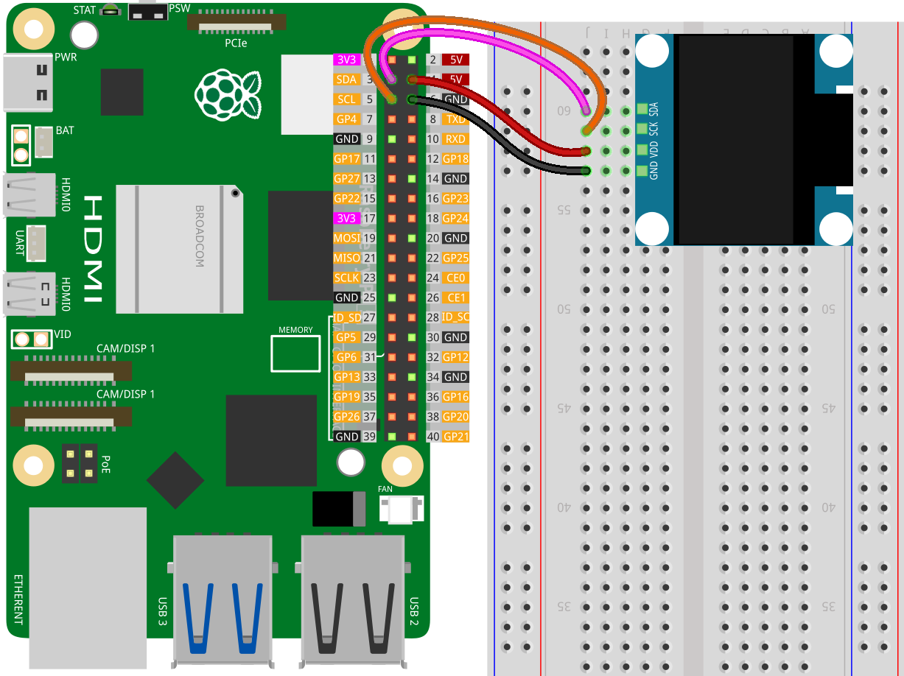

.. note::
    Bonjour, bienvenue dans la communauté des passionnés de SunFounder pour Raspberry Pi, Arduino et ESP32 sur Facebook ! Plongez plus profondément dans l'univers des Raspberry Pi, Arduino et ESP32 avec d'autres passionnés.

    **Pourquoi rejoindre ?**

    - **Support d'experts** : Résolvez les problèmes après-vente et les défis techniques avec l'aide de notre communauté et de notre équipe.
    - **Apprendre et partager** : Échangez des astuces et des tutoriels pour améliorer vos compétences.
    - **Aperçus exclusifs** : Obtenez un accès anticipé aux annonces de nouveaux produits et aux coups d'œil.
    - **Réductions spéciales** : Profitez de réductions exclusives sur nos produits les plus récents.
    - **Promotions festives et cadeaux** : Participez à des tirages au sort et à des promotions festives.

    👉 Prêts à explorer et créer avec nous ? Cliquez sur [|link_sf_facebook|] et rejoignez-nous aujourd'hui !

.. _pi_lesson27_oled:

Leçon 27 : Module d'affichage OLED (SSD1306)
===============================================

Dans cette leçon, vous apprendrez à connecter un Raspberry Pi à un module d'affichage OLED (SSD1306) en utilisant Python. Vous apprendrez à établir une communication I2C entre le Raspberry Pi et l'écran OLED, et à utiliser la Python Imaging Library (PIL) pour créer des graphiques et du texte. La leçon vous guidera à travers le dessin de formes et de textes sur l'écran OLED, fournissant un exemple pratique avec le message "Hello World !".

Composants nécessaires
-------------------------

Pour ce projet, nous aurons besoin des composants suivants.

Il est certainement pratique d'acheter un kit complet, voici le lien :

.. list-table::
    :widths: 20 20 20
    :header-rows: 1

    *   - Nom	
        - ÉLÉMENTS DE CE KIT
        - LIEN
    *   - Kit universel de capteurs pour créateurs
        - 94
        - |link_umsk|

Vous pouvez également les acheter séparément via les liens ci-dessous.

.. list-table::
    :widths: 30 20
    :header-rows: 1

    *   - Présentation des composants
        - Lien d'achat

    *   - Raspberry Pi 5
        - \-
    *   - :ref:`cpn_oled`
        - \-
    *   - :ref:`cpn_breadboard`
        - |link_breadboard_buy|

Câblage
----------

Installation de la bibliothèque
----------------------------------

.. note::
    La bibliothèque adafruit-circuitpython-ssd1306 dépend de Blinka, assurez-vous donc que Blinka est installé. Pour installer les bibliothèques, référez-vous à :ref:`install_blinka`.

Avant d'installer la bibliothèque, assurez-vous que l'environnement Python virtuel est activé :

.. code-block:: bash

   source ~/env/bin/activate

Installez la bibliothèque adafruit-circuitpython-ssd1306 :

.. code-block:: bash

   pip install adafruit-circuitpython-ssd1306

Exécution du code
--------------------

.. note::
   - Assurez-vous d'avoir installé la bibliothèque Python nécessaire pour exécuter le code selon les étapes "Installation de la bibliothèque".
   - Avant d'exécuter le code, assurez-vous que l'environnement Python virtuel avec Blinka installé est activé. Vous pouvez activer l'environnement virtuel en utilisant une commande comme celle-ci :

     .. code-block:: bash
  
        source ~/env/bin/activate

   - Trouvez le code pour cette leçon dans le répertoire ``universal-maker-sensor-kit-main/pi/``, ou copiez et collez directement le code ci-dessous. Exécutez le code en lançant les commandes suivantes dans le terminal :

     .. code-block:: bash
  
        python 27_ssd1306_oled_module.py

.. code-block:: python

   import board
   import digitalio
   from PIL import Image, ImageDraw, ImageFont
   import adafruit_ssd1306
   
   # Initialisez les dimensions de l'affichage OLED
   WIDTH = 128
   HEIGHT = 64
   
   # Configurez la communication I2C avec l'affichage OLED
   i2c = board.I2C()  # Utilise les broches SCL et SDA de la carte
   oled = adafruit_ssd1306.SSD1306_I2C(WIDTH, HEIGHT, i2c, addr=0x3C)
   
   # Effacez l'affichage OLED
   oled.fill(0)
   oled.show()
   
   # Créez une nouvelle image avec une couleur sur 1 bit pour le dessin
   image = Image.new("1", (oled.width, oled.height))
   
   # Obtenez un objet de dessin pour manipuler l'image
   draw = ImageDraw.Draw(image)
   
   # Dessinez un rectangle blanc rempli comme arrière-plan
   draw.rectangle((0, 0, oled.width, oled.height), outline=255, fill=255)
   
   # Définissez la taille de la bordure pour un rectangle intérieur
   BORDER = 5
   # Dessinez un rectangle noir plus petit à l'intérieur du plus grand
   draw.rectangle(
       (BORDER, BORDER, oled.width - BORDER - 1, oled.height - BORDER - 1),
       outline=0,
       fill=0,
   )
   
   # Chargez la police par défaut pour le texte
   font = ImageFont.load_default()
   
   def getfontsize(font, text):
       # Calculez la taille du texte en pixels
       left, top, right, bottom = font.getbbox(text)
       return right - left, bottom - top
   
   # Définissez le texte à afficher
   text = "Hello World!"
   # Obtenez la largeur et la hauteur du texte en pixels
   (font_width, font_height) = getfontsize(font, text)
   # Dessinez le texte, centré sur l'affichage
   draw.text(
       (oled.width // 2 - font_width // 2, oled.height // 2 - font_height // 2),
       text,
       font=font,
       fill=255,
   )
   
   # Envoyez l'image à l'affichage OLED
   oled.image(image)
   oled.show()

Analyse du code
---------------------------

#. Importation des bibliothèques nécessaires

   Ici, nous importons les bibliothèques nécessaires pour le projet. ``board`` est utilisé pour l'interface avec le matériel Raspberry Pi, ``PIL`` pour le traitement d'images, et ``adafruit_ssd1306`` pour contrôler l'affichage OLED.

   Pour plus de détails sur la bibliothèque ``adafruit_ssd1306``, veuillez vous référer à |Adafruit_Adafruit_CircuitPython_SSD1306|.

   .. code-block:: python

      import board
      import digitalio
      from PIL import Image, ImageDraw, ImageFont
      import adafruit_ssd1306

#. Initialisation de l'affichage OLED

   Les dimensions de l'affichage OLED sont définies et la communication I2C est établie. L'objet ``adafruit_ssd1306.SSD1306_I2C`` est créé pour interagir avec l'OLED.

   .. code-block:: python

      # Initialisez les dimensions de l'affichage OLED
      WIDTH = 128
      HEIGHT = 64

      # Configurez la communication I2C avec l'affichage OLED
      i2c = board.I2C()
      oled = adafruit_ssd1306.SSD1306_I2C(WIDTH, HEIGHT, i2c, addr=0x3C)

#. Nettoyage de l'affichage

   L'affichage OLED est nettoyé en le remplissant de zéros (noir).

   .. code-block:: python

      # Effacez l'affichage OLED
      oled.fill(0)
      oled.show()

#. Création d'un tampon d'image

   Un tampon d'image est créé en utilisant PIL. C'est là que les graphiques sont dessinés avant d'être affichés à l'écran.

   La PIL (Python Imaging Library) ajoute des capacités de traitement d'image à votre interpréteur Python. Pour plus de détails, veuillez vous référer à |link_pil_handbook|.

   .. code-block:: python

      # Créez une nouvelle image avec une couleur sur 1 bit pour le dessin
      image = Image.new("1", (oled.width, oled.height))

      # Obtenez un objet de dessin pour manipuler l'image
      draw = ImageDraw.Draw(image)

#. Dessin des graphiques

   Ici, un rectangle blanc (fond) et un rectangle noir plus petit (effet de bordure) sont dessinés sur le tampon d'image.

   .. code-block:: python

      # Dessinez un rectangle blanc rempli comme arrière-plan
      draw.rectangle((0, 0, oled.width, oled.height), outline=255, fill=255)

      # Définissez la taille de la bordure pour un rectangle intérieur
      BORDER = 5
      # Dessinez un rectangle noir plus petit à l'intérieur du plus grand
      draw.rectangle(
          (BORDER, BORDER, oled.width - BORDER - 1, oled.height - BORDER - 1),
          outline=0,
          fill=0,
      )

#. Ajout de texte

   La police par défaut est chargée, et une fonction pour calculer la taille du texte est définie. Ensuite, "Hello World !" est centré et dessiné sur le tampon d'image.

   .. code-block:: python

      # Chargez la police par défaut pour le texte
      font = ImageFont.load_default()

      def getfontsize(font, text):
          # Calculez la taille du texte en pixels
          left, top, right, bottom = font.getbbox(text)
          return right - left, bottom - top

      # Définissez le texte à afficher
      text = "Hello World!"
      # Obtenez la largeur et la hauteur du texte en pixels
      (font_width, font_height) = getfontsize(font, text)
      # Dessinez le texte, centré sur l'affichage
      draw.text(
          (oled.width // 2 - font_width // 2, oled.height // 2 - font_height // 2),
          text,
          font=font,
          fill=255,
      )

#. Affichage de l'image

   Enfin, le tampon d'image est envoyé à l'affichage OLED pour visualisation.

   .. code-block:: python

      # Envoyez l'image à l'affichage OLED
      oled.image(image)
      oled.show()