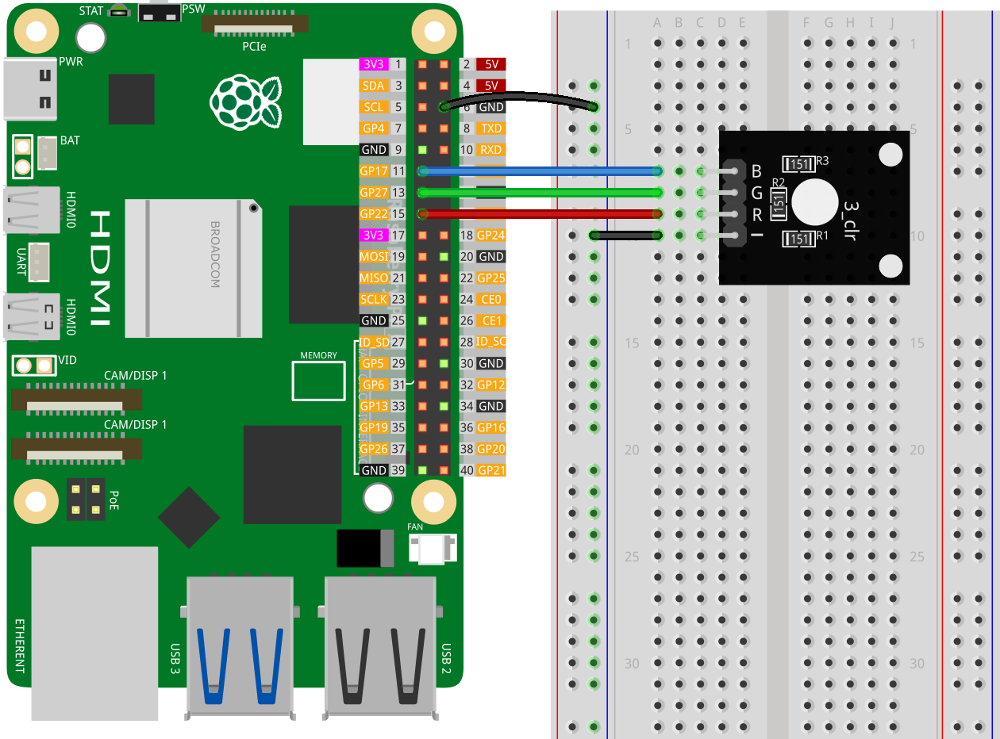

.. note:: 

    Ciao! Benvenuto nella Community Facebook degli appassionati di SunFounder Raspberry Pi, Arduino ed ESP32! Approfondisci l’uso di Raspberry Pi, Arduino ed ESP32 insieme ad altri entusiasti.

    **Perché unirsi?**

    - **Supporto Esperto**: Risolvi problemi post-vendita e sfide tecniche con l’aiuto della community e del nostro team.
    - **Impara e Condividi**: Scambia suggerimenti e tutorial per migliorare le tue competenze.
    - **Anteprime Esclusive**: Ottieni accesso anticipato agli annunci dei nuovi prodotti e anticipazioni.
    - **Sconti Speciali**: Approfitta di sconti esclusivi sui nostri prodotti più recenti.
    - **Promozioni e Giveaway Festivi**: Partecipa a promozioni festive e giveaway.

    👉 Pronto a esplorare e creare con noi? Clicca su [|link_sf_facebook|] e unisciti subito!

.. _pi_lesson28_rgb_module:

Lezione 28: Modulo RGB
==================================

In questa lezione imparerai a controllare un modulo LED RGB con un Raspberry Pi. Scoprirai come usare Python per cambiare il colore del LED in rosso, verde, blu e giallo, e infine spegnerlo. Questo progetto rappresenta un’introduzione semplice all’uso dei LED RGB e all’interfacciamento con i GPIO, rendendolo ideale per i principianti che iniziano con Raspberry Pi e la programmazione in Python.

Componenti Necessari
--------------------------

Per questo progetto, sono necessari i seguenti componenti.

È sicuramente comodo acquistare un kit completo. Ecco il link:

.. list-table::
    :widths: 20 20 20
    :header-rows: 1

    *   - Nome
        - COMPONENTI INCLUSI NEL KIT
        - LINK
    *   - Universal Maker Sensor Kit
        - 94
        - |link_umsk|

Puoi anche acquistare i componenti singolarmente dai link qui sotto.

.. list-table::
    :widths: 30 20
    :header-rows: 1

    *   - Introduzione al Componente
        - Link per l’Acquisto

    *   - Raspberry Pi 5
        - |link_rpi5_buy|
    *   - :ref:`cpn_rgb`
        - \-
    *   - :ref:`cpn_breadboard`
        - |link_breadboard_buy|

Collegamenti
---------------------------

Codice
---------------------------

.. code-block:: python

   from gpiozero import RGBLED  
   from time import sleep  
   from colorzero import Color  

   # GPIO pin assignments for the RGB LED
   red_pin = 22
   green_pin = 27
   blue_pin = 17

   # Initialize the RGB LED with red, green, and blue components connected to their respective GPIO pins
   led = RGBLED(red=red_pin, green=green_pin, blue=blue_pin)

   # Set the LED to red color (red: 100%, green: 0%, blue: 0%) and wait for 1 second
   led.color = (1, 0, 0)
   sleep(1)

   # Set the LED to green color (red: 0%, green: 100%, blue: 0%) and wait for 1 second
   led.color = (0, 1, 0)
   sleep(1)

   # Set the LED to blue color (red: 0%, green: 0%, blue: 100%) and wait for 1 second
   led.color = (0, 0, 1)
   sleep(1)

   # Set the LED to yellow color using the Color class and wait for 1 second
   led.color = Color('yellow')
   sleep(1)

   # Turn the LED off
   led.off()

Analisi del Codice
---------------------------

#. Importazione delle Librerie
   
   Lo script inizia importando la classe ``RGBLED`` da gpiozero per controllare il LED RGB, la funzione ``sleep`` dal modulo time per le pause, e la classe ``Color`` da colorzero per la definizione dei colori.

   .. code-block:: python

      from gpiozero import RGBLED  
      from time import sleep  
      from colorzero import Color  

#. Inizializzazione del LED RGB
   
   - I pin GPIO per ciascun componente colore del LED RGB vengono definiti.
   - Il LED RGB viene inizializzato collegando i componenti rosso, verde e blu rispettivamente ai pin GPIO 22, 27 e 17.

   .. code-block:: python

      red_pin = 22
      green_pin = 27
      blue_pin = 17
      led = RGBLED(red=red_pin, green=green_pin, blue=blue_pin)

#. Impostazione dei Colori del LED
   
   - Il colore del LED viene impostato in sequenza su rosso, verde e blu, con una pausa di un secondo dopo ciascuna impostazione.
   - I colori sono rappresentati da tuple (rosso, verde, blu), dove ciascun valore va da 0 a 1 e indica l’intensità.

   .. code-block:: python

      led.color = (1, 0, 0)
      sleep(1)
      led.color = (0, 1, 0)
      sleep(1)
      led.color = (0, 0, 1)
      sleep(1)

#. Uso della Classe Color
   
   Lo script mostra come usare la classe ``Color`` di colorzero per impostare il LED su un colore predefinito (``yellow``), attendendo poi un secondo.

   Oltre ai colori predefiniti, è anche possibile definire colori in diversi modi. Per maggiori dettagli, consulta |link_gpiozero_color|.

   .. code-block:: python

      led.color = Color('yellow')
      sleep(1)

#. Spegnimento del LED
   
   Infine, il LED viene spento utilizzando ``led.off()``.

   .. code-block:: python

      led.off()
