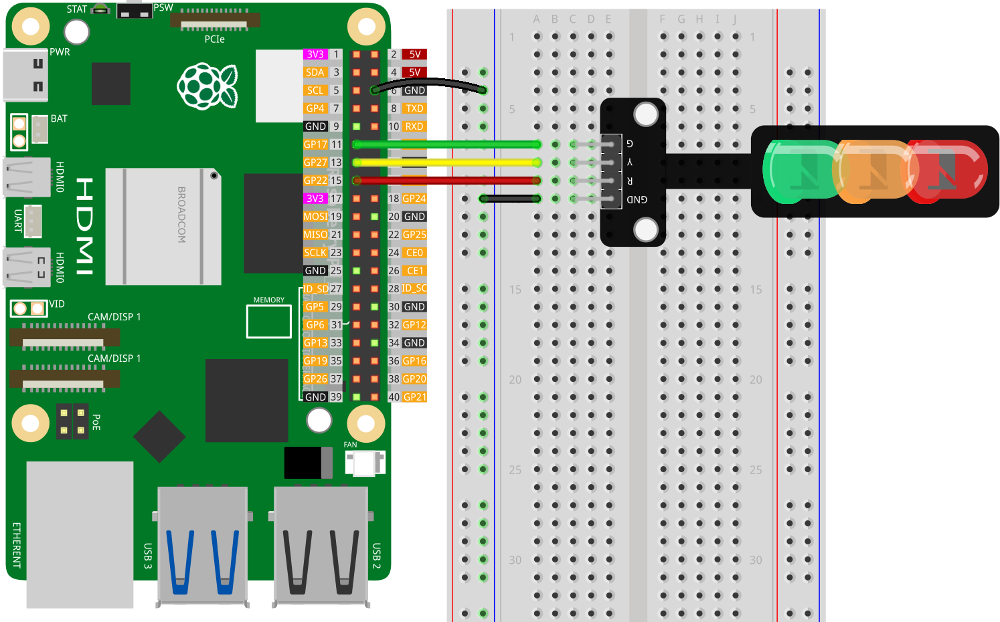

.. note::
    Bonjour et bienvenue dans la communauté des passionnés de SunFounder pour Raspberry Pi, Arduino et ESP32 sur Facebook ! Approfondissez vos connaissances sur Raspberry Pi, Arduino et ESP32 avec d'autres passionnés.

    **Pourquoi rejoindre ?**

    - **Support d'experts** : Résolvez les problèmes après-vente et les défis techniques avec l'aide de notre communauté et de notre équipe.
    - **Apprendre et partager** : Échangez des astuces et des tutoriels pour renforcer vos compétences.
    - **Aperçus exclusifs** : Bénéficiez d'un accès anticipé aux annonces de nouveaux produits et aux avant-premières.
    - **Réductions spéciales** : Profitez de réductions exclusives sur nos produits les plus récents.
    - **Promotions festives et cadeaux** : Participez à des tirages au sort et à des promotions festives.

    👉 Prêts à explorer et créer avec nous ? Cliquez sur [|link_sf_facebook|] et rejoignez-nous aujourd'hui !

.. _pi_lesson29_traffic_light_module:

Leçon 29 : Module de feu de signalisation
============================================

Dans cette leçon, vous apprendrez à simuler des feux de signalisation en utilisant un Raspberry Pi. Vous programmerez le Raspberry Pi pour contrôler ces LED dans une séquence qui ressemble à des feux de circulation : le LED rouge sera actif pendant 3 secondes, le LED jaune clignotera selon un motif spécifique, puis le LED vert s'allumera pendant 3 secondes. Ce projet est une manière pratique de commencer avec l'interface GPIO et la programmation Python, adapté pour ceux qui débutent avec l'association du matériel et du logiciel sur le Raspberry Pi.

Composants nécessaires
----------------------

Pour ce projet, nous aurons besoin des composants suivants.

Il est certainement pratique d'acheter un kit complet, voici le lien :

.. list-table::
    :widths: 20 20 20
    :header-rows: 1

    *   - Nom	
        - ÉLÉMENTS DE CE KIT
        - LIEN
    *   - Kit universel de capteurs pour créateurs
        - 94
        - |link_umsk|

Vous pouvez également les acheter séparément via les liens ci-dessous.

.. list-table::
    :widths: 30 20
    :header-rows: 1

    *   - Présentation des composants
        - Lien d'achat

    *   - Raspberry Pi 5
        - \-
    *   - :ref:`cpn_traffic`
        - |link_traffic_light_module_buy|
    *   - :ref:`cpn_breadboard`
        - |link_breadboard_buy|

Câblage
---------

Code
---------

.. code-block:: python

   from gpiozero import LED
   from time import sleep

   # Initialisation des broches LED
   red = LED(22)    # LED rouge connectée à la broche GPIO 22
   yellow = LED(27) # LED jaune connectée à la broche GPIO 27
   green = LED(17)  # LED verte connectée à la broche GPIO 17

   # Contrôle des LED dans une boucle continue
   try:
       while True:
           # Cycle du LED rouge
           red.on()     # Allume le LED rouge
           sleep(3)     # Le LED rouge reste allumé pendant 3 secondes
           red.off()    # Éteint le LED rouge

           # Motif de clignotement du LED jaune
           yellow.on()  # Allume le LED jaune
           sleep(0.5)   # Le LED jaune reste allumé pendant 0.5 seconde
           yellow.off() # Éteint le LED jaune
           sleep(0.5)   # Éteint pendant 0.5 seconde
           yellow.on()  # Répète le clignotement
           sleep(0.5)   # Le LED jaune reste allumé pendant 0.5 seconde
           yellow.off() # Éteint le LED jaune
           sleep(0.5)   # Éteint pendant 0.5 seconde
           yellow.on()  # Répète le clignotement
           sleep(0.5)   # Le LED jaune reste allumé pendant 0.5 seconde
           yellow.off() # Éteint le LED jaune
           sleep(0.5)   # Éteint pendant 0.5 seconde

           # Cycle du LED vert
           green.on()   # Allume le LED vert
           sleep(3)     # Le LED vert reste allumé pendant 3 secondes
           green.off()  # Éteint le LED vert

   except KeyboardInterrupt:
       # Éteint tous les LED et sort de manière sûre lors d'une interruption clavier
       red.off()
       yellow.off()
       green.off()

Analyse du code
---------------------------

1. Importation des bibliothèques
   
   La bibliothèque ``gpiozero`` est importée pour contrôler les broches GPIO, et la fonction ``sleep`` du module ``time`` est utilisée pour les délais.

   .. code-block:: python

      from gpiozero import LED
      from time import sleep

2. Initialisation des broches LED
   
   Ici, chaque LED est associée à une broche GPIO spécifique sur le Raspberry Pi à l'aide de la classe ``LED`` de la bibliothèque ``gpiozero``.

   .. code-block:: python

      red = LED(22)    # LED rouge connectée à la broche GPIO 22
      yellow = LED(27) # LED jaune connectée à la broche GPIO 27
      green = LED(17)  # LED verte connectée à la broche GPIO 17

3. Boucle de contrôle des LED
   
   La boucle ``while True :`` fonctionne continuellement, cyclant à travers chaque LED. Elle allume et éteint chaque LED selon un motif spécifique, en utilisant les fonctions ``on()``, ``off()`` et ``sleep()``.

   - Le LED rouge est allumé pendant 3 secondes.
   - Le LED jaune clignote : 0,5 secondes allumé, 0,5 secondes éteint, répété trois fois.
   - Le LED vert est allumé pendant 3 secondes.

   .. code-block:: python

      try:
          while True:
              # Cycle du LED rouge
              red.on()
              sleep(3)
              red.off()

              # Motif de clignotement du LED jaune
              # [Le motif est répété trois fois]
              
              # Cycle du LED vert
              green.on()
              sleep(3)
              green.off()

4. Gestion des exceptions
   
   Le bloc ``except`` intercepte un ``KeyboardInterrupt`` (généralement généré par Ctrl+C). Il assure que tous les LED sont éteints avant que le programme ne se termine, évitant que les LED ne restent dans un état indéfini.

   .. code-block:: python

      except KeyboardInterrupt:
          red.off()
          yellow.off()
          green.off()