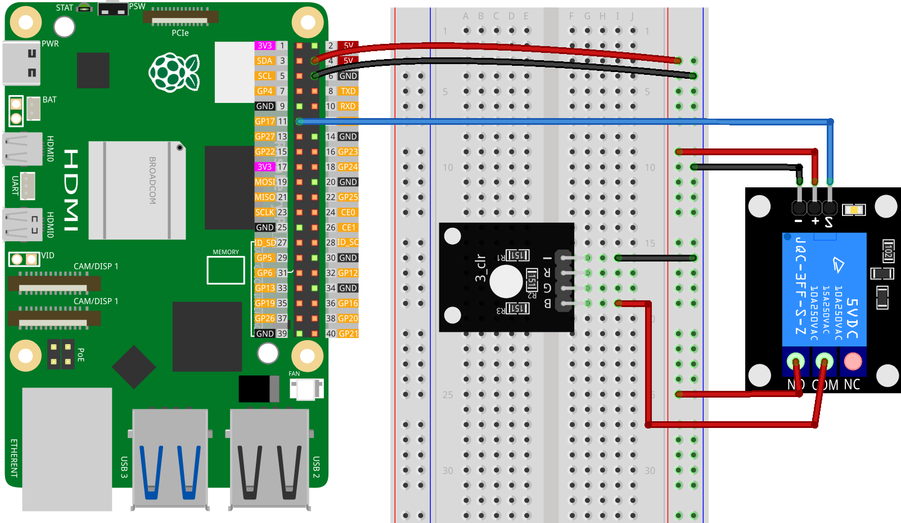

.. note::
    Bonjour et bienvenue dans la communauté des passionnés de SunFounder pour Raspberry Pi, Arduino et ESP32 sur Facebook ! Plongez plus profondément dans les univers de Raspberry Pi, Arduino et ESP32 avec d'autres passionnés.

    **Pourquoi rejoindre ?**

    - **Support d'experts** : Résolvez les problèmes post-vente et les défis techniques avec l'aide de notre communauté et de notre équipe.
    - **Apprendre et partager** : Échangez des conseils et des tutoriels pour améliorer vos compétences.
    - **Aperçus exclusifs** : Obtenez un accès anticipé aux annonces de nouveaux produits et aux aperçus exclusifs.
    - **Réductions spéciales** : Profitez de réductions exclusives sur nos produits les plus récents.
    - **Promotions festives et cadeaux** : Participez à des cadeaux et promotions de fêtes.

    👉 Prêts à explorer et créer avec nous ? Cliquez sur [|link_sf_facebook|] et rejoignez-nous dès aujourd'hui !

.. _pi_lesson30_relay_module:

Leçon 30 : Module de relais
==================================

Dans cette leçon, vous apprendrez à contrôler un module de relais à l'aide d'un Raspberry Pi. Vous apprendrez à écrire un script Python simple pour activer et désactiver le relais à des intervalles d'une seconde. Ce projet constitue une introduction pratique à l'utilisation des broches GPIO pour contrôler des appareils externes, fournissant une compréhension de base du fonctionnement des relais dans les circuits électroniques. C'est un exercice direct et informatif, particulièrement adapté aux débutants qui commencent avec le Raspberry Pi et le contrôle matériel.

Composants nécessaires
----------------------

Pour ce projet, nous aurons besoin des composants suivants.

Il est certainement pratique d'acheter un kit complet, voici le lien :

.. list-table::
    :widths: 20 20 20
    :header-rows: 1

    *   - Nom	
        - ÉLÉMENTS DE CE KIT
        - LIEN
    *   - Kit universel de capteurs pour créateurs
        - 94
        - |link_umsk|

Vous pouvez également les acheter séparément via les liens ci-dessous.

.. list-table::
    :widths: 30 20
    :header-rows: 1

    *   - Présentation des composants
        - Lien d'achat

    *   - Raspberry Pi 5
        - \-
    *   - :ref:`cpn_relay`
        - \-
    *   - :ref:`cpn_rgb`
        - \-
    *   - :ref:`cpn_breadboard`
        - |link_breadboard_buy|

Câblage
--------

Code
--------

.. code-block:: python

   from gpiozero import OutputDevice
   from time import sleep

   # Remplacez par votre numéro de broche GPIO
   relay_pin = 17  # Exemple utilisant GPIO17

   # Initialisation de l'objet relais
   relay = OutputDevice(relay_pin)

   try:
      while True:
         # Activer le relais
         relay.on()
         sleep(1)  # Le relais reste activé pendant 1 seconde

         # Désactiver le relais
         relay.off()
         sleep(1)  # Le relais reste désactivé pendant 1 seconde

   except KeyboardInterrupt:
      # Capture de Ctrl+C et fermeture sécurisée du programme
      relay.off()
      print("Program interrupted by user")

Analyse du code
---------------------------

1. **Importation des bibliothèques**
   
   Importation de la bibliothèque ``gpiozero`` pour le contrôle des GPIO et de la bibliothèque ``time`` pour les délais.

   .. code-block:: python

      from gpiozero import OutputDevice
      from time import sleep

2. **Initialisation du relais**
   
   Définition de la broche GPIO connectée au relais et initialisation d'un objet ``OutputDevice`` avec cette broche.

   .. code-block:: python

      relay_pin = 17  # Exemple utilisant GPIO17
      relay = OutputDevice(relay_pin)

3. **Contrôle du relais en boucle**
   
   La boucle ``while True:`` bascule continuellement le relais. Les méthodes ``relay.on()`` et ``relay.off()`` sont utilisées pour contrôler le relais, et ``sleep(1)`` crée un délai d'une seconde entre chaque état.

   .. code-block:: python

      try:
          while True:
              relay.on()
              sleep(1)  # Le relais reste activé pendant 1 seconde
              relay.off()
              sleep(1)  # Le relais reste désactivé pendant 1 seconde

4. **Gestion des exceptions**
   
   Le bloc ``except`` capture un ``KeyboardInterrupt`` (Ctrl+C). Il garantit que le relais est éteint et que le programme se termine en toute sécurité.

   .. code-block:: python

      except KeyboardInterrupt:
          relay.off()
          print("Program interrupted by user")